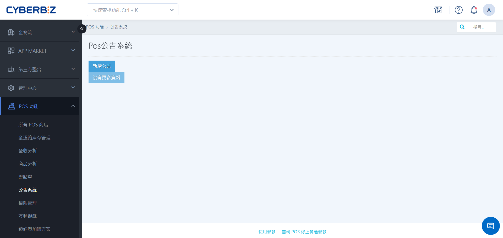
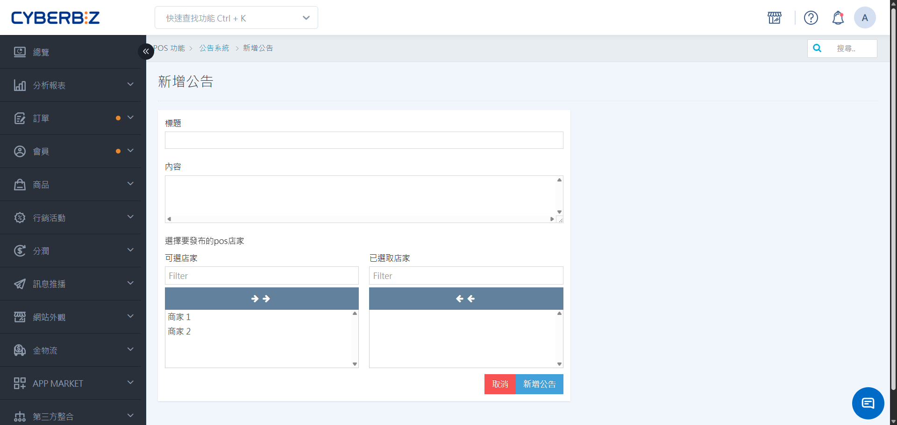

# 公告系統
透過 POS 公告系統，總公司可快速將重要資訊同步給各門市，門市間也能進行高效的資訊溝通。
{ .subtitle }

{ .hero-page }

!!! tip "應用情境"
	- **政策宣導**：總公司發布新的促銷活動或營運規範。
	- **門市互助**：門市間發布調貨需求或重要提醒。
	- **緊急通知**：即時傳達系統維護或臨時營業異動。

## 使用須知

- **權限限制**：僅限 **網站擁有者** 與 **各店店長** 權限可發送公告。
- **發送管道**：公告僅能透過 CYBERBIZ POS 管理後台發送。
- **接收範圍**：可彈性選擇發送給 **全店** 或 **指定單店**。
- **刪除規則**：公告發送後，無論接收端是否已讀，發送者皆可隨時從後台刪除公告。

## 操作流程

### 後台發送公告

由具備權限的人員於後台建立並發布訊息。

1. 前往 POS 管理後台，點選 **POS 功能 > 公告系統**。

1. 點擊 **新增公告**。
2. **編輯內容**：在編輯頁面輸入公告標題與詳細內容。
3. **選擇接收店家**：
    - 左側列表為所有 POS 店家。
    - 點擊欲接收公告的店家，移至右側的公告名單。
4. 點擊 **新增公告**。

{ .screenshot }

### 前台查看公告

門市人員可於 POS 前台即時接收並閱讀公告。

1. **即時通知提醒**：新公告將顯示於 POS 前台右上角的 **鈴鐺** 圖示處，並顯示未讀數字。
2. **快速查閱內容**：點擊鈴鐺圖示，即可查看公告標題與內容。
3. **批次標記已讀**：點選 **標記全部為已讀** 可清除鈴鐺數字。
4. **公告狀態篩選**：
    - 點選 **僅顯示未讀**：系統將自動過濾已閱讀資訊，僅列出待處理公告。
    - 切換回全部：再次點選同按鈕，即可恢復顯示完整公告歷史紀錄。

{ .screenshot }

## 更多操作

- :lucide-shield-check:{ .lg }   
  [__管理員帳號與權限設定__](../../week10(01-製作留存)/管理員帳號與權限設定.md){ data-preview }       
  配置員工或門市人員的後台登入帳號，並賦予正確的權限等級，以便進行 POS 商店的進階設定。

