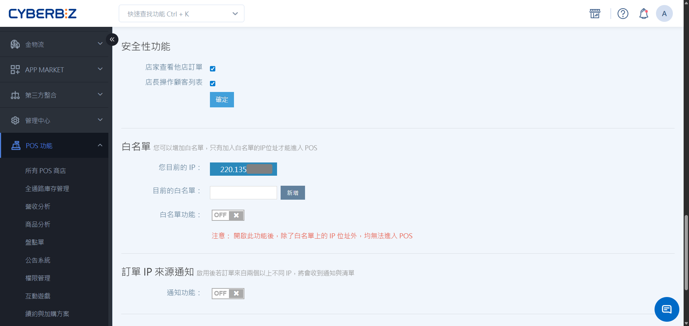

# 安全性設定
設定跨店訂單與顧客資訊查看權限、IP 白名單限制以及訂單來源通知，確保門市營運資料安全。
{ .subtitle }

[:lucide-tag:{ title="適用方案" }](../../resources/conventions#適用方案) | 進階 PLUS / 高手 PLUS / 企業
{ .doc-badge }

{ .hero-page }

!!! tip "應用情境"
    - **保護客戶隱私**：限制店長僅能查看該店顧客資料，防止跨店挖客行為，維護品牌營運穩定。
    - **強化登入防護**：設定 IP 白名單，僅允許門市固定 IP 進入 POS 系統，杜絕不明外部存取風險。
    - **異地登入監控**：開啟訂單 IP 來源通知，當同店出現不同 IP 登入時即時提醒，確保帳號使用安全。

## 使用須知

- **權限要求**：僅 **網站擁有者** 可編輯 POS 商店安全性設定。

## 操作流程

### 設定門市權限

管理員可決定 POS 前台是否顯示其他店點的訂單資訊，以及店長是否具備查看其他店點顧客名單的權限。

1. 登入 CYBERBIZ 管理後台，前往 **POS 功能 > 所有 POS 商店**。
2. 在 **POS 商店列表** 中，點選欲設定的 **POS 店名**。
3. 下滑至 **安全性設定** 區塊，依需求開啟 / 關閉選項。

    - **店家查看他店訂單**：POS 訂單頁面是否呈現跨店訂單
    - **店長操作顧客列表**：該店店長是否可跨店查詢顧客資訊

### 設定 IP 白名單

透過 IP 限制與通知機制，提升 POS 系統的網路防範等級。

1. 下滑至 **白名單** 區塊。
2. 將 **白名單功能** 切換至開啟狀態。
3. 確認門市各裝置的固定 IP。
    - 若需即時確認當前設備位址，可使用 [線上查詢 IP 工具](https://myip.com.tw/) 進行檢測。
4. 輸入 IP 位址，點選 **新增**，建立完整 IP 白名單。 
5. 設定完成後，非白名單 IP 登入時將顯示 Forbidden。

!!! warning "IP 變動風險說明"
    本功能僅建議具備 **固定 IP** 之門市開啟。若門市使用 **浮動 IP**，不建議啟用白名單，以免 IP 變更導致前台無法登入。

### 設定 IP 來源通知

1. 下滑至 **訂單 IP 來源通知** 區塊。
2. 將 **通知功能** 切換至開啟狀態。
3. 設定完成後，同店出現不同 IP 下單時將發送系統通知。

