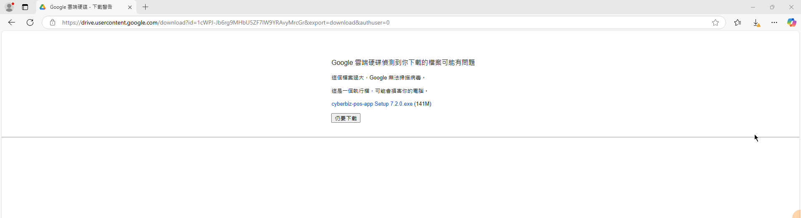
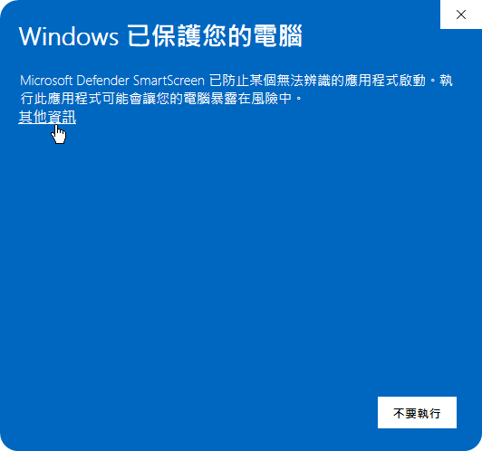
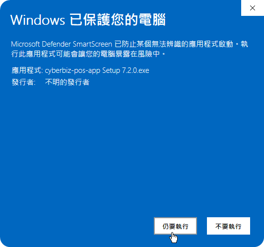
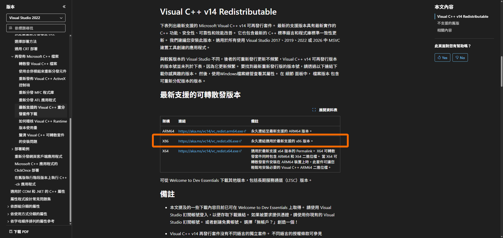
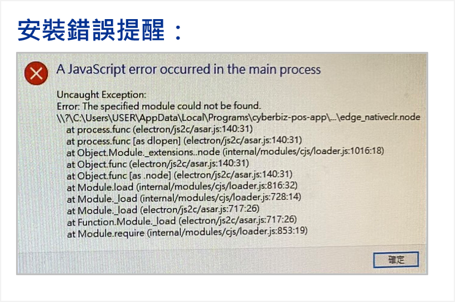

# 驅動程式
POS 驅動程式是串接硬體設備（如發票機、掃碼槍）的關鍵核心，確保在啟動 POS 前台前已正確安裝並執行。
{ .subtitle }

[:lucide-tag:{ title="適用方案" }](../../resources/conventions#適用方案) | 進階 PLUS / 高手 PLUS / 企業
{ .doc-badge }

!!! info "重要先決條件"
    - **作業系統**：僅支援 **Windows**，不支援 macOS 或 Linux。
    - **更新版本**：POS APP V.7.0.0 及更新版本僅相容於 Windows 10 或更高版本作業系統。
    - **啟動順序**：使用 POS 系統前，請務必 **先開啟驅動程式**，再開啟 POS 前台頁面。
    - **例外狀況**：若您使用的是 **MyPay 刷卡機方案**，請勿安裝此 POS 驅動程式。

## 下載與安裝

### 步驟 1：下載安裝檔

請點擊下方連結下載最新版驅動程式：
- [**POS APP 下載 (V.7.9.2)**](https://drive.google.com/file/u/1/d/1Ewhb9v9Pwr7LKdijNDQkWUVkotVPj1bb/view)

`備註：
- 修正客顯商品件數顯示，改為顯示總數量而不是品項數
- 支援 epson TM-m30III 發票機
`

### 步驟 2：執行安裝程式

下載完成後，雙擊執行 `cyberbiz-pos-app Setup.exe`，完成安裝。若系統出現安全警告，請參考後續的 **常見問題** 進行排除。

## 常見問題

??? quote "下載時出現 **不常下載** 警告，該如何排除？"

    當使用 Edge 或 Chrome 下載時，Microsoft Defender SmartScreen 可能會提示檔案不常下載。

    **警告訊息：**
    
    `[FILENAME].exe 不常下載。開啟前，請確認您信任 [FILENAME].exe`

    **排除步驟：**

    1. 點擊 :lucide-move-down: 下載選單中的 **更多選項 (⋯)**。
    2. 選擇 **保留**。
    3. 在警示視窗中，點擊 **顯示更多** > **仍要保留**。

    

    !!! info "安全機制說明"
        此警告訊息源自 Microsoft Defender SmartScreen 安全機制，並不代表所下載檔案即具有惡意性質。詳情請參考 [官方常見問答集](https://feedback.smartscreen.microsoft.com/smartscreenfaq.aspx#)。

??? quote "開啟安裝檔案時顯示 **Windows 已保護您的電腦**，該如何排除？"

    這是 Windows 的安全機制，阻止了未辨識應用程式的啟動。

    **警告訊息：**

    `Windows 已保護您的電腦 
    Microsoft Defender SmartScreen 已防止某個無法辨識的應用程式啟動。執行此應用程式可能會讓您的電腦暴露在風險中。`

    **排除步驟：**

    1. 在警示訊息中點擊 **其他資訊**。

        { .small-image }

    2. 點擊按鈕 **仍要執行**。

        { .small-image }

??? quote "出現 **A JavaScript error occurred in the main process** 錯誤訊息，該如何排除？"

    此錯誤通常代表您的 Windows 缺少必要的系統套件。

    **排除步驟：**

    1. 下載並安裝 Microsoft 官方提供的套件：[**Visual C++ 可轉散發套件**](https://docs.microsoft.com/zh-tw/cpp/windows/latest-supported-vc-redist?view=msvc-170)。
    2. **安裝優先順序**：

        - 請優先安裝 **x86 版本**。

            { .screenshot }

        - 若安裝後仍出現錯誤，請再嘗試安裝 **x64 版本**。

            { .small-image }
            
    3. 安裝完成後，重新啟動 POS 驅動程式。

    
