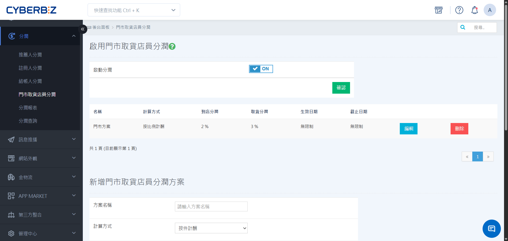
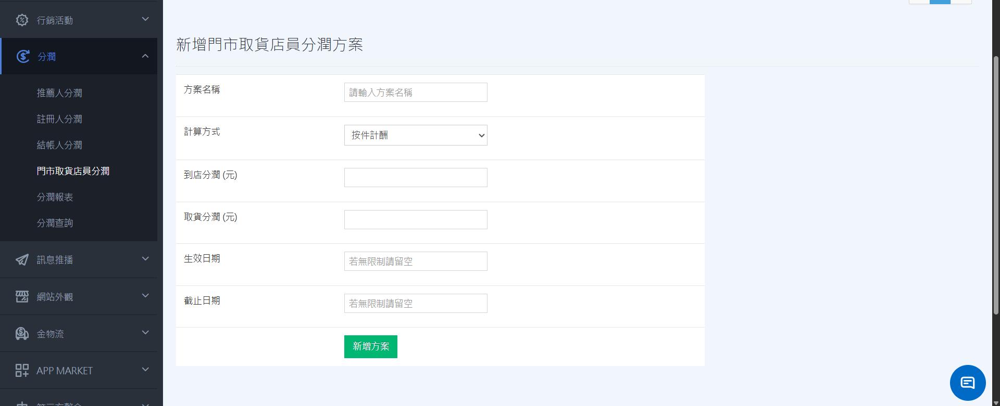
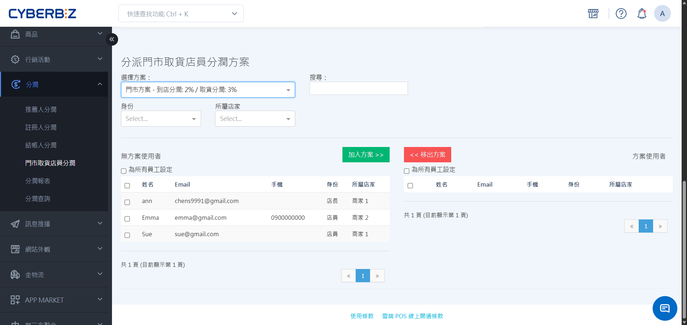

# POS 門市取貨店員分潤
透過分潤機制激勵門市人員處理「門市取貨」訂單的效率。您可以自訂到店與取貨的報酬，並自動化統計員工的分潤金額。
{ .subtitle }

[:lucide-tag:{ title="適用方案" }](../../resources/conventions#適用方案) | 進階 PLUS / 高手 PLUS / 企業
{ .doc-badge }

{ .hero-page }

!!! tip "應用情境"
    - **提升門市協作意願**：針對官網下單、門市取貨的訂單，給予門市人員額外的處理貼津，平衡實體與電商的工作量。
    - **勞務報酬公平化**：根據「到店處理」與「交付顧客」兩個環節分別設定分潤，確保參與流程的每位店員都能獲得對應獎金。
    - **簡化帳務結算**：系統自動根據訂單狀態與經手人員計算分潤，管理員只需下載報表即可完成獎金撥付，減少人工統計誤差。

## 使用須知

- **唯一方案限制**：每位員工僅能加入 **一個** 分潤方案。若在員工列表中找不到特定人員，請先確認其是否已加入其他方案。
- **方案名稱唯一性**：新增方案時，名稱不得與現有方案重複，以利後續報表辨識。
- **生效時間與範圍**：系統將從員工加入方案後的 **下一筆訂單** 開始計算分潤。不追溯或補發加入前的歷史訂單分潤。

## 操作流程

### 步驟一：開啟功能與建立分潤方案

首先需啟用分潤開關，並根據門市管理需求建立分潤計算規則。

1. 登入 CYBERBIZ 管理後台，前往 **分潤 > 門市取貨店員分潤**。
2. 將 **啟動分潤** 狀態切換為 `ON`，並點擊 **確認**。
3. 下滑至 **新增門市取貨店員分潤方案** 區塊，建立分潤方案。

    - **方案名稱**：建立此方案的識別名稱。
    - **計算方式**：**按件計酬** / **按比例計酬**。
    - **到店分潤**：設定商品 **抵達門市** 時的分潤獎金。
    - **取貨分潤**：設定顧客 **完成取貨** 時的分潤獎金。
    - **生效/截止日期**：設定方案開始與結束時間。
      
        > 若無限制開始與結束時間請留空

4. 設定完成後點選 **儲存**。

{ .screenshot }

### 步驟二：分配員工至方案

方案建立後，需將對應的門市人員加入，系統才會開始追蹤其經手的訂單並計算費用。

1. 下滑至 **分派門市取貨店員分潤方案**，於下拉選單 **選擇方案**。
2. 在左側清單中，利用 **搜尋**、指定 **身分** 或 **所屬店家**，篩選出目標員工。
3. 勾選員工名稱，點擊 **加入方案** 按鈕。
4. 確認員工出現在右側的 **已加入員工** 列表中。

{ .screenshot }

## 常見問題

??? quote "為什麼在員工清單中找不到某位店員？"
    最常見的原因是該員工已加入 **其他的門市取貨分潤方案**。請先到其他方案的已加入名單中檢查，或確認該員工具備 POS 操作權限。

??? quote "分潤可以追溯加入方案前的訂單嗎？"
    不可以。分潤計算採 **即時生效** 制，僅會計算員工加入方案 **之後** 所處理的到店或取貨動作。

## 更多操作

- :lucide-truck:{ .lg }   
  [__POS 門市取貨功能說明__](連結)     
  了解如何開啟 POS 門市取貨功能。 
  了解如何處理官網下單、門市取貨的訂單流程。

- :lucide-chart-column-increasing:{ .lg }   
  [__查看與管理分潤報表__](連結)     
  掌握員工分潤數據與業績表現，支援匯出詳細報表以利帳務核銷與績效評估。

- :lucide-search:{ .lg }   
  [__查詢員工所屬分潤方案__](連結)     
  快速檢索個別員工目前的綁定狀態與分潤比例，確保配置正確無誤。

