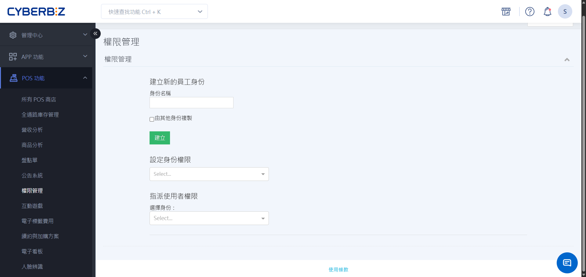
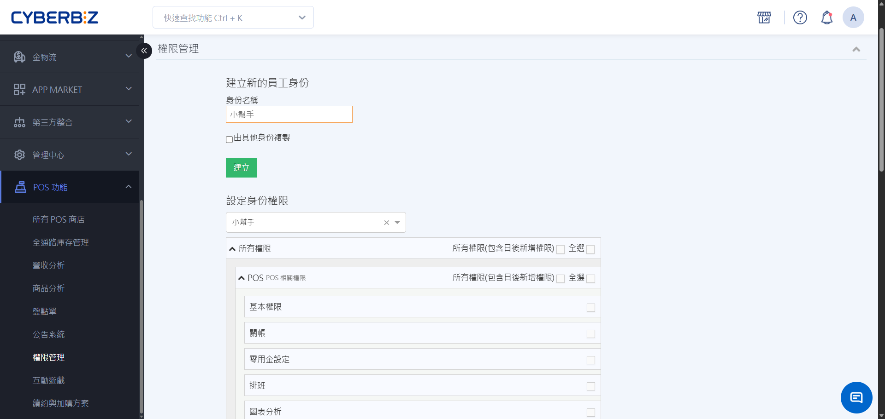
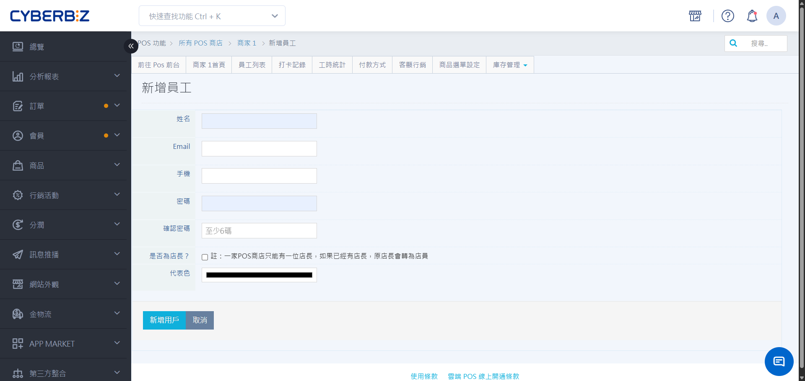
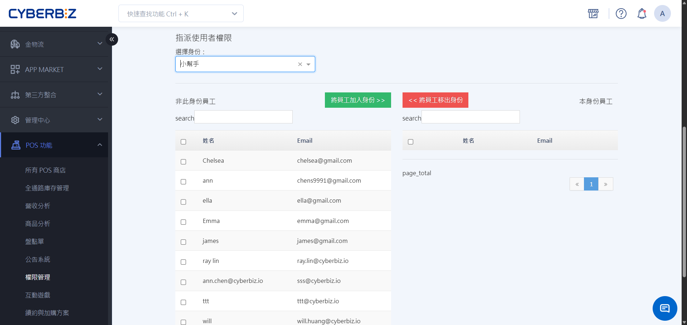
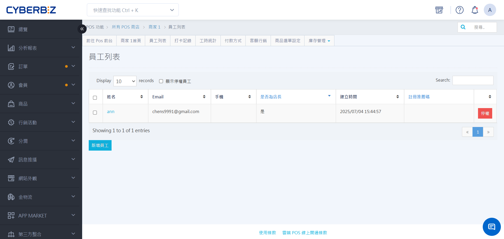
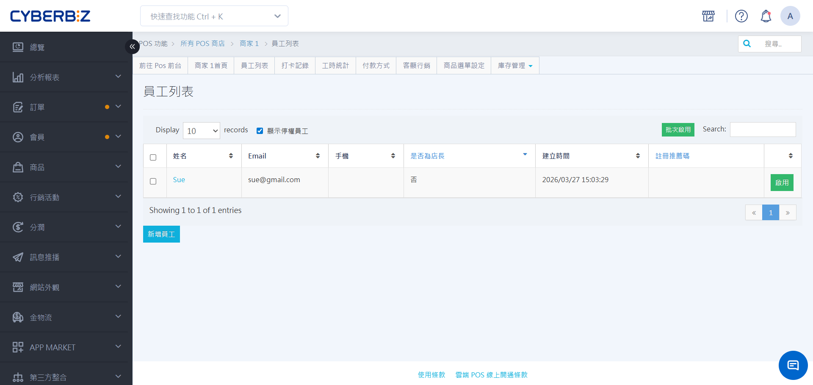

# 員工權限與帳號管理
建立標準化的「身分模板」並指派給對應的「員工帳號」，確保每位店員僅能操作其職務範圍內的功能。
{ .subtitle }

{ .hero-page }

[:lucide-tag:{ title="適用方案" }](../../resources/conventions#適用方案) | 進階 PLUS / 高手 PLUS / 企業
{ .doc-badge }

!!! tip "應用情境"
    - **人員到職**：為新進員工建立專屬 POS 帳號，並指派為 **一般店員** 身分。
    - **職務升遷**：將既有店員帳號的身分調整為 **店長**，解鎖改價與報表權限。
    - **人員離職**：立即將帳號設為 **停權** ，防止離職員工存取系統資料。
    - **安全稽核**：定期檢視身分模板，確保工讀生無法執行退貨或開啟錢箱。

## 使用須知

- **設定權限**：僅 **網站擁有者** 具備設定身分權限與指派店長的最高權限。
- **Email 衝突規則**：POS 員工帳號的 Email **不可** 與現有的 EC 網站後台管理員相同。
- **單店店長制**：每一間 POS 商店僅能指派 **一位** 店長，其餘均為店員身分。

## 角色預設權限

| 選項 | EC 網站擁有者 | EC 協同管理者 | POS 店長 | POS 店員 |
| ---- | ------------ | ------------ | -------- | -------- |
| 人數 | 1 位 | 無限 | 1 位 | 無限 |
| POS 前台權限 | ✕ | ✕ | ✓ | ✓ |
| POS 後台權限 | 所有功能 | 部分功能 | 本店所有功能 | 本店部分功能 |
| 身分建立權限 | 店長、店員 | ✕ | 店員 | ✕ |
| 商品管理權限 | 所有商品 (EC、POS) | EC 商品 | 本店 POS 商品 | 本店 POS 商品 | 
| 查看商品 | ✓ | ✓ | ✓ | ✓ |
| 編輯商品資訊 | ✓ | ✓ | ✓ | ✕ |
| 編輯商品庫存 | ✓ | ✓ | ✓ | ✕ |
| 訂單管理權限 | 所有訂單 | 所有訂單 | 所有 / 本店訂單 |  所有 / 本店訂單 | 
| 會員管理權限 | 所有會員 | 所有會員 | 本店會員 / 無權限 | 本店會員 / 無權限 | 

## 核心管理流程

### 步驟一：定義職務身分（身分模板）

先設定好職務對應的權限範疇，後續可直接套用給不同帳號。

1. 登入管理後台，前往 **POS 功能 > 權限管理**。
2. **建立身分**：輸入名稱（如：店長、工讀生、小幫手）並點擊 **建立**。
3. **設定權限**：在下拉選單選擇身分後，勾選欲開放的功能。
4. 點擊 **更新身分** 完成儲存。

{ .screenshot }

!!! tip "權限配置參考指引"
    設定權限時，若不確定各功能對應的控制範疇，請參閱 [POS人員權限欄位參考表](../reference/人員權限欄位參考表.md)。您可以依此表對照系統內各項操作（如：退貨、折扣、刪單）的開通範圍，快速建立職位模板。
    

### 步驟二：建立與管理員工帳號

為每位門市人員建立登入 POS 的帳戶。

1. 前往 **POS 功能 > 所有 POS 商店**，選擇對應商店點擊 **員工列表**。
2. **新增員工**：
    - **必填欄位**：填寫姓名、Email 與 **6 碼以上密碼**。
    - **代表色**：設定後在 POS 打卡或切換使用者時易於辨識。
    - **指派店長**：若該員為該店負責人，請勾選「店長」。
3. **帳號維護**：
    - **修改資料**：進入員工詳情頁點選 **編輯**，可修改姓名、代表色或重新指派店長。
    - **修改密碼**：在編輯頁面下方，輸入目前密碼與新密碼後點擊 **修改密碼**。

{ .screenshot }

### 步驟三：指派使用者身分

將「員工帳號」與「職務身分」綁定。

1. 回到 **POS 功能 > 權限管理** 頁面。
2. 找到 **指派使用者權限** 區塊。
3. 在下拉選單選擇一個 **身分**（如：店長）。
4. 從下方列表勾選欲指派的帳號，點擊 **加入身分** 移至右方區塊。
5. 員工重新整理 POS 頁面後，新權限立即生效。

{ .screenshot }

## 帳號停權與恢復

當人員離職或暫停職務時，應使用停權功能以保護資料。

- **執行停權**：在商店的 **員工列表** 中，點擊該員工後方的 **停權**。
    { .screenshot }
- **查看/恢復**：
    1. 勾選 **顯示停權員工**。
    2. 點擊該員後方的 **啟用** 按鈕，即可恢復其登入權限與既有設定。
    { .screenshot }

## 常見問題

??? quote "為什麼建立員工時提示「Email 已被使用」？"
    這通常是因為該 Email 已經被註冊為 EC 後台管理員。請使用不同的信箱地址建立員工帳號。

??? quote "更換店長需要注意什麼？"
    由於每間店僅限一位店長，指派新店長時，原店長將自動降為店員。此操作僅限網站擁有者執行。

## 更多操作

- :lucide-user-round-key:{ .lg }   
  [__人員權限欄位參考表__](../reference/人員權限欄位參考表.md)     
  了解權限類型與系統功能對應關係。

