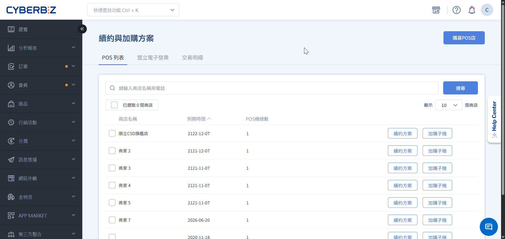
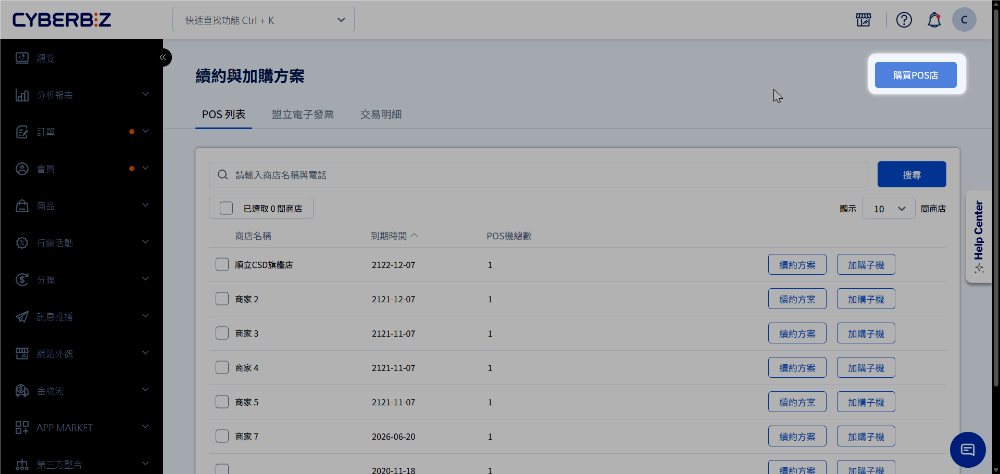
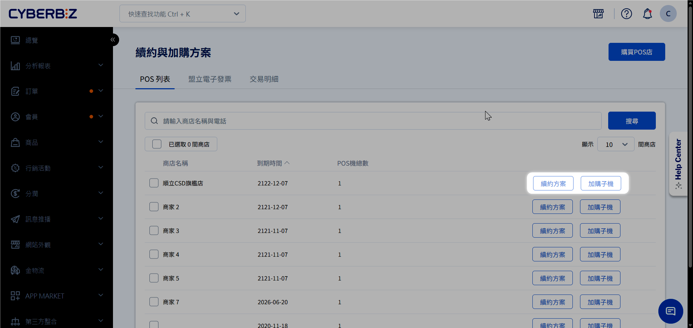
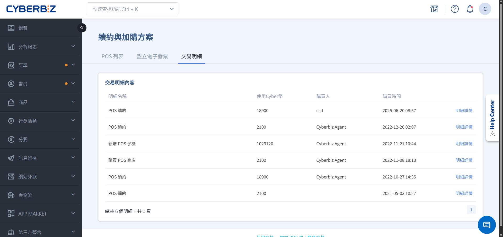

# 續購與加購方案
直接於管理後台辦理 POS 系統續約或加購子機，無需聯繫顧問即可快速完成合約展延與設備擴充。
{ .subtitle }

{ .hero-page }

!!! tip "應用情境"
    - **合約到期前夕**：自主於後台執行續約，確保 POS 服務不中斷。
    - **擴充結帳櫃檯**：當單一門市需要多台 POS 機同時作業時，可加購子機授權。

## 使用須知

- **付款方式**：執行續約或加購時 **無需當下付款**，系統將透過 **對帳單** 進行收款。
- **子機定義**：當同一間 POS 店需要多個結帳點同時作業時，即需加購 **子機** 授權。

## 操作流程

### 新增 POS 商店

1. 登入管理後台，前往 **POS 功能 > 續約與加購方案**，點擊 **購買 POS 店** 頁籤。
2. 確認方案內容與預計產生的費用。
3. 完成結帳，系統將自動記錄並列入下期對帳單。

{ .screenshot }

### 辦理續約或加購子機

1. 登入管理後台，前往 **POS 功能 > 續約與加購方案**，點擊 **POS 列表** 頁籤。
2. 找到欲操作的門市，根據需求點選 **續約** 或 **加購子機**。
3. 確認方案內容與預計產生的費用。
4. 完成結帳，系統將自動記錄並列入下期對帳單。

{ .screenshot }

### 查看交易紀錄

1. 登入管理後台，前往 **POS 功能 > 續約與加購方案**，點擊 **交易明細** 頁籤。
2. 即時瀏覽所有交易紀錄，包含 **購買人**、**交易時間** 及 **費用**。
3. 點擊 **明細詳情** 可進一步檢視 **對應商店** 與 **續約開始與結束時間**。

{ .screenshot }

## 子機功能與限制

- **期限對齊**：加購子機之效期將切齊首台子機，並依首台子機 **剩餘月份** 按比例計算加購子機的首期年費。
- **資料同步**：所有子機皆套用同一間店的行銷活動、庫存數據及圖表分析。
- **獨立作業**：各台子機需 **分開執行關帳** 與 **結存入庫金額**。
- **報表篩選**：每日出金報表、訂單彙總報表可於 Excel 匯出後，依據 **子機名稱** 進行篩選與對帳。

## 常見問題

??? quote "子機可以跨店使用嗎？"
    不可以。子機授權是綁定於特定門市下的。若其他門市有需求，需於該門市下另行加購。
