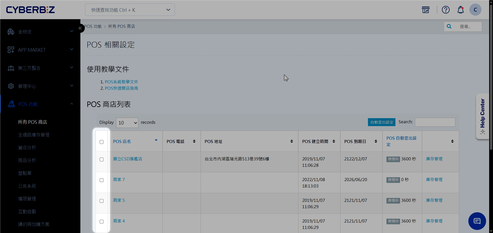
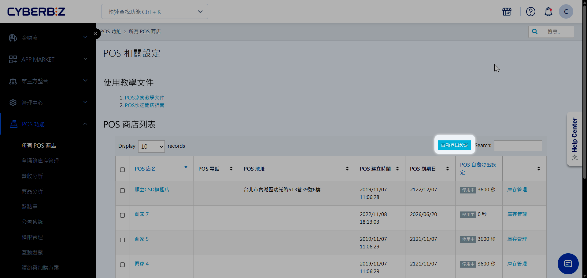
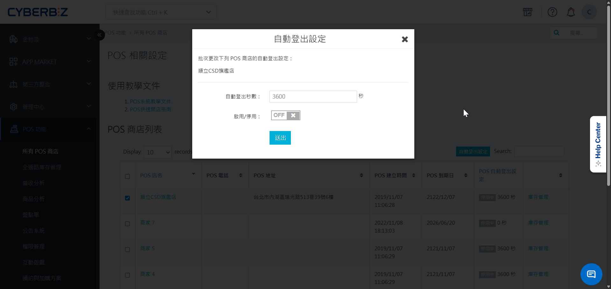
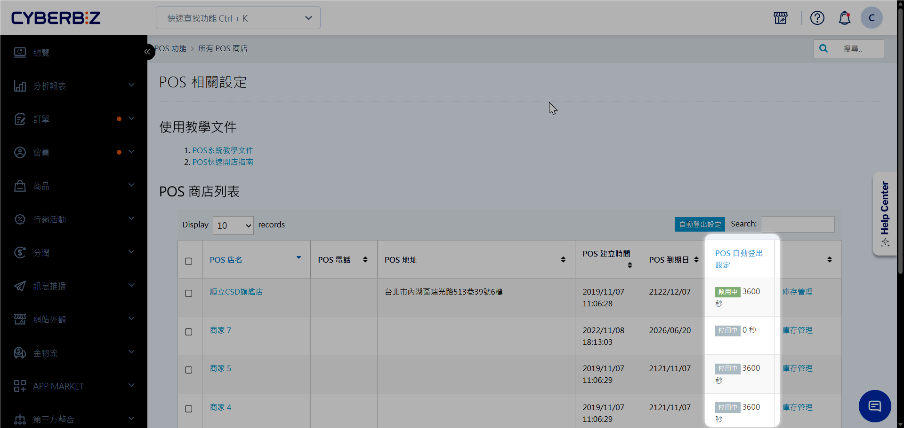

# 設定前台自動登出時間
當 POS 前台在指定時間內未進行任何操作時，系統將自動登出帳號，以確保門市收銀系統的安全。
{ .subtitle }

!!! tip "應用情境"
	- **資訊安全防護**：防止店員離開收銀台後，他人未經授權操作 POS 系統。
	- **帳號權限控管**：確保每次操作皆由當班人員重新登入，落實責任歸屬。

## 使用須知

- **權限限制**：僅限 **網站擁有者** 身份可進行此項設定。
- **適用範圍**：此設定僅適用於 **POS 前台** 介面，不影響管理後台。
- **計時邏輯**：系統偵測到以下行為時，將重新開始倒數計時：
    - 網頁重新整理
    - 滑鼠游標移動
    - 滑鼠游標點擊

## 操作流程

### 步驟1：進入 POS 商店列表

登入 CYBERBIZ 管理後台，前往 **POS 功能 > 所有 POS 商店**。

### 步驟2：選擇目標門市

在商店列表中，勾選欲設定自動登出的 POS 店家。

{ .screenshot }

### 步驟3：開啟自動登出設定

點選列表上方的 **自動登出設定** 按鈕。

{ .screenshot }

### 步驟4：設定登出秒數並啟用

1. 在彈出視窗中輸入欲設定的 **登出秒數**。
2. 將開關切換為 **啟用**。
3. 點選 **送出**。

{ .screenshot }

### 步驟5：確認更新成功

設定完成後，**POS 自動登出設定** 即切換為 **啟用中**，並顯示自動登入時間。

{ .screenshot }

### 步驟6：前台顯示驗證

前往 POS 前台介面，右上角將顯示 **自動登出** 的倒數資訊或狀態。

{ .screenshot }

## 常見問題

??? quote "為什麼我找不到 **自動登出設定** 按鈕？"
    請確認您目前的登入身份是否為 **網站擁有者**。若為一般管理員權限，無法看到或操作此功能。

## 更多操作

- :lucide-shield-check:{ .lg }   
  [__管理員帳號與權限設定__](員工權限與帳號管理.md){ data-preview }       
  建立員工或門市人員的後台登入帳號，並賦予正確的權限等級。

