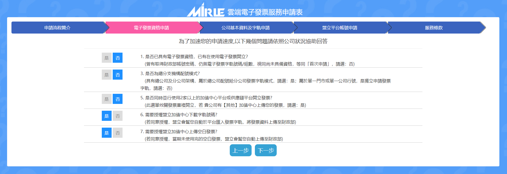
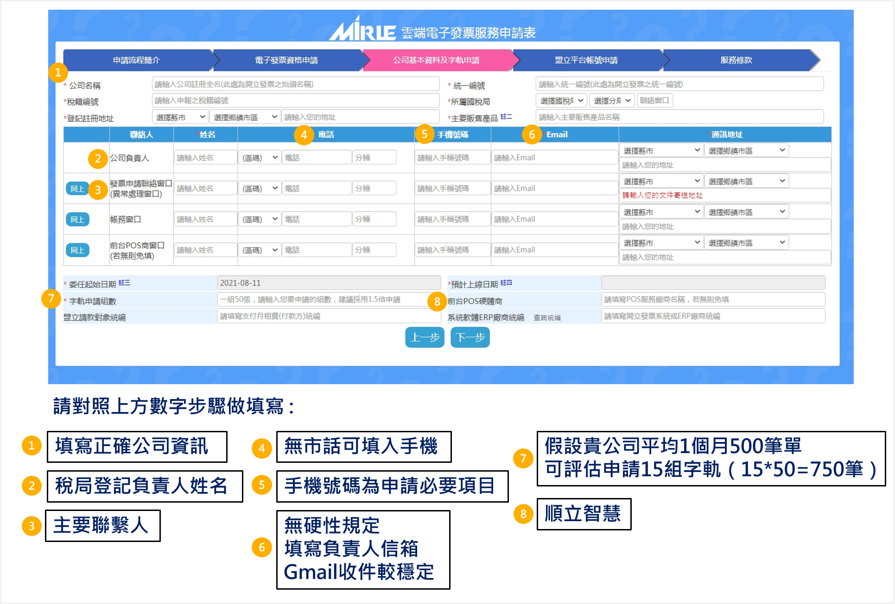
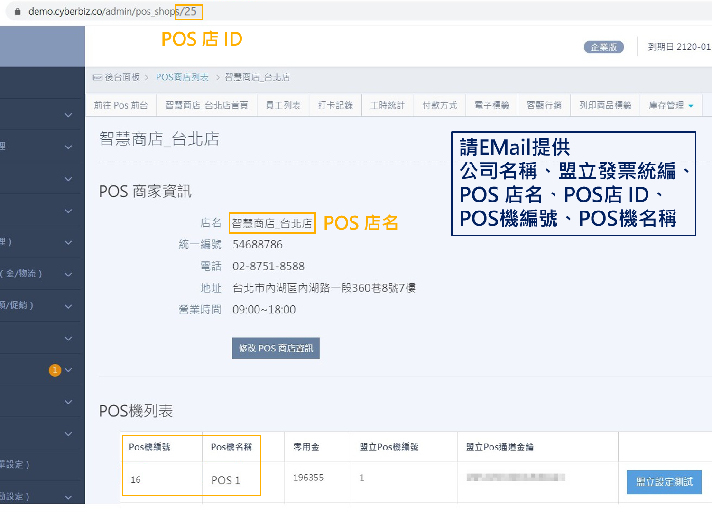
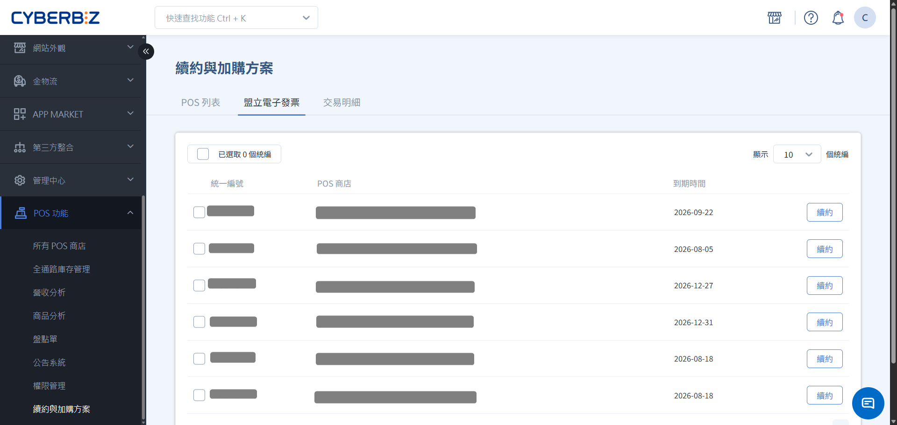
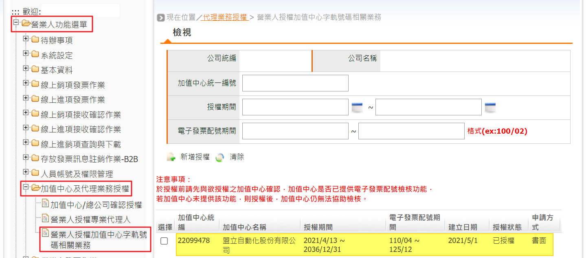
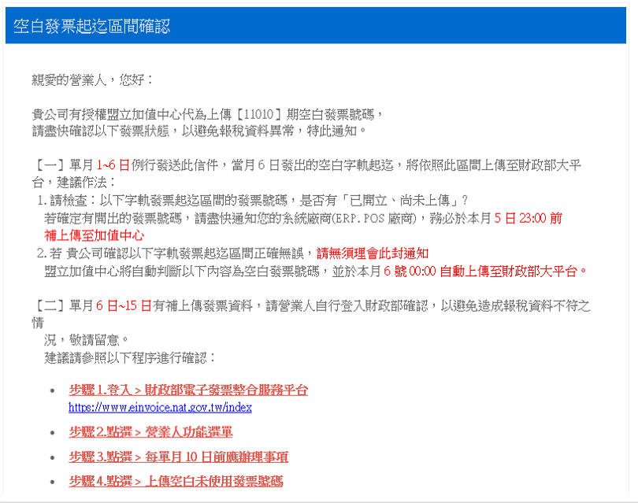

# 申請盟立電子發票
瞭解盟立電子發票加值中心的申請流程、字軌管理規範以及常見營運問題排除。
{ .subtitle }

[:lucide-tag:{ title="適用方案" }](../../resources/conventions#適用方案) | 進階 PLUS / 高手 PLUS / 企業
{ .doc-badge }

## 使用須知

- **購買方案**：先向開店顧問購買 **盟立電子發票加值中心**，再開始設定。
- **費用計算**：盟立加值中心以 **月份** 計費。若於當月 29 日啟用，仍會收取該月全額費用。
- **申請時程**：電子發票申請涉及國稅局審核，建議至少預留 **3 至 4 週** 的作業時間。
- **字軌預抓機制**：為避免網路不穩導致無法開票，CYBERBIZ 可依據商家用量預抓字軌至 POS 子機。預抓字軌不可移轉至其他子機或 EC 官網使用。如有需求請聯繫客服，將視調整情況酌收費用處理。

## 申請流程

### 步驟一：申請盟立電子發票帳號

若您尚未擁有盟立電子發票帳號，請從此步驟開始申請：

**線上填表**：前往 [盟立電子發票申請表](https://inv.iotnet.com.tw/service.php?module=A1005&DCApp=einvoice_actegory&id=NTQ2ODg3ODY=) 完成填寫。

1. **電子發票資格申請**

    請依序填寫以下資訊：

    - 是否已具有電子發票資格，已有在使用電子發票開立：**否**
    - 是否為總分支機構配號模式：**否**
    - 是否同時並行使用 2 家以上的加值中心平台或...：**否**
    - 需要授權盟立加值中心下載字軌號碼嗎：**是**
    - 需要授權盟立加值中心上傳空白發票：**是**

    { .screenshot }
    

2. **公司基本資料及字軌申請**

    請依序填寫以下資訊：
    
    - **公司名稱**
    - **公司負責人**：填寫稅局登記之負責人姓名
    - **發票申請聯絡窗口**：填寫主要聯繫人
    - **電話**：若無市話可填寫手機號碼
    - **手機號碼**
    - **Email**：建議填寫 gmail 信箱，收信較為穩定
    - **字軌申請組數**
        - 每組字軌包含 50 筆發票號碼，請依據貴司 **每月平均訂單量** 評估所需發票數量，並預留額度，確保發票配額充足。
        - 範例：每月訂單量為 500 筆，則可申請 15 組字軌。(15 × 50 =750 筆)

    - **前台 POS 硬體商**：填寫 **順立智慧**

    { .screenshot }

### 步驟二：取得國稅局核准

若您已擁有盟立電子發票帳號，請從此步驟開始申請：

1. **領取文件**：CYBERBIZ 將寄送相關紙本文件（申請書、委任書等）給商家。
2. **送交國稅局**：商家填寫完畢並用印後，將文件提供給所屬地區的國稅局。
3. **取得平台帳密**：國稅局核准後，財政部電子發票整合服務平台將透過 Email 寄送帳號密碼給商家。
4. **通知盟立**：將財政部平台的帳號密碼提供給盟立（寄至 `invoice@mirle.com.tw`）。
5. **完成串接**：取得盟立加值中心帳密後，Email 通知 CYBERBIZ 客服（`support@cyberbiz.io`）完成系統串接。

    Email 中請提供以下資訊：

    - 公司名稱
    - 盟立發票統編
    - POS 店名
    - POS 店 ID
    - POS 機編號
    - POS 機名稱

    > 可登入 POS 後台，前往 **POS 設定 > 所有 POS 商店**，點擊各店查詢 POS 機台資訊。

    { .screenshot }

### 步驟三：安裝刷卡機

安裝 [Posiflex 有線發票機](../hardware/Posiflex%20有線發票機/)。

## 續購盟立帳號

1. 登入 POS 管理後台，前往 **POS 功能 > 續約與加購方案**。
2. 點擊 **盟立電子發票** 頁籤，選擇指定統編帳號，點擊 **續購**。

{ .screenshot }

## 手動匯入字軌

- **手動匯入情境**：若商家 **不授權盟立自動下載字軌** 或 **同時使用多個發票平台**，則必須手動匯入字軌。
- **匯入教學**：請依 [手動匯入盟立平台教學](https://www.cyberbiz.io/support/wp-content/uploads/2021/11/%E7%9B%9F%E7%AB%8B%E5%8A%A0%E5%80%BC%E4%B8%AD%E5%BF%83%E5%B8%B8%E8%A6%8B%E5%95%8F%E9%A1%8C01.pdf) 操作。
- **匯入時間**：每個期別開始前（如 3/1 前需匯入 3-4 月字軌），需至盟立後台完成匯入。
- **重複匯入**：匯入發票字軌前，**請務必確認該字軌是否已在其他加值中心平台使用**。若因匯入錯誤字軌導致發生重複開立發票的情況，系統端將無法協助進行補開或註銷處理，需由 **商家自行與國稅局聯繫並依相關規定處理**。
- **補開限制**：已成立但開立失敗的訂單 **無法補開發票**。若因忘記匯入字軌導致失敗，需補匯字軌後取消原訂單重新下單。
- **結帳錯誤訊息**：若結帳時出現 **發票開立錯誤，未收到發票號碼** 的錯誤訊息，務必至盟立後台檢查字軌是否未匯入或已使用完畢。

## 常見問題

### 盟立帳號與合約

??? quote "我有兩間 POS 店，使用兩個統編開立發票，需要申請幾個盟立帳號？"
    一個統編需申請一組盟立帳號。若需統一管理，請在申請兩組帳號後聯繫盟立客服進行關聯設定。

??? quote "盟立合約到期後如何續約？"
    請前往 **管理後台 > POS > 續約與加購方案** 完成續約，費用將計入當期對帳單。

??? quote "已有盟立帳號，想將系統商切換為 CYBERBIZ 該如何操作？"

    請先聯繫 CYBERBIZ 服務人員，供預計切換的日期，並依照以下流程：

    1. 原系統商於盟立後台停用。
    2. 通知盟立切換配合系統商為 CYBERBIZ。
        - 盟立客服作業流程約需 2~3 小時
    3. 盟立切換完成後，通知 CYBERBIZ 客服進行串接。
        - CYBERBIZ 串接作業約需 2~3 小時
    4. 完成串接後， CYBERBIZ 客服會主動通知商店。
    5. 即可依 [Posiflex 有線發票機](../hardware/Posiflex%20有線發票機/) 安裝並下測試單。

    > :lucide-triangle-alert: 切換期間若門市仍在營業，請先確認切換期間的訂單發票可自行處理。

??? quote "申請完成後，若想加購盟立帳號，可以直接在後台購買嗎？"
    若想取得新的盟立帳號，需經過國稅局審核流程，並完成門市綁定，無法直接在後台購買。請從 [步驟二：取得國稅局核准](盟立電子發票/#步驟二取得國稅局核准) 開始申請。

??? quote "申請文件 **電子發票申請書** 的委任期間可以短一點嗎？"
    如果要取消授權，可以自行到財政部網頁取消授權，取消授權很快速方便，但每次委任授權申請都需要走用印 > 寄出 > 確認授權 > 盟立檢核 > 設定的流程。所以建議不要修改委任年份，委任時間到期都需要 **自行記得再次申請授權**。
    { .screenshot }

??? quote "申請文件需寄送至國稅局，若無固定聯繫窗口該如何處理？"
    若商店有委任會計師事務所代辦，建議優先詢問事務所的對應窗口。若採自行辦理，請致電所屬國稅局，並告知公司登記地址的**行政里別**，系統將協助轉接至負責該里別的稅務承辦人。

### 盟立信件通知

??? quote "收到盟立的【空白發票通知】信件需要處理嗎？"
    以這封信件為例，這是提醒您該期別已取號字軌尚有剩餘的空白發票號碼未開立，盟立會在隔月 6 號上傳空白發票號碼至財政部。為避免您的報稅資料異常，請依信件指示完成帳戶資料確認。
    CYBERBIZ POS 系統僅能開立當日之發票，且發票開立、折讓後皆在隔日早上 9 點自動批次上傳至盟立，一般不會發生上述的情況。
    { .screenshot }

??? quote "收到盟立信件【發票歷史筆數上傳通知】，需要注意什麼嗎？"
    此為盟立每天例行發送的通知信件，提供商店比對發票實際開立數量。

??? quote "如何修改盟立通知信寄送的聯絡信箱？"
    請自行至盟立後台，前往 **首頁 > 功能總覽 > 公司基本資料 > Email收件人設定** 完成修改。

### 字軌與開票異常

??? quote "字軌已匯入且測試列印成功，但開立發票仍失敗？"
    建議先關閉 POS APP 與前台頁面，重新開啟 POS APP 確認發票機連線後，再重新進行結帳。

## 更多操作

- :lucide-printer:{ .lg }
  [__有線發票機安裝教學__](../hardware/Posiflex%20有線發票機/) 
  完成盟立申請後，請依照此指南安裝硬體設備。

- :lucide-settings:{ .lg }
  [__開立 POS 混稅發票__](設定與開立-pos-混稅發票.md) 
  若有免稅商品需求，請接續設定混稅功能。

