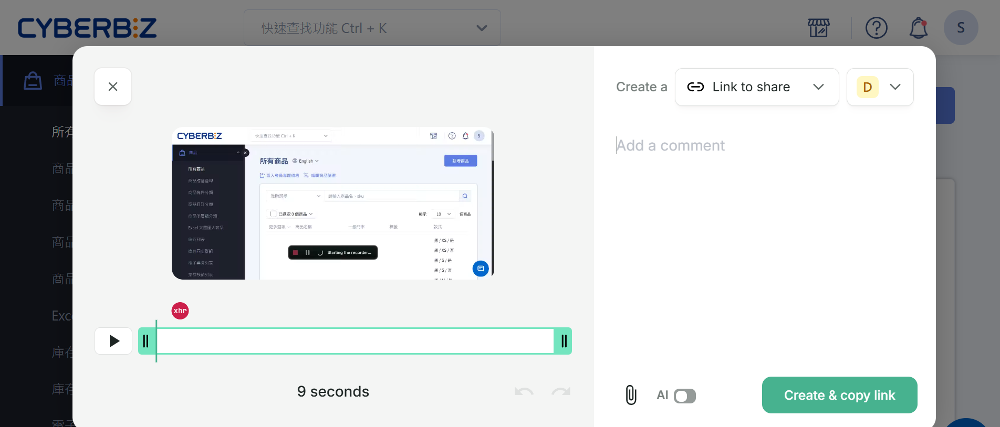
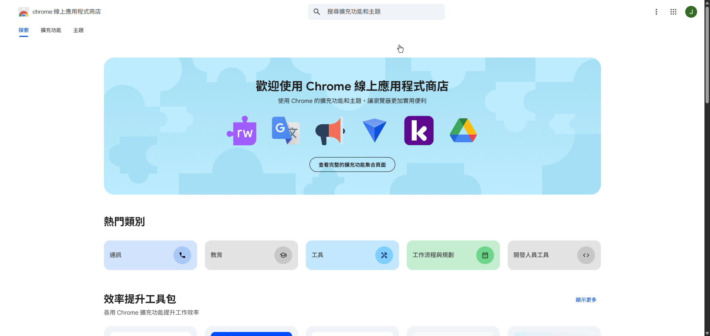
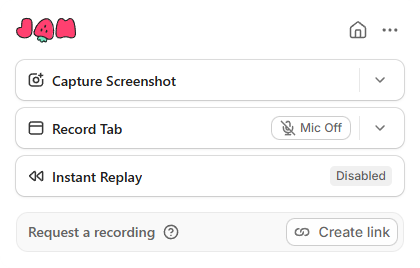

# 使用 Jam 回報操作問題
用 Jam 錄製畫面，提供連結給客服，協助排查問題。
{ .subtitle }

{ .hero-page }

## 使用須知

!!! quote inline end "一張圖或影片勝過千言萬語"
    只要截圖或錄下 *看到什麼、做了什麼、發生什麼*，即可讓問題回報更簡單、清楚、有效。

 - 建議附上重現步驟及相關商品/操作資訊，以加快處理速度。
 - 錄影或截圖前，請移除或遮蔽所有敏感資料，以確保錄影或截圖中無包含敏感個資。

## 操作流程
### :material-numeric-1-circle-outline: 安裝 Jam Chrome 擴充功能

1. 打開 [Chrome 線上應用程式商店 Jam 頁面](https://chromewebstore.google.com/detail/jam/iohjgamcilhbgmhbnllfolmkmmekfmci)。
2. 點擊 **加到 Chrome > 新增擴充功能** 完成安裝。
3. 點擊 Chrome 右上角拼圖圖示，將 Jam 固定到工具列，方便快速開啟。（建議）
4. 點擊 Jam 🍓 圖示，使用 Google 帳號登入或建立 Jam 帳號。

### :material-numeric-2-circle-outline: 錄影並重現問題

1. 點擊 Chrome 工具列右上角的 Jam 🍓 圖示。  
2. 選擇以截圖或是錄影：

	- **:material-camera-plus-outline: Capture Screenshot 截圖**：擷取當前頁面狀態，保留完整技術背景資訊。
	- **:material-tab: Record Tab 錄影分頁**：錄製螢幕操作過程，逐步重現問題情境。
	> 若要錄音，請點擊麥克風圖示 :material-microphone-off:/:material-microphone: 將麥克風開啟。
	- **:material-skip-backward: Instant Replay 快速重播**：自動擷取最近 30 秒的操作畫面，無需重新重現錯誤。   

3. 重現操作問題，並可口述操作情境。  
4. 錄影結束後，點擊 End Recording，Jam 會自動生成影片連結，方便提供給客服或研發團隊。

### :material-numeric-3-circle-outline: 分享影片給客服與研發

1. 點擊 **分享** 或 **複製連結**。  
2. 將連結寄至 CYBERBIZ 客服信箱：[support@cyberbiz.io](mailto:support@cyberbiz.io)。
3. 若需附加電腦規格，可在 Jam 設定中查看系統資訊，並一併提供。  

## 常見問題

??? quote "Jam 是免費的嗎？"
    是的，基本錄影與分享功能免費。

??? quote "影片會不會曝光？"
    只有擁有連結的人可以觀看，且可設定刪除。

??? quote "我錄到錯誤畫面但沒聲音，該怎麼辦？"
    請確保錄影時已開啟麥克風授權。