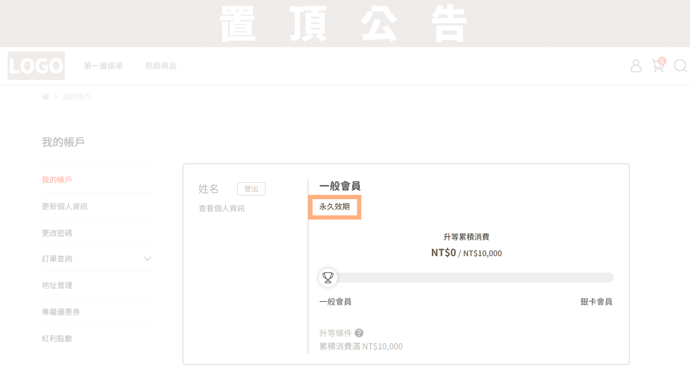
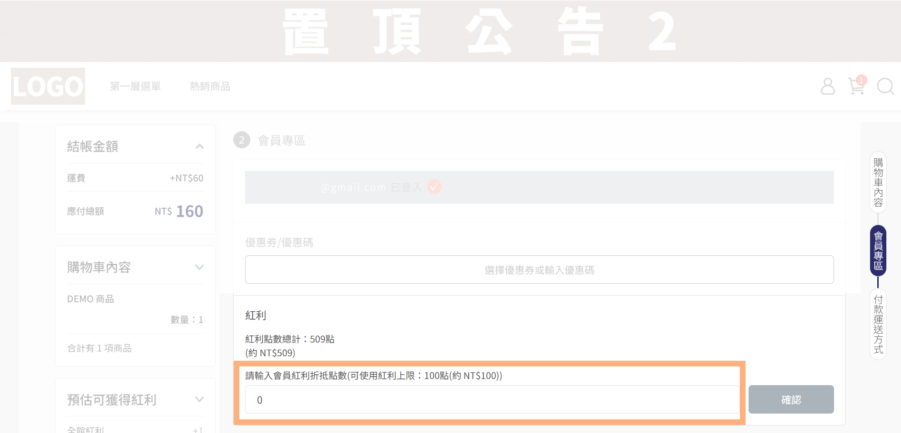
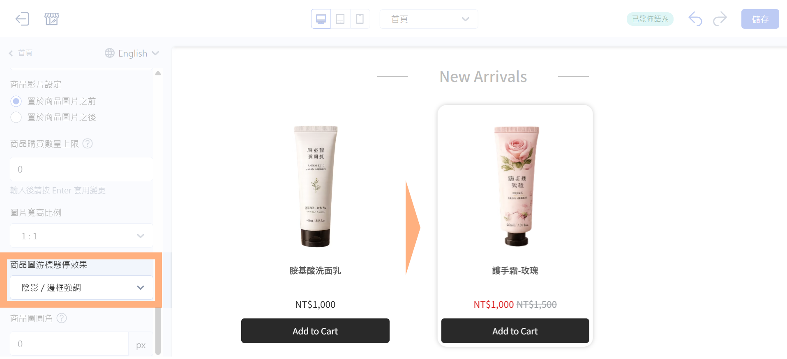

# 2026 年 06 月新功能報報
<!-- wp:html -->

<!-- /wp:html -->

<!-- wp:html -->

  
  
目錄 

（點選標題可直接跳至該段落）

  

    

      🚀
      <a href="#a" style="text-decoration: none;">本月重點功能</a>
    

    
  

      
<a href="#a1" style="text-decoration: none;">1. 滿額／滿件贈支援限定會員分群贈送</a>

    

  

  

    

      ⚡
      <a href="#b" style="text-decoration: none;">功能優化</a>
    

    
    

      
<a href="#b1" style="text-decoration: none;">1. VIP 會員層級效期新增無期限設定</a>

      
<a href="#b2" style="text-decoration: none;">2. 結帳頁自動帶入可折抵紅利點數開關</a>

      
<a href="#b3" style="text-decoration: none;">3. 電腦版商品圖游標懸停效果：擴充適用頁面</a>

    

  

 
<!-- /wp:html -->

<!-- wp:html -->

  
  

    <h2 style="font-size: 28px; font-weight: bold; color: #222222; margin: 0; letter-spacing: 0.5px; line-height: 1.2;" id="a">🚀 本月重點功能</h2>
  

  

    
    <h3 style="font-size: 22px; font-weight: bold; color: #222222; margin: 0 0 16px 0; line-height: 1.3;" id="a1">1. 滿額／滿件贈支援限定會員分群贈送</h3>
    
    

      #企業版
    

    
    

      
希望針對不同會員族群提供差異化贈品，打造更精準的會員經營策略？

      
現在滿額／滿件贈活動可綁定會員分群，依您篩選出的客群條件（如 VIP、會員標籤、購買紀錄）發送指定贈品，僅符合資格的會員可獲得對應贈品，讓不同會員享有專屬回饋，提升活動彈性與行銷精準度！

    
  
    
    <blockquote style="font-size: 18px; margin-bottom: 32px; line-height: 1.5;">
      使用範例：指定 VIP 會員 618 期間內下單加贈商品 
      會員篩選器篩選：VIP
    </blockquote>

    <figure><video controls src="../../assets/videos/EC-後台-行銷活動-滿額贈滿件贈-新功能報報宣傳01.mp4"></video></figure>
    

    

    <a href="../../ec/marketing/discounts/threshold-gifts-and-quantity-gifts/" style="display: inline-block; background-color: #00338c; color: #ffffff; font-size: 18px; font-weight: 500; text-decoration: none; padding: 8px 20px; border-radius: 9999px; transition: background-color 0.2s ease; cursor: pointer;" target="_blank" rel="noopener">
      立刻前往設定
    </a>
    

  

 
<!-- /wp:html -->

<!-- wp:html -->

  
  

    <h2 id="b" style="font-size: 28px; font-weight: bold; color: #222222; margin: 0; letter-spacing: 0.5px; line-height: 1.2;"> ⚡功能優化</h2>
  

  

    
    <h3 id="b1" style="font-size: 22px; font-weight: bold; color: #222222; margin: 0 0 16px 0; line-height: 1.3;">1. VIP 會員層級效期新增無期限設定</h3>
    
    

      #企業版
    

    

      
希望特定 VIP 會員升等後永久保留資格，不因效期到期而降級？

      
現在每個 VIP 層級可分別設定「升等條件計算期間」與「會員層級有效期間」，兩者皆支援「無期限」選項，讓您可針對不同 VIP 等級規劃升等、續會機制，會員經營策略更彈性！

      
提醒您：欲使用此功能需重新發布 VIP，發布後可能導致部分會員的 VIP 等級異動

    

    
    

      後台路徑：
      會員 → VIP 設定 
    

    

    

    <a href="../../ec/members/vip/setup-store-wide-vip-system/" style="display: inline-block; background-color: #00338c; color: #ffffff; font-size: 18px; font-weight: 500; text-decoration: none; padding: 8px 20px; border-radius: 9999px; transition: background-color 0.2s ease; cursor: pointer;" target="_blank" rel="noopener">
      立刻了解功能
    </a>
    

  

<!-- /wp:html -->

<!-- wp:html -->

  

    
    <h3 id="b2" style="font-size: 22px; font-weight: bold; color: #222222; margin: 0 0 16px 0; line-height: 1.3;">2. 結帳頁自動帶入可折抵紅利點數開關</h3>

    

      
結帳頁預設自動帶入會員可用紅利點數，造成會員誤用點數，衍生客服詢問？

      
後台新增「結帳頁自動帶入會員紅利」開關，您可依照會員使用情況或品牌點數經營策略，調整結帳頁是否自動帶入紅利點數，關閉後由會員自行決定使用數量，提升點數運用的彈性。

    

    
    

      後台路徑：
      金物流 → 結帳頁&物流設定 → 結帳頁自動帶入會員紅利
    

    

    

    <a href="../../ec/marketing/bonus-and-gifts/setup-bonus-points/#結帳頁自動帶入紅利" style="display: inline-block; background-color: #00338c; color: #ffffff; font-size: 18px; font-weight: 500; text-decoration: none; padding: 8px 20px; border-radius: 9999px; transition: background-color 0.2s ease; cursor: pointer;" target="_blank" rel="noopener">
      立刻前往設定
    </a>
    

  

<!-- /wp:html -->

<!-- wp:html -->

  

    
    <h3  id="b3" style="font-size: 22px; font-weight: bold; color: #222222; margin: 0 0 16px 0; line-height: 1.3;">3. 電腦版商品圖游標懸停效果：擴充適用頁面</h3>
    
    

      
希望提升商品展示質感，讓顧客瀏覽商品時更有互動感？

      
現在可於拖拉版型中自訂商品圖的游標懸停效果，提供圖片切換、放大效果、陰影／邊框強調等選項，適用範圍除首頁外，也擴充任選折扣、紅利商城、紅配綠等頁面，讓品牌各頁面的商品展示風格更一致，提升整體瀏覽體驗。

    

    
    

      後台路徑：
      網站外觀 → 套版主題管理 → 全站設定 → 商品圖游標懸停效果
    

    

  

<!-- /wp:html -->

<!-- wp:html -->

<!-- /wp:html -->
