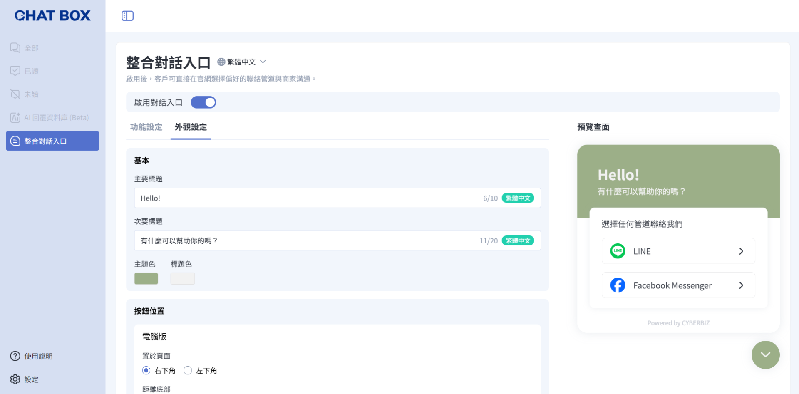
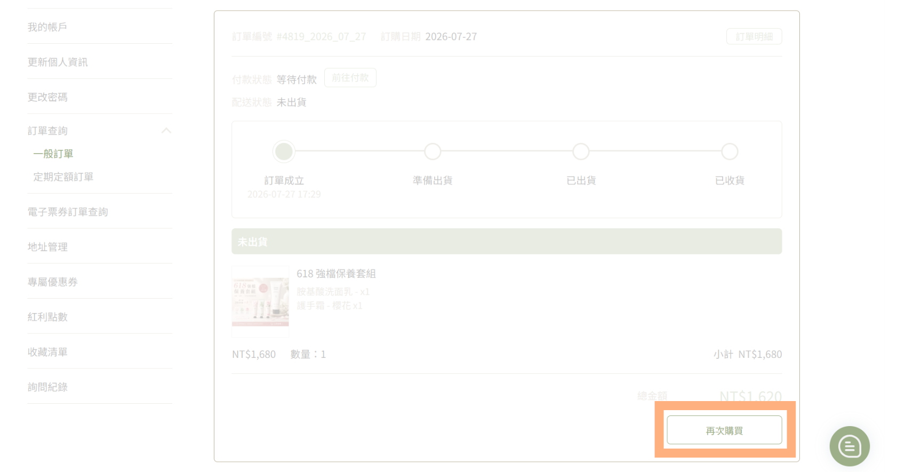
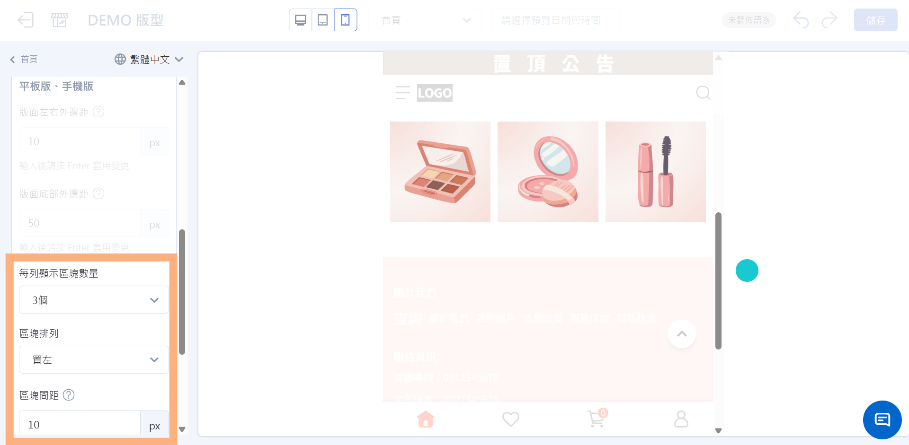
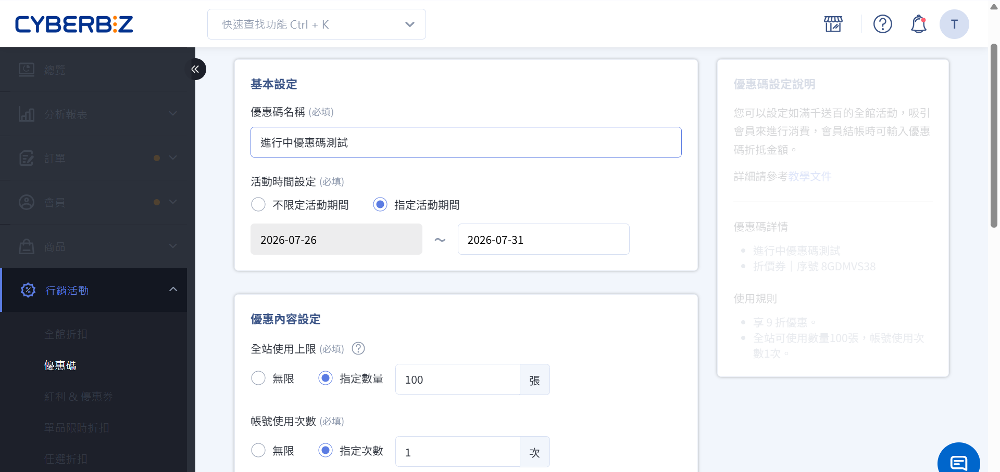

# 2026 年 07 月 | 新功能報報

<!-- wp:html -->

  
  
目錄 

（點選標題可直接跳至該段落）

  

    

      🚀
      <a href="#a" style="text-decoration: none;">本月重點功能</a>
    

    
  

      
<a href="#a1" style="text-decoration: none;">1. Chat Box｜官網整合對話入口</a>

    

  

  

    

      ⚡
      <a href="#b" style="text-decoration: none;">功能優化</a>
    

    
    

      
<a href="#b1" style="text-decoration: none;">1. 消費者再次購買功能</a>

      
<a href="#b2" style="text-decoration: none;">2. 自訂排版設計支援手機版多列並排顯示</a>

      
<a href="#b3" style="text-decoration: none;">3. 可編輯進行中的優惠碼</a>

    

  

 
<!-- /wp:html -->

<!-- wp:html -->

  
  

    <h2 style="font-size: 28px; font-weight: bold; color: #222222; margin: 0; letter-spacing: 0.5px; line-height: 1.2; border-bottom: none;" id="a">🚀 本月重點功能</h2>
  

  

    
    <h3 style="font-size: 22px; font-weight: bold; color: #222222; margin: 0 0 16px 0; line-height: 1.3;" id="a1">1. Chat Box｜官網整合對話入口</h3>
    
    

      #企業版
      #PLUS版
    

    
    

      
每一次詢問，都是成交的機會！

      
現在可在官網加入對話小工具，讓顧客透過 LINE 或 Facebook Messenger 快速聯繫您，降低詢問門檻；所有訊息將同步集中至 Chat Box 管理，降低多平台管理成本。

      
針對前台入口也可支援自訂標題、顏色與按鈕位置，打造更符合品牌風格的呈現。

    

    
    

      後台路徑：
      APP MARKET → 我的擴充服務 → Chat Box
    

    

    

    <a href="../../ec/app-market/chatbox/integrated-chat-widget/" style="display: inline-block; background-color: #00338c; color: #ffffff; font-size: 18px; font-weight: 500; text-decoration: none; padding: 8px 20px; border-radius: 9999px; transition: background-color 0.2s ease; cursor: pointer;" target="_blank" rel="noopener">
      立刻前往設定
    </a>
    

  

 
<!-- /wp:html -->

<!-- wp:html -->

  
  

    <h2 id="b" style="font-size: 28px; font-weight: bold; color: #222222; margin: 0; letter-spacing: 0.5px; line-height: 1.2; border-bottom: none;"> ⚡功能優化</h2>
  

  

    
    <h3 id="b1" style="font-size: 22px; font-weight: bold; color: #222222; margin: 0 0 16px 0; line-height: 1.3;">1. 消費者再次購買功能</h3>
    
    

      #進階版以上版本
    

    

      
每次回購都得重新找商品加入購物車，讓熟客的購物體驗打折扣？

      
現在會員可省去重新搜尋商品的流程、直接點擊「再次購買」，一鍵把曾購買的品項加入購物車，縮短購買決策時間，打造更順暢的回購體驗！

    

    

    

    <a href="../../ec/orders/basics/repurchase-order/" style="display: inline-block; background-color: #00338c; color: #ffffff; font-size: 18px; font-weight: 500; text-decoration: none; padding: 8px 20px; border-radius: 9999px; transition: background-color 0.2s ease; cursor: pointer;" target="_blank" rel="noopener">
      立刻了解功能
    </a>
    

  

<!-- /wp:html -->

<!-- wp:html -->

  

    
    <h3 id="b2" style="font-size: 22px; font-weight: bold; color: #222222; margin: 0 0 16px 0; line-height: 1.3;">2. 自訂排版設計支援手機版多列並排顯示</h3>
    
    

      #拖拉版型
    

    

      
精心設計的首頁內容，到了手機版卻無法呈現理想版型？

      
現在平板、手機版的自訂排版設計支援每列顯示 1～4 個區塊，並可自由調整置左、置中、置右對齊方式，讓商品分類、會員權益等內容也能在行動裝置上呈現多欄並排效果，打造更具彈性且一致的版面設計。

    

    
    

      後台路徑：
      網站外觀 → 套版主題管理 → 網站設定
    

    

  

<!-- /wp:html -->

<!-- wp:html -->

  

    
    <h3 id="b3" style="font-size: 22px; font-weight: bold; color: #222222; margin: 0 0 16px 0; line-height: 1.3;">3. 可編輯進行中的優惠碼</h3>
    
    

      #企業版
    

    

      
優惠活動開始後才發現設定需要調整細節，卻只能刪除重建優惠碼？

      
現在狀態為「進行中」的全館型優惠碼，也能直接編輯優惠碼名稱、結束日期、全站使用上限及帳號使用次數，讓活動可依實際狀況即時調整，不必中斷或重新建立優惠碼。每次編輯皆會保留異動紀錄，清楚記錄調整時間與操作人員，管理更安心！

    

    
    

      後台路徑：
      行銷活動 → 優惠碼
    

    

    

    <a href="../../ec/marketing/coupon/setup-promo-codes-new/#edit-ongoing-coupon" style="display: inline-block; background-color: #00338c; color: #ffffff; font-size: 18px; font-weight: 500; text-decoration: none; padding: 8px 20px; border-radius: 9999px; transition: background-color 0.2s ease; cursor: pointer;" target="_blank" rel="noopener">
      立刻了解功能
    </a>
    

  

<!-- /wp:html -->
