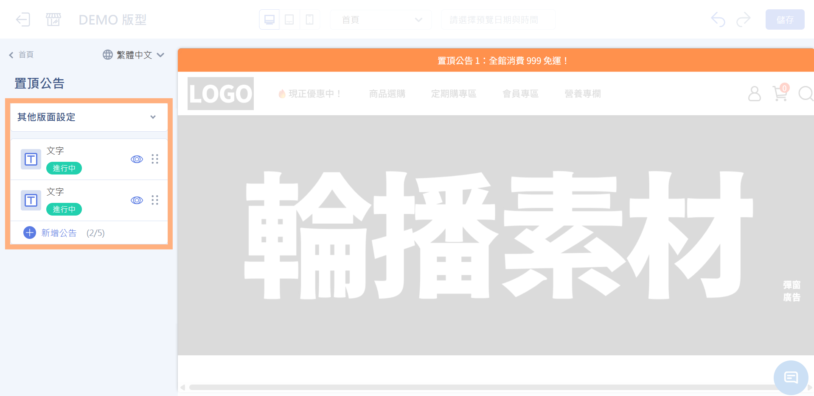
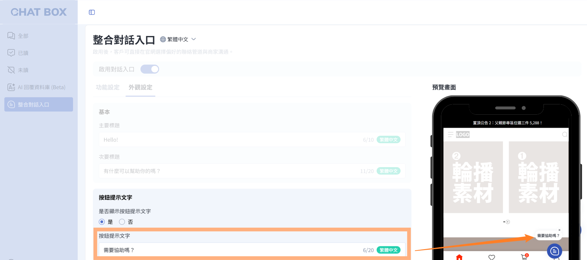
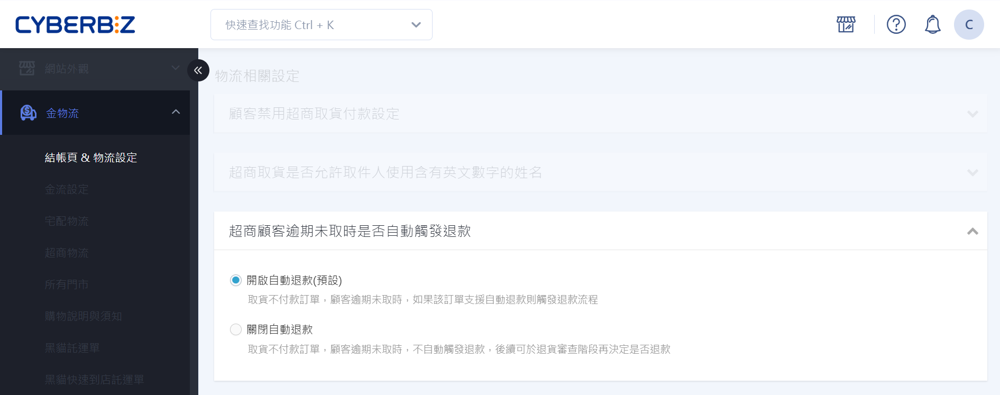
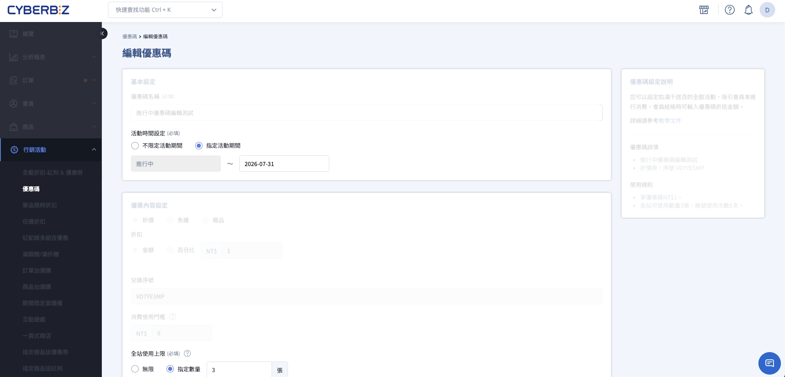

# 2026 年 08 月 | 新功能報報

<!-- wp:html -->

  
  
目錄 

（點選標題可直接跳至該段落）

  

    

      🚀
      <a href="#a" style="text-decoration: none;">本月重點功能</a>
    

    
  

      
<a href="#a1" style="text-decoration: none;">1. 置頂公告｜多版位排程輪播功能</a>

    

  

  

    

      ⚡
      <a href="#b" style="text-decoration: none;">功能優化</a>
    

    
    

      
<a href="#b1" style="text-decoration: none;">1. CHAT BOX｜支援手機版後台檢視、自訂前台對話提示文字</a>

      
<a href="#b2" style="text-decoration: none;">2. 超商逾期未取訂單可設定是否自動退款</a>

      
<a href="#b3" style="text-decoration: none;">3. 支援編輯進行中全館型優惠碼</a>

    

  

 
<!-- /wp:html -->

<!-- wp:html -->

  
  

    <h2 style="font-size: 28px; font-weight: bold; color: #222222; margin: 0; letter-spacing: 0.5px; line-height: 1.2; border-bottom: none;" id="a">🚀 本月重點功能</h2>
  

  

    
    <h3 style="font-size: 22px; font-weight: bold; color: #222222; margin: 0 0 16px 0; line-height: 1.3;" id="a1">1. 置頂公告｜多版位排程輪播功能</h3>
    
    

      #拖拉版型
    

    
    

      
想在首頁同時曝光多檔活動，卻受限於置頂公告只能顯示一組訊息，難以兼顧不同宣傳內容？新版置頂公告獨立為專屬區塊，一次最多可設定 5 組公告，支援圖片、文字、倒數三種內容形式、圖文可以分別導連結，並提供上下輪播、左右輪播、全展開三種顯示模式，讓不同活動訊息都能在首頁靈活曝光！

    

    
    

      後台路徑：
      網站外觀 → 套版主題管理 → 置頂公告
    

    

    

    <a href="../../ec/website-appearance/navigation/setup-pinned-post/" style="display: inline-block; background-color: #00338c; color: #ffffff; font-size: 18px; font-weight: 500; text-decoration: none; padding: 8px 20px; border-radius: 9999px; transition: background-color 0.2s ease; cursor: pointer;" target="_blank" rel="noopener">
      立刻前往設定
    </a>
    

  

 
<!-- /wp:html -->

<!-- wp:html -->

  
  

    <h2 id="b" style="font-size: 28px; font-weight: bold; color: #222222; margin: 0; letter-spacing: 0.5px; line-height: 1.2; border-bottom: none;"> ⚡功能優化</h2>
  

  

    
    <h3 id="b1" style="font-size: 22px; font-weight: bold; color: #222222; margin: 0 0 16px 0; line-height: 1.3;">1. CHAT BOX｜支援手機版後台檢視、自訂前台對話提示文字</h3>
    
    

      #企業版
      #PLUS版
    

    

      
想隨時掌握顧客訊息，也希望依不同檔期或活動調整前台對話提示？

      
➊ <b>CHAT BOX 新增手機版後台檢視功能</b> 訊息瀏覽、即時回覆等核心功能皆可透過手機操作，隨時掌握顧客訊息、即時回應。

      
➋ <b>同時開放自訂前台對話入口提示文字</b> 可依檔期或需求彈性調整提示內容，引導消費者開啟對話，讓溝通更直覺、增加互動機會。

    

    
    

      後台路徑：
      APP MARKET → CHAT BOX
    

    

    

    <a href="../../ec/app-market/chatbox/integrated-chat-widget/" style="display: inline-block; background-color: #00338c; color: #ffffff; font-size: 18px; font-weight: 500; text-decoration: none; padding: 8px 20px; border-radius: 9999px; transition: background-color 0.2s ease; cursor: pointer;" target="_blank" rel="noopener">
      立刻前往設定
    </a>
    

  

<!-- /wp:html -->

<!-- wp:html -->

  

    
    <h3 id="b2" style="font-size: 22px; font-weight: bold; color: #222222; margin: 0 0 16px 0; line-height: 1.3;">2. 超商逾期未取訂單可設定是否自動退款</h3>
    
    

      #企業版
      #PLUS版
      #CYBERBIZ PAYMENTS｜收款入帳
    

    

      
超商訂單消費者已付款但逾期未取時，原本系統會自動觸發退款流程。

      
若商家希望先與消費者溝通、改以其他方式處理，現在可透過開關選擇是否自動退款，讓後續執行更有彈性！

    

    
    

      後台路徑：
      金物流 → 結帳頁 & 物流設定 → 物流相關設定
    

    

    

    <a href="../../ec/orders/returns-refunds/cvs-unclaimed-order/#specs-overdue-cvs-orders-no-auto-refund-plugin" style="display: inline-block; background-color: #00338c; color: #ffffff; font-size: 18px; font-weight: 500; text-decoration: none; padding: 8px 20px; border-radius: 9999px; transition: background-color 0.2s ease; cursor: pointer;" target="_blank" rel="noopener">
      立刻前往設定
    </a>
    

  

<!-- /wp:html -->

<!-- wp:html -->

  

    
    <h3 id="b3" style="font-size: 22px; font-weight: bold; color: #222222; margin: 0 0 16px 0; line-height: 1.3;">3. 支援編輯進行中全館型優惠碼</h3>
    
    

      #企業版
    

    

      
優惠碼活動進行中，想延長檔期或調整使用次數，卻只能重新建立一組優惠碼？

      
進行中的全館型優惠碼現可直接編輯名稱、結束日期、全站使用上限與帳號使用次數，並保留編輯記錄，活動調整更彈性。

    

    
    

      後台路徑：
      行銷活動 → 優惠碼
    

    

  

<!-- /wp:html -->
