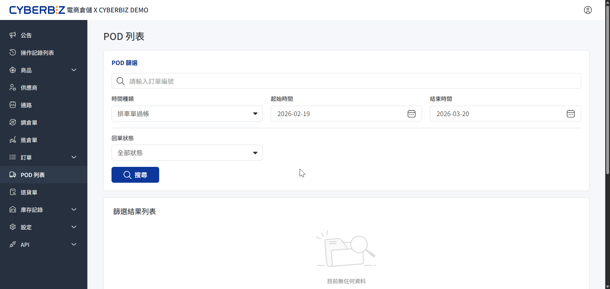

# POD 列表
在電商倉儲（WMS）中利用 POD 列表追蹤「專車派車」訂單的派車狀態。
{ .subtitle }

{ .hero-page }

## 使用須知

- **專車派車出貨**：專車派車為 **加值服務**，將另行將酌收費用，若有需求請洽詢倉儲經理，取得專屬報價。開通服務後，您即可於此處追蹤專車派車狀態。

## POD 列表功能概覽
介面分為「篩選區」與「結果列表」，提供精確的訂單追蹤能力。

1. 進入 CYBERBIZ 電商倉儲（WMS）管理後台，點選 **POD 列表**。
2. **篩選條件配置**：
    - **時間區間**：選擇特定時段（不可超過 **30 天**），亦可不限時間進行全量查詢。
    - **回單狀態**：
        - **已完成**：物流端已回傳簽收證明，且系統已完成紀錄。
        - **未完成**：貨件可能尚在配送中，或回傳憑證尚未歸檔。
3. 點擊 **搜尋**。

## 查詢結果應用

在列表顯示後，商家可透過列表執行以下操作：

- **追蹤回單進度**：透過 **回單狀態** 欄位，快速識別訂單的派送狀態。
- **查看訂單詳情**：點擊列表中的 **訂單編號**，系統將自動連結至該訂單的詳細資訊頁面，方便核對品項與收件人資訊。
- **異常識別**：若貨態顯示已送達但 POD 狀態長期處於 **未完成**，請聯繫倉庫客服或物流商確認。
