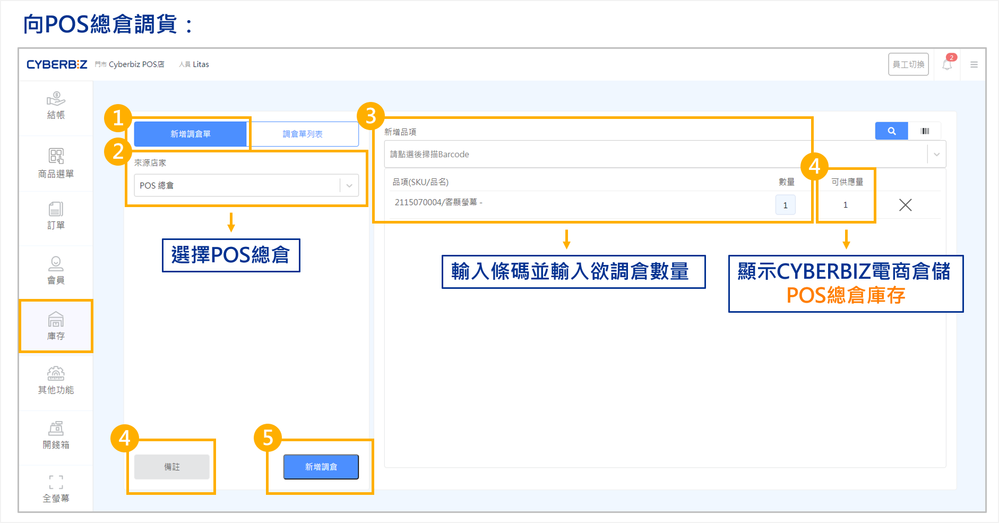
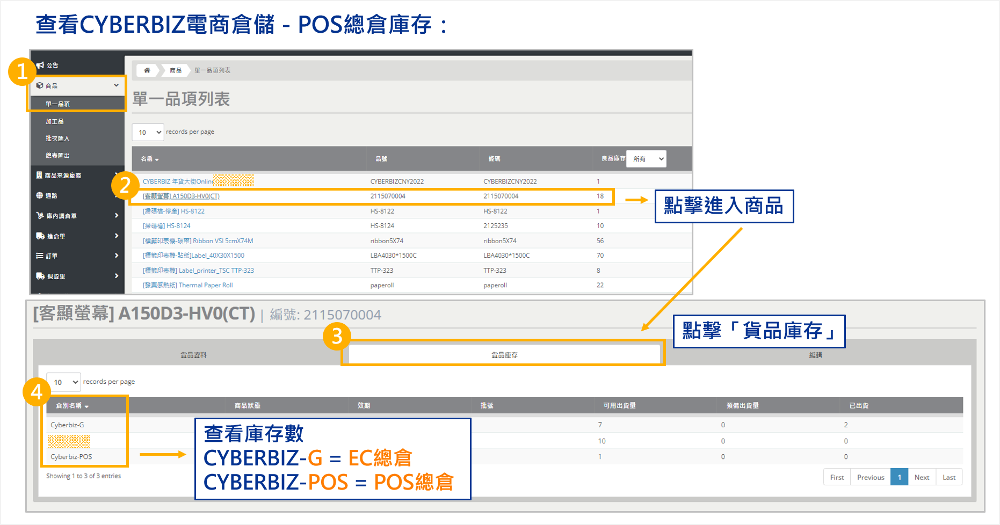
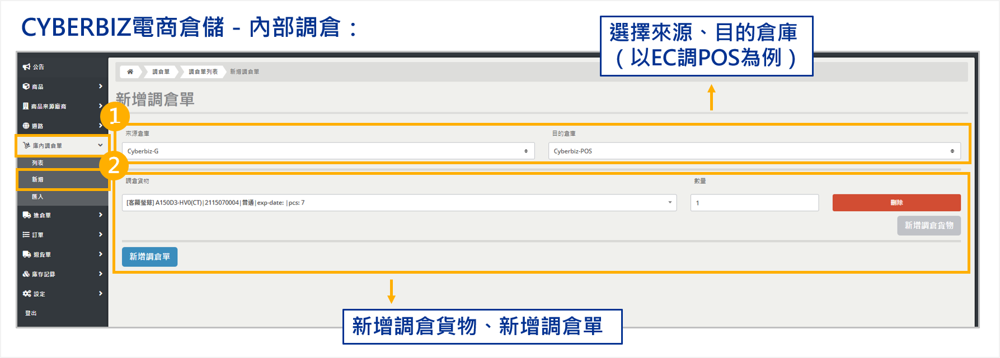

# POS 系統串倉庫存轉調
同時使用 EC、POS 與 WMS 服務時，執行門市調貨、查看 WMS 庫存配置以及在線上/線下倉別間進行庫存轉調。
{ .subtitle }

## 三合一庫存機制

在三合一（EC+POS+WMS）架構下，電商倉儲內的商品會依銷售管道區分為：

- **CYBERBIZ-G**：供應官網（EC）銷售。
- **CYBERBIZ-POS**：供應實體門市（POS）調貨。

## POS 門市向總倉申請調貨

門市人員若發現現場庫存不足，可透過 POS 前台向 WMS 總倉發起調倉申請。

1. 登入 **POS 前台**，前往 **庫存**，點擊 **新增調倉單**。
2. 在 **來源店家** 欄位選擇 **POS 總倉**。
3. 搜尋欲補貨的商品，並點擊加入列表。
4. 於品項列輸入欲申請的 **調貨數量**。
5. 查看 POS 總倉即時可用庫存，確保申請數未超過可用數。
6. 視需求輸入備註資訊，完成後點擊 **新增調倉**。

!!! tip "後續流程與取消說明"
    - **發貨**：申請提交後，WMS 端將接收指令並開始撿貨、發貨至門市。
    - **取消**：若提交後發現錯誤，**POS 端無法自行刪除**。請立即聯繫 WMS 窗口，確認該單據尚未開始作業，委由倉務人員手動終止。

{ .screenshot }

## 查看 WMS 庫存配置

管理人員可於 WMS 後台監控 EC 與 POS 管道的庫存分配狀況。

1. 登入 **WMS 管理後台**，前往 **商品 > 單一品項**。
2. 找到目標商品後，**商品庫存列表**。
3. 在彈出視窗中查看各倉別庫存：
    - **CYBERBIZ-G** = 線上 EC 總倉剩餘數。
    - **CYBERBIZ-POS** = 線下 POS 總倉剩餘數。

{ .screenshot }

## 線上與線下庫存內部轉調

若 POS 總倉庫存用罄，但 EC 總倉仍有餘裕，管理人員可執行「倉內轉調」，將官網庫存撥給門市使用。

1. 進入 **WMS 管理後台**，前往 [調倉單](調倉單.md)，點擊 **新增調倉單**。
2. **轉調路徑配置**：
    - **來源倉庫**：選擇 **CYBERBIZ-G**。
    - **目的倉庫**：選擇 **CYBERBIZ-POS**。
3. 點擊 **新增品項**，輸入欲轉調的品項與數量。
4. 確認資訊無誤後提交。系統將自動扣除線上庫存並增加線下可用庫存。

{ .screenshot }
