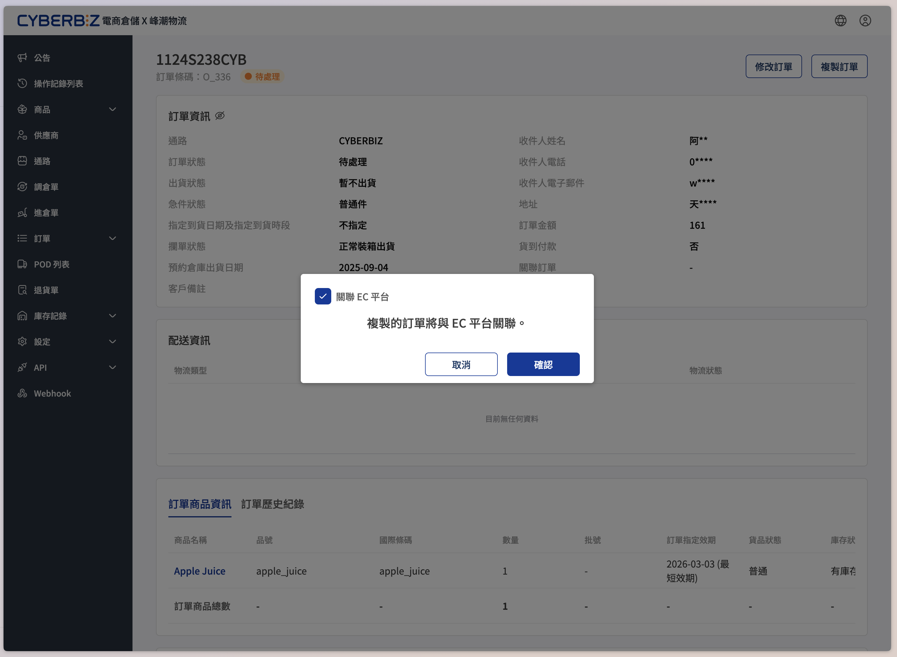
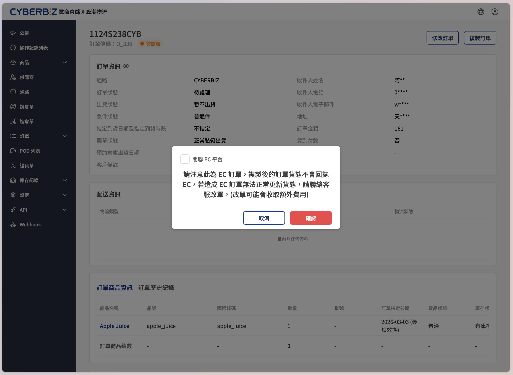

# 複製訂單
當商家需要針對現有訂單進行改單、重新出貨時，可透過「複製訂單」功能快速建立新訂單，並彈性決定是否保留與原電商平台（EC）的關聯。
{ .subtitle }

[:lucide-layers:{ title="適用產品" }](../../resources/conventions#適用產品) | 智慧倉儲
{ .doc-badge }

## 功能簡介

- **一鍵複製**：當商家需要針對現有訂單進行資訊修正或重新出貨時，可透過「複製訂單」功能快速建立新單並調整內容。
- **同步貨態**：系統提供 **關聯 EC 平台** 選項。這讓商家能決定新訂單的貨態是否要回拋至原平台，或是作為一張完全獨立的 WMS 訂單處理。

## 複製模式差異

根據是否勾選「關聯 EC 平台」，新訂單的繼承邏輯與貨態回拋行為將有顯著差異：

=== "關聯 EC 平台"

    複製後的新訂單會 **繼承原訂單的 EC 平台關聯**：

    - **貨態同步**：新訂單將接管原單的回拋權限，後續的出貨貨態可正常回拋至 EC 平台。
    - **關聯轉移**：原訂單會解除與 EC 平台的關聯，確保同一筆 EC 交易僅對應一張有效的回拋單。
    - **設定維持**：訂單的銷售通路與物流方式將維持原 EC 平台的設定。

    !!! example "適用情境"
        當原訂單需 **改單出貨**，且您仍希望電商平台端的消費者能收到最新的貨態通知時，請使用此方式。

=== "不關聯 EC 平台"

    複製後的新訂單會 **與 EC 平台完全斷開關聯**：

    - **貨態不回拋**：新訂單的所有貨態更新（如已出貨、已收貨）均 **不會同步** 回電商平台。
    - **原單維持**：原訂單與 EC 平台的關聯保持不變。
    - **通路變更**：新訂單的通路會轉變為 **其他**，且物流方式將轉換為對應的一般物流類型。

    !!! example "適用情境"
        當您是為了 **換貨** 或 **補出商品** 而複製訂單時，新訂單僅需在 WMS 內獨立出貨，不影響原訂單的狀態。**請務必取消勾選「關聯 EC 平台」**，否則會導致原單貨態無法正常回拋至電商平台。

## 注意事項

- **預設勾選**：每次開啟複製視窗時，勾選框預設皆為 **開啟** 狀態。
- **特定通路**：此功能僅適用於 CYBERBIZ、Shopline 等 EC 串接通路訂單，一般訂單不受影響。
- **出貨方式**：不論是否勾選，複製訂單一律視為新訂單，依正常流程出貨。
- **商品刪除提示**：若原訂單中包含已在系統刪除的商品，該商品不會被複製，且系統會顯示警示訊息。
- **人工作業風險**：若因誤設關聯導致貨態無法回拋，需聯絡客服協助改單，可能產生額外的技術處理費用。

## 操作步驟

1. 登入電商倉儲後台，前往 **訂單 > 列表**，進入欲複製的訂單詳情頁。
2. 點擊頁面右上角的 **複製訂單**。
3. 系統將彈出複製確認視窗。若該訂單為 EC 串接訂單，視窗中會出現 **關聯 EC 平台** 勾選框。
4. 根據您的出貨需求決定是否勾選，點擊 **確定** 完成複製。

    > 非 EC 串接的一般訂單（如手動建單）不會出現此勾選框，維持原有複製流程。

    === "關聯 EC 平台"

        { .screenshot }

    === "不關聯 EC 平台"

        { .screenshot }

## 常見問題

??? quote "什麼是「EC 訂單」？"
    指透過 CYBERBIZ、Shopline 等電商平台串接進 WMS 的訂單。

??? quote "複製後原本的 EC 訂單還在嗎？"
    還在。複製功能是建立一張全新的 WMS 訂單，不會刪除或覆蓋原有的訂單紀錄。

??? quote "一般（非 EC）訂單的複製流程有改變嗎？"
    沒有。非 EC 串接訂單的複製流程維持原狀，不會出現「關聯 EC 平台」的選項。

??? quote "如果我想補發商品，選錯了會有什麼後果？"
    若您在補發商品時誤勾了「關聯 EC 平台」，原訂單與電商平台的連結會 **轉移** 到這張補發單上。這會導致原本那張完整的訂單無法正確回拋貨態。
