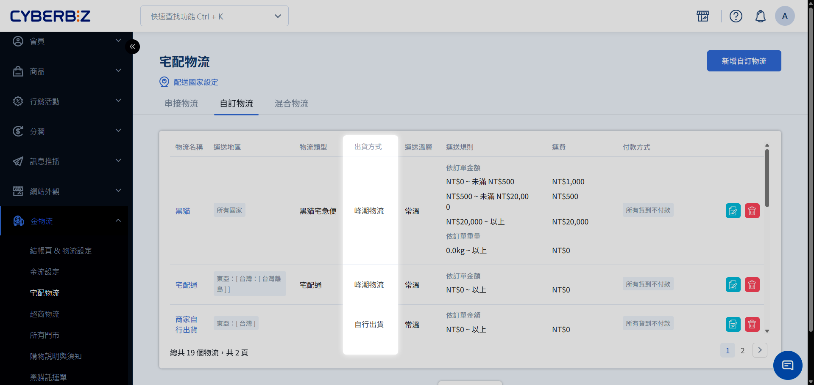

  <!-- LEFT: Hero -->
  

    <h1>
      智慧 
      
        倉儲
      
    </h1>

    

      <big><strong>專業的電商倉儲管理解決方案</strong></big> 
      從入倉儲存到系統化出貨與退貨管理，為您打通物流最後一哩路，讓您專注品牌經營。
    

    

      <a href="merchant-inbound-operation-rules.md" class="md-button md-button--primary">商家進倉作業規範 ➜</a>
      <a href="application-process-and-activation.md" class="md-button">官網串倉整合指南</a>
    

  

  <!-- RIGHT: POS Callout -->
  

  

    <!-- Tabs -->
    

      <button role="tab" aria-selected="true" class="tab-btn active"
        onclick="openTab(event, 'latest')">最新文件</button>
      <button role="tab" aria-selected="false" class="tab-btn"
        onclick="openTab(event, 'popular')">熱門文章</button>
    

    <!-- Latest -->
    

      <a href="processed-products.md">更新加工商品</a>
	  <a href="duplicate-order.md">新增複製訂單</a>
    

    <!-- Popular -->
    

      <a href="returns-and-vehicle-dispatch.md">更新退貨與派車</a>
    

  

  

---

## 核心功能概覽

-   :lucide-package: __商品管理__
    
    ---
    支援單一品項、加工商品與季別群組管理
    
    [:octicons-arrow-right-24: 單一品項](single-items.md) 
    [:octicons-arrow-right-24: 加工商品](processed-products.md)

-   :lucide-arrow-right-left: __倉儲作業__
    
    ---
    完整的進倉、出倉與調倉單據流程
    
    [:octicons-arrow-right-24: 進倉管理](inbound-orders.md) 
    [:octicons-arrow-right-24: 調倉作業](transfer-orders.md)

-   :lucide-shopping-cart: __訂單處理__
    
    ---
    自動同步官網訂單，支援手動建單與 POD 追蹤
    
    [:octicons-arrow-right-24: 訂單列表](list.md) 
    [:octicons-arrow-right-24: 手動建單](manual-order-creation.md)

-   :lucide-settings: __系統設定__
    
    ---
    商店資訊、帳號權限與報表通知設定
    
    [:octicons-arrow-right-24: 權限設定](permission-settings.md) 
    [:octicons-arrow-right-24: 商店設定](store-settings.md)

---

## 核心營運場景

<big><strong>官網與倉儲自動化同步</strong></big> 
實現庫存即時同步、自動拆單或混單處理。確保官網訂單能準確且快速地傳遞至倉儲系統進行出貨。
  

<a href="site-and-warehouse-sync-rules.md" class="md-button md-button--primary">官網與倉儲同步規則 ➜</a>  
<a href="enable-partial-warehouse-integration-and-order-splitting.md" class="md-button">啟用部分串倉與拆單 ➜</a>&nbsp;&nbsp;
<a href="enable-partial-warehouse-integration-and-mixed-orders.md" class="md-button">啟用部分串倉與混單 ➜</a>

---

## 依角色探索

-   :lucide-user: __倉管人員__
    
    ---
    專注於現場作業與庫存異動
    
    [:octicons-arrow-right-24: 建立進倉單](inbound-orders.md) 
    [:octicons-arrow-right-24: 建立退貨單](return-orders.md) 
    [:octicons-arrow-right-24: 庫存紀錄查詢](inventory-records.md)

-   :lucide-user-cog: __營運管理者__
    
    ---
    專注於系統整合與數據監控
    
    [:octicons-arrow-right-24: 員工帳號建置](account-management.md) 
    [:octicons-arrow-right-24: 操作紀錄列表](operation-logs.md) 
    [:octicons-arrow-right-24: 報表通知設定](report-notification-settings.md)

