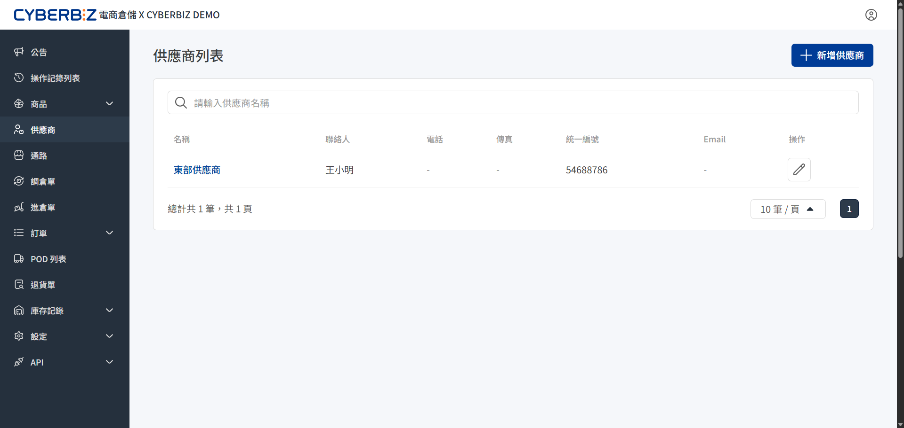
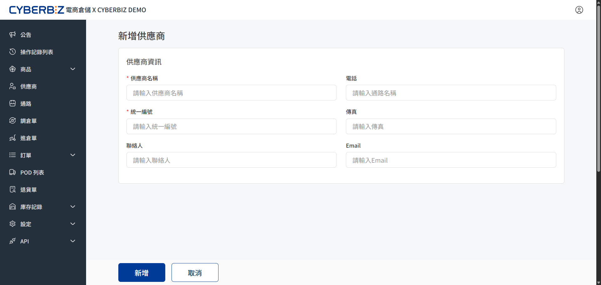
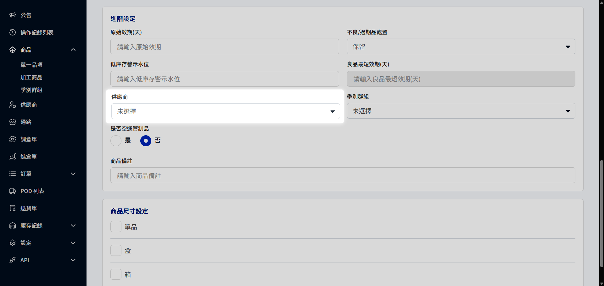

# 供應商
在電商倉儲中建立供應商資料，能讓商家更清晰地管理貨物來源。透過將商品與供應商綁定，在後續建立進倉單或進行庫存盤點時，系統能自動對接廠商資訊。
{ .subtitle }

{ .hero-page }

!!! tip "應用情境"
    - **進倉來源追蹤**：商家需要區分不同品牌商或代工廠的到貨，以便於進倉驗收。
    - **庫存責任歸屬**：透過綁定供應商，在盤點異常時能快速追溯貨物來源。
    - **進銷存報表分析**：後續可根據供應商維度，分析不同來源的進貨成本與銷速。

## 使用須知

- **唯一性要求**：建議為每位供應商建立唯一的代碼或名稱，避免後續進倉單對接錯誤。

## 操作流程

### 任務一：建立供應商資料

商家可根據配合的工廠、品牌商或貿易商建立基礎資料，作為後續業務往來的識別。

1. 登入電商倉儲後台，前往 **供應商**。
2. 點擊右上角 **新增供應商**（或直接進入新增頁面）。
3. 輸入 **供應商名稱**、**聯繫人**、**電話**、**Email** 與 **地址** 等資訊。
4. 確認資訊無誤後，點擊 **儲存**。
5. 建立完成後，該廠商將顯示在列表頁中。

{ .screenshot }

### 任務二：將商品與供應商綁定

建立供應商後，必須手動將對應的商品與廠商進行關聯，以便系統在進倉時自動對接。

1. 前往 **商品 > 單一品項**，點擊欲設定的 **商品名稱** 進入編輯頁。
2. 在頁面中找到 **供應商** 欄位。
3. 在下拉選單中選擇對應的供應商名稱。
4. 點擊 **儲存** 完成綁定。

{ .screenshot }

### 任務三：編輯與維護廠商資訊

若供應商聯繫資訊異動，需及時更新以防進倉溝通落差。

1. 前往 **供應商**，在列表中選擇欲修改的 **廠商名稱**。
2. 點擊 :lucide-pencil:操作。
3. 修正相關資訊（如電話、地址）後，點擊 **儲存**。
