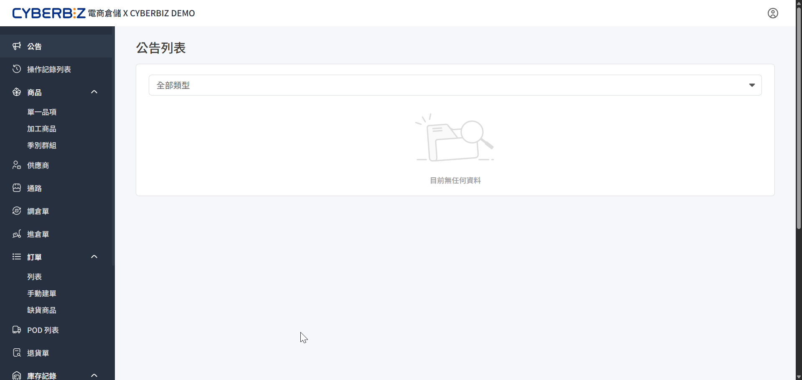

# 公告
即時掌握電商倉儲（WMS）的系統更新進度、倉庫端的重要作業異動，以及系統問題的修復狀況。
{ .subtitle }

{ .hero-page }

## 公告類型說明

系統公告主要分為以下三類，協助商家快速判斷資訊的影響範圍：

- **商家後台系統更新**：涉及 WMS 介面功能優化、新功能上線或操作流程調整。
- **倉庫作業**：涉及實體倉庫端的營運通知，例如：連假收貨調整、盤點日期提醒或重大物流異動。
- **BUG 修復**：記錄系統已知問題的修正進度，提供商家追蹤功能是否回復正常。

## 查看與篩選公告

前往公告列表，依據需求篩選特定類型的公告資訊。

1. 登入 **WMS 管理後台**，前往 **公告**。
2. **篩選公告類型**：在頁面頂部選擇欲查看的類型。
3. **查看詳情**：點擊感興趣的 **公告標題**，系統將展開完整的公告說明與附件。

## 公告提醒機制

為了確保重要資訊不被遺漏，系統設有主動提示機制：

- **首屏蓋板提示**：當有全新的重大公告發布時，商家登入後台後，系統將自動跳出公告視窗並維持 **5 秒鐘** 的蓋板顯示，確保商家第一時間獲取資訊。
