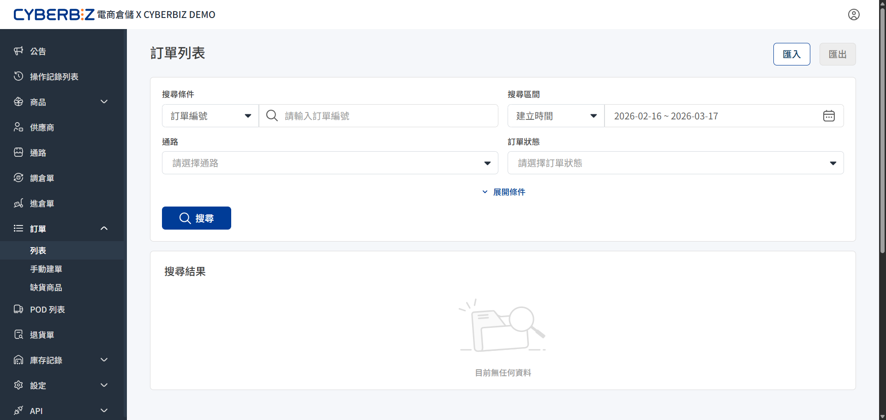

# 列表
電商倉儲（WMS）的訂單列表是商家管理出貨進度與庫存調度的核心介面，讓商家掌握每一筆訂單在倉庫內的作業階段。
{ .subtitle }

{ .hero-page }

## 訂單列表介面

進入 **訂單 > 列表**，查看所有匯入至電商倉儲系統的訂單。介面提供多維度的篩選功能，協助快速定位特定訂單。

### 篩選功能

您可利用多樣化的篩選維度，精確鎖定需要處理的訂單對象：

- **基礎屬性搜尋**：
    - **搜尋條件**：支援透過 **訂單編號**、**收件人姓名**、**手機** 等關鍵資訊直接檢索。
    - **搜尋區間**：可依 **建立時間** 或 **付款時間** 設定日期範圍。
- **訂單階段維度**：
    - **訂單狀態**：依據作業階段篩選（如：待處理、作業中、已完成）。
    - **貨品/出貨狀態**：區分貨物準備情形與物流配送進度。
- **來源與分流控制**：
    - **通路**：篩選來自品牌官網或其他整合通路（匯入）的訂單。
    - **物流狀態**：追蹤包裹目前在物流端（如：已發貨、配送中）的實際位置。
- **優先權管理**：
    - **急件狀態**：快速篩選標註為優先處理或特殊急單的物件，確保時效。

## 訂單狀態定義

訂單狀態反映了訂單在 WMS 系統與實體倉庫間的連動關係，主要分為以下階段：

| 狀態名稱 | 系統定義與說明 | 可否修改訂單 | 
| :--- | :--- | :--- | 
| **待處理** | 訂單已匯入系統，但 **尚未轉出** 至倉庫作業 | ✓ |
| **作業中** | 訂單已轉發至倉庫進行揀貨、包裝 | ✕ | 
| **已出貨** | 倉庫已完成作業，包裹已交由物流商攬收或離開倉庫 | ✕ | 
| **已取消** | 訂單已被終止出貨作業 | ✕ | 
| **庫存不足** | 訂單內有品項庫存低於需求數量。需補足倉庫實體庫運後方可自動或手動轉為出貨作業 | ✕ |

當發生退貨申請時，訂單會進入以下狀態：

| 狀態名稱 | 系統定義與說明 |
| :--- | :--- |  
| **待收退貨** | 已申請退貨，物流已派車取件，或消費者寄回中。等待退貨商品回到倉庫 | 
| **退貨已收** | 該筆退貨單中的所有商品皆已抵達倉庫，並完成驗收 | 
| **退貨部分驗收** | 僅部分退貨商品抵達倉庫並完成驗收 | 

## 資料匯入與匯出

### 1. 訂單匯入

若有非官網串接通路的訂單需由倉庫出貨，使用匯入功能。

- **操作路徑**：點選列表右方的 **匯入** 按鈕。
- **必要步驟**：
    1. **下載範本**：務必按系統提供的 Excel 格式填寫訂單資訊。
    2. **上傳附件**（選填）：如需隨貨附上採購單、銷貨單、入庫通知單、嘜頭檔案，或出貨時須提供給收件人的文件，可在此上傳。
    3. **執行匯入**：完成上傳後點擊匯入，系統將產生匯入紀錄。

### 2. 報表匯出

將篩選後的訂單資料匯出為報表，用於對帳或數據分析。

- **操作方式**：設定篩選條件後，點擊頁面右方的 **匯出** 下載 Excel 報表。
