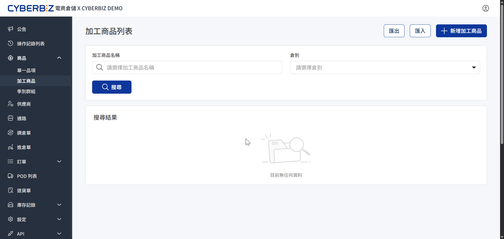
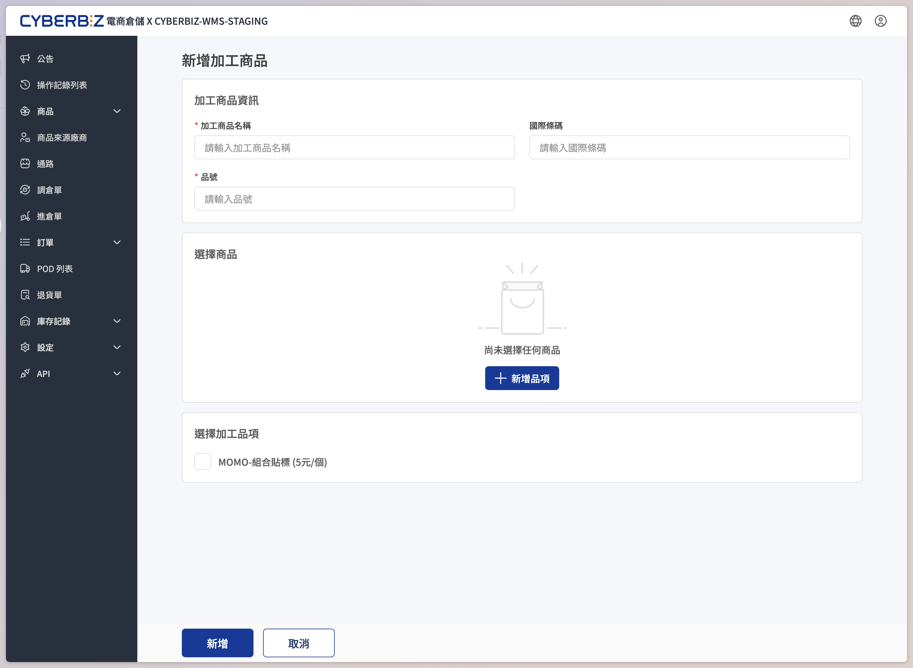
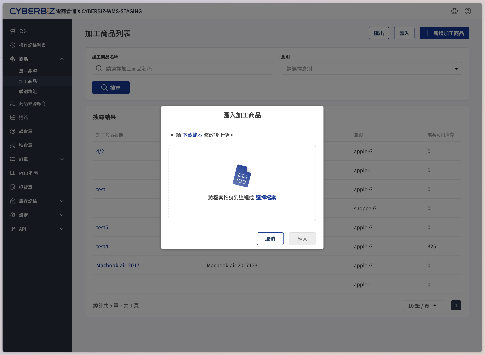
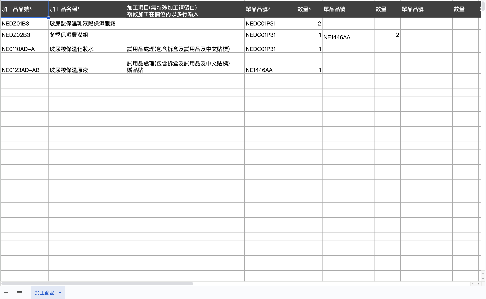

# 加工商品
「加工商品」即為電商官網常見的「組合商品」。商家將多個單一品項綁定為一個新的銷售單位，當訂單成立時，系統將自動扣除各個子品項的庫存。
{ .subtitle }

{ .hero-page }

## 使用須知

- **CYBERBIZ 官網庫存連動**：若您的倉儲系統已串接 CYBERBIZ 官網 (EC)，請務必遵循以下對接規範：
    - **建立順序**：於 WMS 倉儲系統完成 **加工品** 建立後，需同步至官網後台 [建立對應商品]()。
    - **關鍵對照**：官網商品的 **商品 SKU** 必須與 WMS 的 **品號** 完全一致。
    - **自動同步**：資訊對應成功後，系統將啟動自動化邏輯，確保兩端庫存即時同步。
- **組合庫存邏輯**
    - **公式**：加工商品的可用庫存量 = **所有子品項中「可販售數量」的最小值**。
    - **範例**：組合商品 A+B。子品項 A 庫存 100 件，子品項 B 庫存 80 件。
    - **結果**：組合商品的最大可售數量為 80 組。
    - **連動**：若子品項 B 售出 30 件（不論是單賣或經由其他組合），則此組合商品庫存將自動降為 50 組。

## 申請與前置準備

由於加工商品涉及倉庫的人力組裝作業，在系統設定前請務必完成以下行政流程：

1. **諮詢與報價**：聯繫專屬業務或倉庫行政人員，說明加工需求（如：封膜、貼標、入盒），倉庫端會計算加工費率並報價。
2. **建立加工項**：倉庫端會根據報價在系統中建立對應的 **加工項**。**商家須等倉庫完成此設定後，才能在後台選取對應項目。**
3. **單品建檔**：確保所有要組合成加工品的 **子品項** 都已在 **商品 > 單一品項** 中 [完成建檔](單一品項/#新增單一品項)。

## 手動建立加工商品

完成前置準備後，即可在 WMS 後台將單品「綁定」為加工品。

1. 前往 **商品 > 加工商品**。
2. 點擊右上角 **新增加工商品**。
3. 填寫基本資訊：
    - **名稱**：輸入組合商品的名稱。
    - **國際條碼**：若組合後有新的外箱條碼則填寫（選填）。
    - **品號 (必填)**：若倉儲系統串接 CYEBRBIZ 官網，請輸入與官網（EC）後台對應的 **商品 SKU 碼**。
4. **增加品項**：
    - 點擊 **新增品項** 按鈕。
    - 透過關鍵字或 SKU 搜尋並選擇子品項。
    - 輸入該組合中包含的 **數量**。
5. **增加加工項**：在下拉選單中選擇倉庫預先建立好的加工服務項目。
6. 點擊 **新增** 完成。

{ .screenshot }

## 批次匯入加工商品

若有大量組合品需求，可使用 Excel 批次作業。

1. 前往 **商品 > 加工商品**，點擊右上角 **匯入**。
2. 點擊 **下載範本**。
    { .screenshot }
3. 依範本格式填寫 **加工品品號**、**加工項**、**子品項 SKU** 與 **數量**。
    { .screenshot }
4. 上傳檔案並點擊 **開始匯入**。

!!! warning "匯入注意事項"
    匯入過程中 **請勿重新整理或離開頁面**。請靜候進度條完成至 100%，否則可能導致資料毀損或匯入結果不完整。

## 後續操作

- :lucide-chart-bar-increasing:{ .lg }   
  [__如何在庫存總表中核對數據__](單一品項/#匯出商品報表)     
  下載「商品庫存總表」，確保帳物一致。

- :lucide-square-chart-gantt:{ .lg }   
  [__單一品項管理__](單一品項.md)     
  新增個別商品至 WMS 系統，並完成基本屬性設定。

- :lucide-barcode:{ .lg }   
  [__EC 官網商品 SKU 設定指引__](連結)     
  查詢並設定 EC 官網 SKU，確保與 WMS 品號成功同步。

