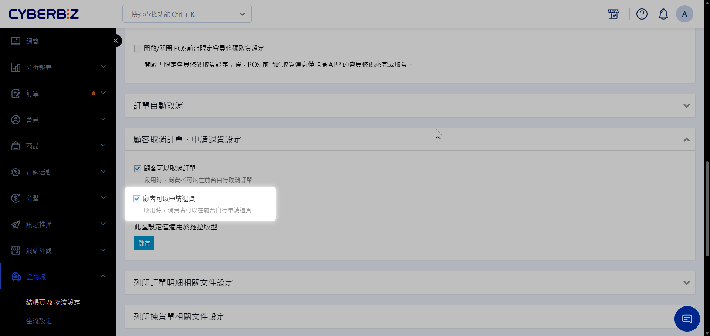

# 商家自行驗收退貨
電商倉儲的商家希望自行處理退貨包裹（不退回總倉），可引導消費者將商品寄至指定地址。由商家自行驗收後，再於官網後台執行退貨退款指令。
{ .subtitle }

## 使用情境

若退貨商品需特殊處理（如：維修、二次加工、由商家親自鑑定品況）或商家希望節省倉儲驗收處理費，適合採用此「自行驗收」模式。

## 準備工作：關閉自動退貨功能

為了避免系統自動產生 WMS 退貨單或預設物流路徑，商家需先手動控制退貨申請。

1. 登入電商官網，前往 **金物流 > 結帳頁&物流設定**。
2. 進入 **訂單相關設定 > 顧客取消訂單、申請退貨設定**。
3. 關閉 **顧客可以申請退貨** 功能。

{ .screenshot }

## 驗收與退款作業

1. 由商家主動提供退貨地址與寄送方式給消費者。
2. 商家收到包裹並完成實體驗收後，請至訂單列表執行以下操作。

    - [執行退貨審查](../ec/orders/訂單退貨流程/#步驟-2執行退貨審查)
    - [執行退款流程](../ec/orders/訂單退款流程.md)

!!! info "退貨物流自主管理"
    若您選擇自行驗收退貨，須自行聯繫物流商並安排退貨收件，**恕不支援透過 CYBERBIZ 平台建立逆物流**。

## 後續操作

- :lucide-chart-bar-increasing:{ .lg }   
  [__訂單退貨流程__](../ec/訂單訂單退貨流程.md)     
  了解系統退貨政策、操作須知與相關規則。

- :lucide-square-chart-gantt:{ .lg }   
  [__訂單退款流程__](../ec/訂單退款流程.md)     
  了解退款審核時程、金額計算與帳務處理須知。

