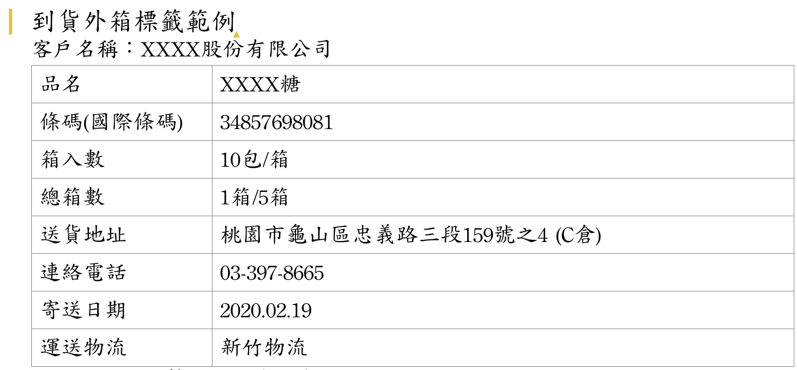
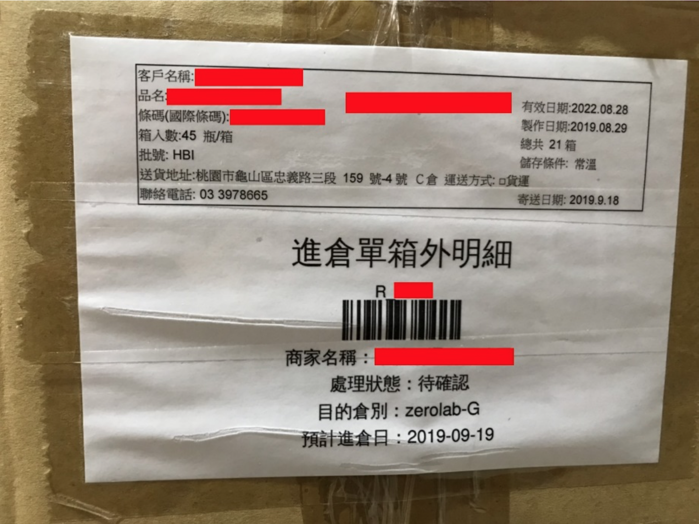

# 商家進倉作業規範
商家商品進入 CYBERBIZ 電商倉儲的標準作業流程與規範，包含預約進倉、驗收標準、包裝條碼規格及現場作業安全守則。
{ .subtitle }

## 進倉預約流程

所有商品入庫前，必須先於 WMS 後台 [建立進倉單](進倉單.md)，並依進貨量提前通知倉庫。

### 1. 預約通知標準

| 進倉類型 | 通知期限 | 說明 |
| :--- | :--- | :--- |
| **一般進倉** | 到貨前 3~5 工作天 |  |
| **急件進倉** | 到貨前 2 工作天 | 需加收急件驗收費用 |
| **大量進倉** (≥300板) | 到貨前 3 個月 | 需提前規劃排程 |

!!! info "進倉通報作業規範"
    - **通知內容**：進倉單號、品項、數量、效期、板數、箱數
    - **通知管道**：請透過該通路的 **Line 群組** 或 E-mail (`honeycomb-admin@cyberbiz.com.tw`) 進行預約。

### 2. 收貨時間限制

- **服務時段**：週一至週五 09:00-12:00 / 13:00-16:00（國定假日暫停）。
- **截止時間**：每日 15:00 前。
    - 15:00-16:00 到貨者，僅供暫存入庫，驗收時間依排程調整。
    

### 3. 特殊情境處理

1. **貨櫃進倉**

    若為貨櫃進倉，CYBERBIZ 電商倉儲將依標準作業流程提供以下紀錄照片，確保貨權交接清晰：

    - **到貨驗證**：未開啟的貨櫃門全景（含車牌號碼）、完整的貨櫃封條（含號碼清單）。
    - **拆櫃過程**：開啟後的櫃內初始狀態、拆櫃作業過程紀錄。
    - **完工確認**：拆解完成後的空櫃照片。

2. **到貨當日系統無進倉單**

    若實體貨物已送達，但系統尚未建立進倉單，依以下規則處理：

    - **首要動作**：商家需立即於系統補建進倉單，倉庫方可執行驗收入庫。
    - **入庫時效**：驗收作業將依現場剩餘人力與排程進行，不保證當日入庫。
    - **急件處理**：若需優先強插排程驗收，將產生 **急件驗收費用**。

## 包裝與棧板規範

### 1. 裝箱

- **零散箱**：未滿箱商品須放置於棧板最上方，並改用 **不同顏色膠帶** 封箱，嚴禁穿插交疊於棧板中。
- **承重防護**：商品外箱須能承受箱內物品的重量，如有外箱破損者，將現場拆箱確認商品狀態。

### 2. 貨品標籤

- **隨貨單據交付**：請於 WMS 後台列印 **進倉單明細** 及 **進倉單箱外明細**，將其放入其中一箱商品內，隨貨進場。
- **外箱標示與黏貼**：
    - **必備標籤**：每箱外箱皆須確實黏貼 **進倉單箱外明細** 與 **外箱標籤**。
    - **黏貼位置**：須朝向外側，嚴禁朝內重疊或遮蔽，確保驗收人員無需翻動貨件即可掃描。
    - **疊放原則**：不同規格（尺寸）的箱體請勿混雜疊放於同一側面，應依規格分類整齊排列。
    - **範本下載與參考**：
        - **進倉單箱外明細**：請至後台[下載進倉單箱外明細](進倉單/#下載與列印進倉文件)。
        - **外箱標籤**：請參考以下範本進行製作列印。
            { .screenshot }
    - **黏貼範例**
        { .screenshot }
- **條碼與標籤規格**：
    - **編碼格式**：必須使用 Code 128 格式
    - **字元限制**：內容字數不得超過 17 位數
    - **列印效果**：必須為白底黑字，確保掃描高對比度
    - **最小尺寸**：不可小於 4cm × 2cm
    - **條碼密度**：單一字元寬度最小需達 0.537 mm

**若不符合以上條碼規格規定，將由 CYBERBIZ 電商倉儲直接加工貼條碼標籤貼，費用另計。**

### 3. 棧板堆疊

- **標準尺寸**：請使用 110cm × 110cm 標準棧板。
- **堆疊限制**：
    - 高度：不超過 150cm (含棧板)。
    - 重量：每板不超過 800KG。
    - 範圍：嚴禁超出棧板邊緣。
- **防護要求**：
    - 必須以收縮膜穩固綑綁，確保運輸過程不傾倒。
    - 綑綁層數須足以承受貨品總重，避免搬運時傾斜。
    - 兩棧板邊緣需保持距離，避免收縮膜互黏導致撕裂。
- **棧板管理**：
    - 交貨棧板採等量交換；若使用破損棧板，倉庫有權拒絕交換。
    - 若無法當場交換，將開立棧板租借單，商家須於三個工作天內等量歸還。

## 進倉驗收與異常處理

### 1. 驗收標準

為確保入庫效率與庫存準確性，倉庫依以下標準執行驗收作業：

- **預設存倉與點收**：
    - **存倉安排**：若商家未事前指定存放方式，將由 CYBERBIZ 電商倉儲依倉位狀況規劃入倉。
    - **點收方式**：預設採單一品項、單一原箱、單一Pcs **抽驗點收**。
        - 若後續揀貨過程中發現開箱短少或損壞異常，將發信通知做後續處理。
    - **費用說明**：不同商品混箱裝載者，驗收費用另計。
- **核對維度**：對照系統進倉單之品項、數量、效期 進行清點。
- **入庫流程**：驗收無誤後，倉庫將黏貼 **商品收貨標籤** 並移至儲位完成上架。
- **特殊需求通報**：若商品有特殊驗收標準，須於進倉前主動提供 SOP 規範，否則一律依倉庫標準作業辦理。

### 2. 異常處置

若驗收過程發現數量不符、效期錯誤、外箱損毀或內容物異常，將啟動以下流程：

1. **異常通報**：倉庫將拍攝異常現場照片，並即時通知商家確認。
2. **限時回覆**：為避免影響整體入庫排程，商家須於 **2 小時內** 回覆處理指令。
3. **逾時處理**：若逾時未收到回覆，倉庫將依據 **標準異常處理規範** 逕行處置。

## 進場作業與安全守則

進倉人員必須遵守現場安全與作業規範，違者倉庫有權拒絕收貨。

### 1. 進場車輛與卸貨

- **車輛要求**：以有尾門或能直接靠碼頭卸貨的車輛為主。
- **卸貨支援**：若需使用堆高機協助，須事先通知倉庫或向倉區主管租借。
- **進場分類**：商品到貨前應 **預先分類分板**。嚴禁於現場進行大規模重新分類作業，以免影響其他商家進貨。

### 2. 現場安全規範

- **行車安全**：車速限制 **20km/h** 內。車輛停靠碼頭完成後必須立即熄火。
- **人員裝備**：嚴禁赤腳、赤裸上身或穿著露趾鞋（如涼鞋、拖鞋）。
- **場地禁令**：嚴禁吸菸（指定吸菸區除外）、嚼食檳榔、飲酒、亂丟垃圾。
- **職業道德**：嚴禁提供倉庫作業人員任何有價物品（如香菸、飲料、檳榔等）。
- **環境維護**：車輛離開後須保持場地乾淨，嚴禁遺留污泥或垃圾。

### 3. 簽收程序

完成交貨或收退貨後，請務必與倉庫作業人員完成簽收手續，以確保權益。

