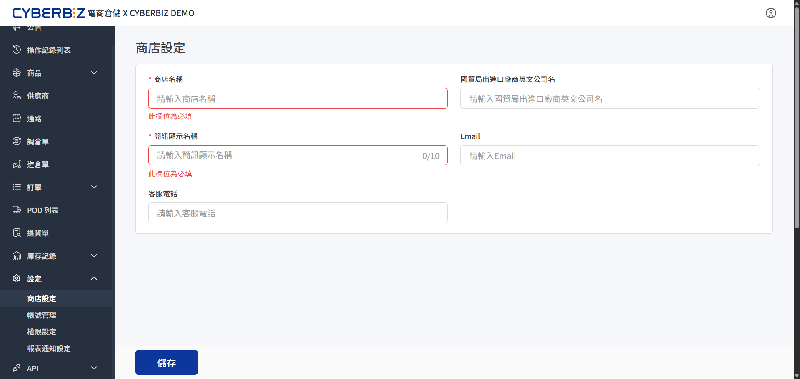

# 商店設定
定義商店的識別名稱、簡訊發送人與聯繫資訊，確保電商倉儲系統的物流與通訊流程具備正確的基礎資料。
{ .subtitle }

{ .hero-page }

!!! tip "應用情境"
    - **初始化設定**：在正式使用電商倉儲系統前，完成商店的基礎識別資料填寫。
    - **變更聯繫資訊**：當商店 Email 或客服電話異動時，即時更新系統記錄。
    - **跨境貿易準備**：填寫國貿局登記之英文公司名，以利報關與國際物流作業。

## 使用須知

- **必填標示**：標有紅星號 `*` 的欄位為系統運作的必要資訊，不可留空。
- **字數限制**：簡訊顯示名稱限制為 **10 個字** 以內。

## 操作流程

1. 登入 CYBERBIZ 電商倉儲管理後台，前往 **設定 > 商店設定**。
2. 根據以下說明填寫各項欄位：

    | 欄位名稱 | 說明 | 必選填 |
    | :--- | :--- | :--- |
    | **商店名稱** | 設定此商店在系統內部的顯示名稱 | 必填 |
    | **簡訊顯示名稱** | 設定發送通知簡訊時，顯示在簡訊開頭的發送人名稱 | 必填 |
    | **國貿局出進口廠商英文公司名** | 填寫於國貿局登記之正式英文公司名稱 | 選填 |
    | **Email** | 商店的主要聯繫電子信箱 | 選填 |
    | **客服電話** | 供相關單位或顧客查詢的聯繫電話 | 選填 |

3. 確認資料無誤後，點擊頁面下方的 **儲存**。

## 常見問題

??? quote "填寫「國貿局英文公司名」有什麼作用？"
    若您的商店涉及跨境進出貨，請填寫此欄。此欄位資訊將帶入對應的物流單或報關文件中，確保文件與政府登記資料一致。

