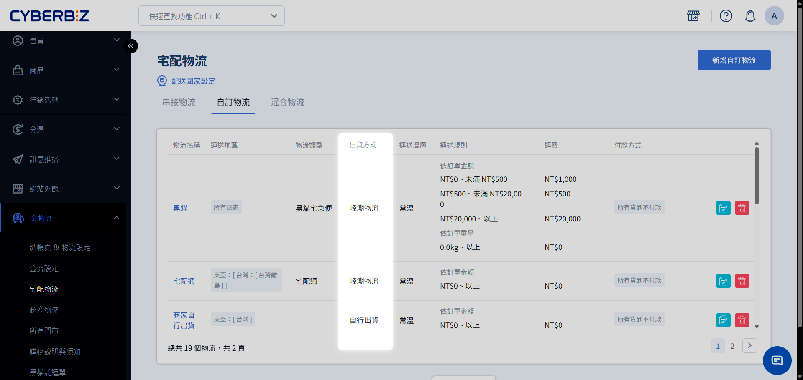
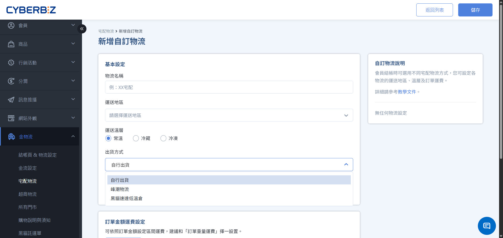
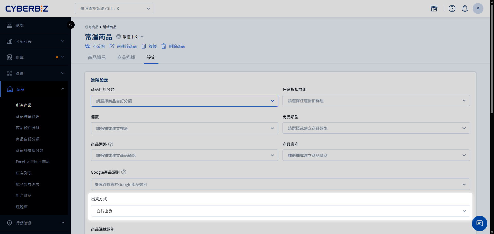
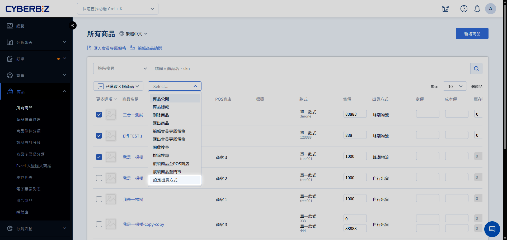
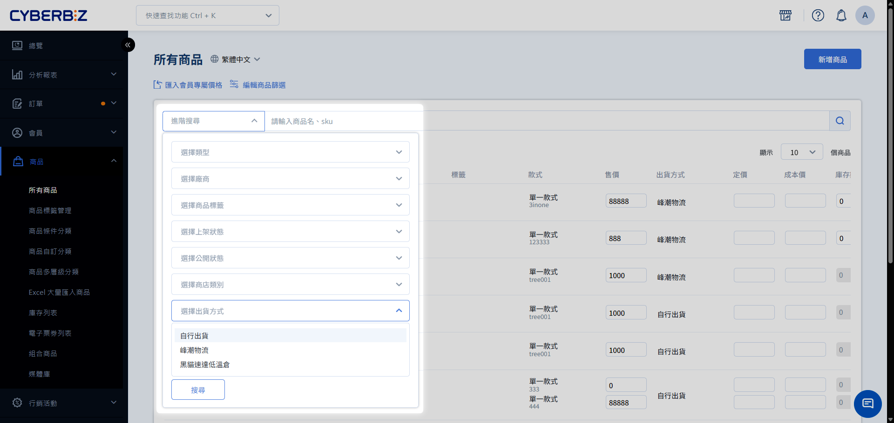

# 啟用部分串倉與拆單
適用於部分商品存放於 CYBERBIZ 倉庫，部分則由商家自行出貨的情境。若顧客同時購買兩類商品，系統將自動將購物車拆分為多筆訂單獨立結帳。
{ .subtitle }

[:lucide-layers:{ title="適用產品" }](../../resources/conventions#適用產品) | 電商官網 / 電商倉儲
[:lucide-tag:{ title="適用方案" }](../../resources/conventions#適用方案) | 高手 / 所有PLUS / 企業
{ .doc-badge }

{ .hero-page }

## 使用須知

- **拆單與混單模式比較**
    - **拆單模式（本篇）**：入倉商品與自出商品 **分開結帳**，產生多筆訂單，運費分別計算。
    - **混單模式**：入倉商品與自出商品 **合併結帳**，產生一筆訂單，運費可合併計算。相關設定請參考 [啟用部分串倉與混單](啟用部分串倉與混單.md)。
- **混單模式限制**
    - **金流限制**：自行出貨訂單 **不支援貨到付款**。

## 啟用設置

### 步驟 1：開通與系統初始化

1. **功能申請**：如需使用此功能，請先洽詢您的開店顧問或客服人員協助開通。
2. **自動配置**：開通當下，系統會自動執行以下變更：
    - 將所有現有的物流運費設定改為 **串倉（倉庫出貨）**。
    - 將所有商品的預設出貨方式改為 **倉庫出貨**。
3. **後續調整**：您必須手動將 **不入倉** 的商品改為 **自行出貨**，方可完成區分。

### 步驟 2：物流選項設定

您必須為 **倉庫出貨** 與 **自行出貨** 分別設定可用的物流選項。

前往 **金物流 > 宅配物流**，進入 **自訂物流** 頁籤。

#### 1. **建立「倉庫出貨」物流**：

1. **新增物流項目**：點擊 **新增自訂物流**。
2. **設定顯示名稱**：於 **物流名稱** 欄位輸入名稱。

    > 此名稱將直接顯示於消費者結帳頁面，建議填寫清晰易懂的名稱，如：倉庫配送。

3. **指定出貨類型**：在 **出貨方式** 下拉選單中，選取 **峰潮物流**。
4. **完善詳細設定**：依序填寫運費規則與適用區域。詳細設定方式可參考 [建立自訂物流]()。

#### 2. **建立「自行出貨」物流**：

1. **新增物流項目**：點擊 **新增自訂物流**。
2. **設定顯示名稱**：於 **物流名稱** 欄位輸入名稱。

    > 此名稱將直接顯示於消費者結帳頁面，建議填寫清晰易懂的名稱，如：商家自行配送。

3. **指定出貨類型**：在 **出貨方式** 下拉選單中，選取 **自行出貨**。
4. **完善詳細設定**：依序填寫運費規則與適用區域。詳細設定方式可參考 [建立自訂物流]()。

{ .screenshot }

### 步驟 3：更改商品出貨方式

將商品指向正確的出貨來源，支援三種操作方式：

=== "單一商品修改"

    1. 登入電商官網後台，前往 **商品 > 所有商品**，點擊欲修改商品。
    2. 在 **設定** 頁籤中，找到 **出貨方式**，選擇適用物流。

    { .screenshot }

=== "批次修改"

    1. 在商品列表勾選多項商品。
    2. 點選 **更多操作 > 設定出貨方式** 進行統一變更。

        !!! warning "限制提醒"
            若商店有開啟 **快速到貨** 或 **POS** 功能，該類商品不得更改出貨方式，批次勾選時請務必排除。
    
    { .screenshot }

=== "Excel 大量匯入"

    1. 在商品列表勾選商品後點選 **更多操作 > 匯出商品**。
    2. 在 Excel 中找到 **出貨方式** 欄位進行修改。
    3. 前往 **商品 > Excel 大量匯入商品**，上傳檔案。

## 出貨與訂單管理

=== "顧客結帳體驗"

    當購物車內同時含 **倉庫出貨** 與 **自行出貨** 商品：

    - **強制拆單**：系統會引導顧客在結帳頁面分別選擇兩筆訂單的配送方式。
    - **運費計算**：依據兩筆訂單各自達成的免運門檻獨立計算。

=== "商家訂單處理"

    1. 前往 **訂單 > 所有訂單**。
    2. **篩選自行出貨訂單**：點擊 **新增篩選條件**，選擇 **配送方式 > [自行出貨物流名稱]**。
    3. **自行出貨單**：勾選訂單，點選 **更多操作 > 列印 XXX 託運單**。
        - 自訂出貨訂單支援 [部分出貨]()。
        - 自訂出貨訂單恕不支援貨到付款。
    4. **倉庫出貨單**：系統會自動將訂單推送至 WMS，商家僅需觀察貨態更新。

### 辨別訂單出貨主體

在訂單列表的 **出貨方式** 欄位中，您可以快速識別該筆訂單的出貨責任方：

- **自行出貨**：全數商品由商家端自行打包寄送。
- **CYBERBIZ 電商倉儲**：全數商品由 CYBERBIZ 倉庫自動接單並執行發貨。

!!! info "找不到 **出貨方式** 欄位？"
    若您的列表中未顯示此資訊，請至 [編輯訂單列表欄位]()，勾選 **出貨方式**。可將其拖曳至前方排序，以便快速辨識訂單處理方。

{ .screenshot }

## 退貨流程與情境

| 訂單類型 | 退貨邏輯 | 處理方式 | 退貨流程 |
| :--- | :--- | :--- | :--- |
| **倉庫出貨單** | 依照 WMS 退貨流程 | 系統預設將包裹退回 **電商倉庫地址** | [倉儲退貨與派車]() |
| **自行出貨單** | 依照標準 EC 退貨流程 | 商家需自行[派逆物流](..\ec\orders\訂單退貨流程\#步驟-1啟動退貨與安排逆物流)或由顧客寄回 **商家指定地址** | [訂單退貨流程](..\ec\orders\訂單退貨流程.md) | 

## 常見問題

??? quote "自行出貨商品的庫存會同步倉庫嗎？"
    不會。只有出貨方式設定為 **倉庫出貨** 的商品，且 SKU 與倉庫對應一致時，庫存才會自動同步。

??? quote "如何快速篩選出由「商家自行出貨」的商品？"
    您可以前往 **商品管理 > 所有商品**，點擊 **進階搜尋**，在 **出貨方式** 篩選條件中勾選您設定的 **[自行出貨物流名稱]**，即可精確列出關聯商品。

    { .screenshot }
