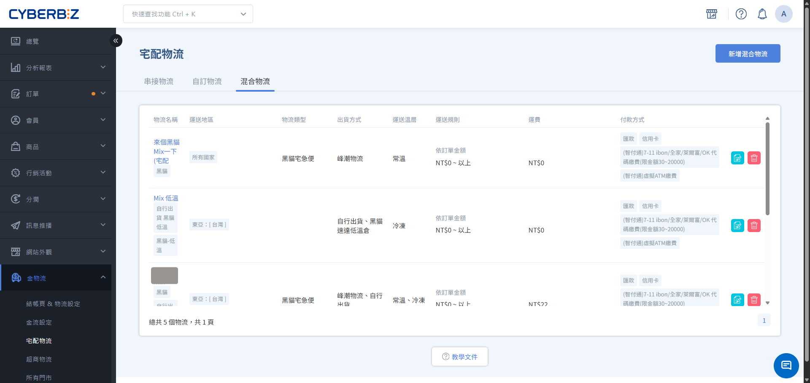
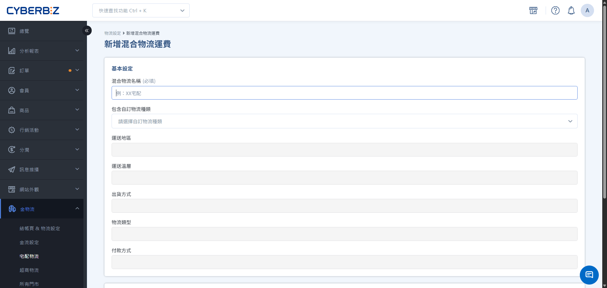
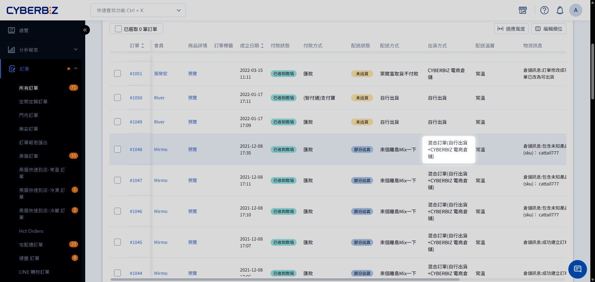

# 啟用部分串倉與混單
顧客將「入倉商品」與「不入倉商品」加入同一個購物車，並透過「混合物流」在同一筆訂單中合併結帳。
{ .subtitle }

[:lucide-layers:{ title="適用產品" }](../../resources/conventions#適用產品) | 電商官網 / 電商倉儲
[:lucide-tag:{ title="適用方案" }](../../resources/conventions#適用方案) | 高手 / 所有PLUS / 企業
{ .doc-badge }

{ .hero-page }

## 使用須知

- **拆單與混單模式比較**
    - **拆單模式**：入倉商品與自出商品 **分開結帳**，產生多筆訂單，運費分別計算。相關設定請參考 [啟用部分串倉與拆單](啟用部分串倉與拆單.md)。
    - **混單模式（本篇）**：入倉商品與自出商品 **合併結帳**，產生一筆訂單，運費可合併計算。
- **混單模式限制**
    - **物流限制**：混合訂單 **不支援超商取貨**（結帳頁將自動隱藏超取選項）。
    - **金流限制**：混合訂單 **不支援串接宅配貨到付款**。

## 啟用設置

### 步驟 1：開通與系統初始化

1. **功能申請**：如需使用此功能，請先洽詢您的開店顧問或客服人員協助開通。
2. **自動配置**：開通當下，系統會自動執行以下變更：
    - 將所有現有的物流運費設定改為 **串倉（倉庫出貨）**。
    - 將所有商品的預設出貨方式改為 **倉庫出貨**。
3. **自訂物流準備**：請先至 **金物流 > 宅配物流 > 自訂物流**，完成 [物流選項設定](啟用部分串倉與拆單/#步驟-2物流選項設定)。
4. [更改商品出貨方式](啟用部分串倉與拆單/#步驟-3更改商品出貨方式)：將自行出貨商品綁定 **自行出貨** 的物流選項。

### 步驟 2：設定混合物流

混合物流的作用是定義 **當訂單同時含入倉與自出商品時** 應套用的規則。

1. 前往 **金物流 > 宅配物流 > 混合物流**。
2. 點擊 **新增混和物流**。
3. **設定關鍵項目**：
    - **物流名稱**：此名稱將直接顯示於消費者結帳頁面，建議填寫清晰易懂的名稱，如：倉庫配送。
    - **選擇自訂物流**：選擇要套用混單模式的物流選項。
4. **系統自動比對**：
    - 系統會自動比對 **自訂物流** 與 **倉庫出貨** 的設定，取其 **交集** ，判斷混合物流支援的 **運送地區**、**出貨方式**、**物流類型**、**付款方式**。
    - 若無交集（例如地區或付款方式完全不重疊），則無法儲存。
    - **溫層**：系統會取兩者的 **聯集**（例如一為常溫、一為冷凍，則混單可支援兩溫層商品）。
5. **訂單運費設定**：可依 **金額** 或 **重量** 設定運費。

!!! tip "最佳實踐：建立全域物流組合"
    若購物車組合不符合任何已設定的 **混合物流**，系統將退回 **拆單模式** 進行結帳。若要全站商品能混單結障，建議設定一組 **囊括所有自訂物流** 的混合物流，以確保混單成功。

{ .screenshot }

## 出貨與訂單管理

=== "顧客結帳體驗"

    當購物車內同時含 **倉庫出貨** 與 **自行出貨** 商品：

    - **直接結帳**：顧客在單一結帳頁面即可完成下單。
    - **運費計算**：依據訂單總額合併計算免運門檻。

=== "商家訂單處理"

    1. 前往 **訂單 > 所有訂單**。
    2. **篩選自行出貨訂單**：點擊 **新增篩選條件**，選擇 **配送方式 > [混合物流名稱]**。
    3. **自行出貨單**：勾選訂單，點選 **更多操作 > 列印 XXX 託運單**。
        - 自訂出貨訂單支援 [部分出貨]()。
        - 自訂出貨訂單恕不支援貨到付款。
    4. **倉庫出貨單**：系統會自動將訂單推送至 WMS，商家僅需觀察貨態更新。

### 辨別訂單出貨主體

在訂單列表的 **出貨方式** 欄位中，您可以快速識別該筆訂單的出貨責任方：

- **混合訂單 (自行出貨 + [倉庫名])**：訂單內同時包含 **商家自出商品** 與 **倉儲代發商品**，需由雙方分別作業。
- **自行出貨**：全數商品由商家端自行打包寄送。
- **CYBERBIZ 電商倉儲**：全數商品由 CYBERBIZ 倉庫自動接單並執行發貨。

!!! info "找不到 **出貨方式** 欄位？"
    若您的列表中未顯示此資訊，請至 [編輯訂單列表欄位]()，勾選 **出貨方式**。可將其拖曳至前方排序，以便快速辨識訂單處理方。

{ .screenshot }

### 混合訂單的配送狀態演變

由於混合訂單具備雙出貨方，其配送狀態將依據雙方的 **作業完成度** 進行聯動更新：

| 配送狀態 | 觸發條件 | 說明 | 
| ------- | -------- | --- |
| **部分出貨** | 任一方完成出貨 | 當商家已寄出或倉庫已發貨（其中之一完成）時，訂單即轉為此狀態 |
| **已出貨** | 雙方皆完成出貨 | 兩方貨件均已交給物流商，正式離開出貨端 |
| **已收貨** | 雙方貨態皆更新為已收貨 | 兩方貨件皆已交付消費者 | 

## 退貨流程與情境

### 退貨規範

- **退貨方式**：依照 EC [訂單退貨流程](..\ec\orders\訂單退貨流程.md)。
- **統一窗口**：不論是倉庫商品或自出商品，混合訂單的退貨包裹預設皆寄回 **商家指定地址**。
- **倉庫商品回倉**：若商家收到倉庫商品後欲退回 WMS 倉庫，需手動於 WMS 後台[建立退貨單（逆物流）]()。

### 退貨情境限制

| 訂單狀態 | 能否操作退貨 | 說明 |
| :--- | :--- | :--- | 
| **部分出貨** | **否** | 混合訂單退貨統一退回商家，為避免部分出貨導致退款金額與貨態計算異常，系統禁止此狀態下操作退貨 |
| **已出貨** | **商家可 顧客否** | 僅限商家手動操作，前台顧客暫無法申請 |
| **已收貨** | **皆可** | 商家與顧客皆可正常操作 |

## 常見問題

??? quote "建立混合物流後，可以修改其中的自訂物流嗎？"
    不行。若修改自訂物流，可能導致與倉庫設定不再有交集，混合物流會無法使用。請先到混合物流 **取消綁定自訂物流**，調整完自訂物流後再重新綁定。

??? quote "為什麼結帳頁面突然拆分購物車？"
    這代表目前的商品組合（倉庫出貨 vs 自行出貨）找不到任何符合的 **混合物流** 選項（例如付款方式不匹配），系統會自動啟動保底的 **拆單模式**。

## 更多操作

- :lucide-hand-helping:{ .lg }   
  [__開放會員於前台申請退貨__](..\ec\orders\開啟會員退貨申請功能.md)     
  若開放消費者提出退貨申請，請同步開啟前台申請退貨功能。

