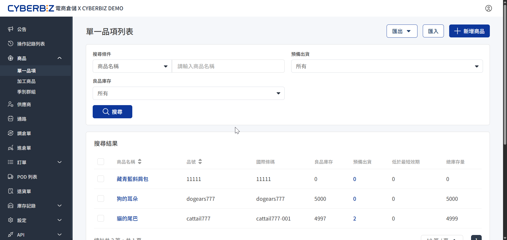
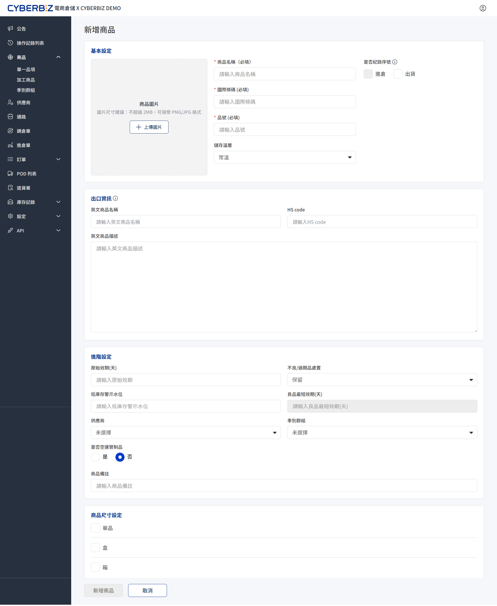
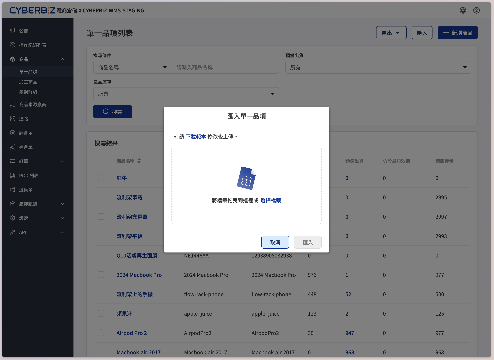
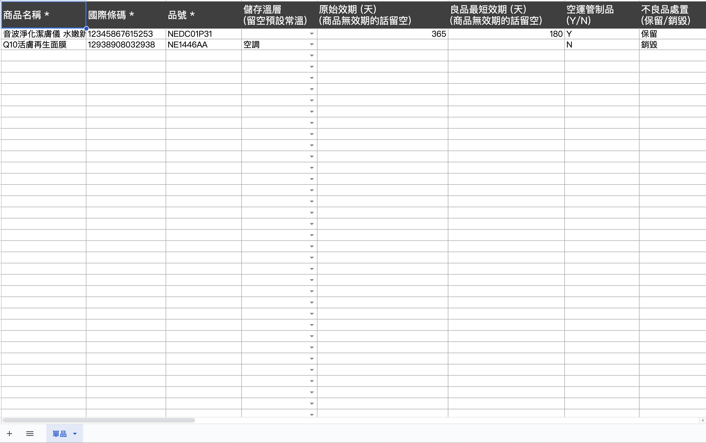

# 單一品項
在電商倉儲中建立與管理單一品項，包含新增商品資訊、批次匯入、設定供應商以及匯出庫存報表。
{ .subtitle }

{ .hero-page }

## 使用須知

- **條碼必要性**：實體商品外包裝必須備有國際條碼。若商品無條碼，商家須自行定義條碼並張貼於包裝上。

## 新增單一品項

新商品入倉前，須在 WMS 後台建立品項資訊。

1. 前往 **商品 > 單一品項**。

2. 點擊右上角 **新增商品**。

3. **基本設定**：
    - **商品名稱 (必填)**：建議與官網名稱一致。
    - **國際條碼 (必填)**：輸入商品包裝上的條碼（須為英數、無符號）。
    - **品號 (必填)**：輸入商品的唯一識別編碼。

        !!! info "官網串倉設定指引"
            若您的倉儲系統連動 CYBERBIZ 官網，此欄位需與電商官網後台的 **商品 SKU 碼** 相同。
            您可登入電商官網後台，前往 **商品 > 所有商品**，進入商品明細頁，即可於規格資訊中查看對應的 SKU 碼。

    - **儲存溫層**：選擇商品存放的環境溫度。
    - **是否記錄序號**：當要求 **進倉簽收** 與 **出貨掃描** 均須嚴格紀錄單一序號以供後續追蹤時，建議開啟。

        > 若商品屬於高價值品類（如：大型家電、電腦、手機等），此功能可協助您追蹤每一件商品的流向。

    - **商品圖片**：上傳實體照片，降低現場作業錯誤率。

4. **出口資訊**：若商品可能寄送至海外，則須填寫。

5. **進階設定**：
      - **原始效期**：輸入有效天數（如三年為 1095 天）。
      - **不良/過期品處置**：選擇商品失效後的系統行為（保留或銷毀）。
      - **低庫存警示水位**：設定門檻值，低於此量時系統會每日發送每日提醒信件。
      - **良品最短效期**：設定可容許配送的最短剩餘效期，利於即期品規劃。
      - **空運管管制制品**：若含電池、噴霧等，務必勾選以符合物流規範。
      - **供應商**：可指定商品供應商。若需新增供應商，請前往 **供應商** [建立廠商資訊](供應商.md)。
      - **季別群組**：可指定季別群組。若需新增季別群組，請前往 **季別群組** [建立群組](季別群組.md)。

6. **商品尺寸設定**：
      - **商品尺寸**：設定單品、盒裝或箱裝，協助倉庫作業人員辨識。  

7. 點擊 **新增商品** 完成。

!!! warning "食品與美妝類規範"
    依據法規，食品與美妝品必須嚴格控管效期。商品外包裝務必附上完整的中文標示與到期日，且系統中的 **原始效期** 必須大於 **良品最短效期**。

{ .screenshot }

## 查詢商品庫存資訊

建立品項後，可於 **商品庫存列表** 查看即時庫存狀態。

- **批號管理**：若需精確控管製造批次，可在此查看各批次的入庫詳情。
- **關鍵數據說明**：
    - **可用出貨量**：實體總庫存扣除 **瑕疵品** 與 **預備出貨（訂單已配貨）** 後的淨值。
    - **預備出貨量**：已被訂單鎖定但尚未實體離開倉庫的數量。
    - **已出貨**：該商品自入倉以來累計的總出貨數。

## 批次匯入品項

若商品數量眾多，使用 Excel 批次作業。

1. 前往 **商品 > 單一品項**，點擊右上角 **匯入**。
    { .screenshot }
2. 點擊 **下載範本**，取得標準 Excel 格式。
    { .screenshot }
3. 完成資料編輯。
4. 點選 **匯入**，上傳檔案。

!!! warning "匯入注意事項"
    匯入過程中 **請勿重新整理或離開頁面**，請靜候進度條完成，否則可能導致資料不完整或匯入結果回報失敗。

## 匯出商品報表

定期匯出總表進行庫存盤點與資料更新。

1. 前往 **商品 > 單一品項**，點擊右上角 **匯出**。
2. 選擇匯出類型：
    - **商品資訊總表**：包含商品基本主檔資訊。可用於修改內容後，批次匯入來更新現有品項。
    - **商品庫存總表**：包含倉庫內的即時總庫存與預備出貨量，供商家核對帳務。

## 常見問題

??? quote "我可以批次編輯品項資訊嗎？"
    可以。請先點擊 **匯出** 下載 **商品資訊總表**，於 Excel 編輯完成後，再透過 **匯入** 功能上傳檔案，系統即可自動完成批次更新。
