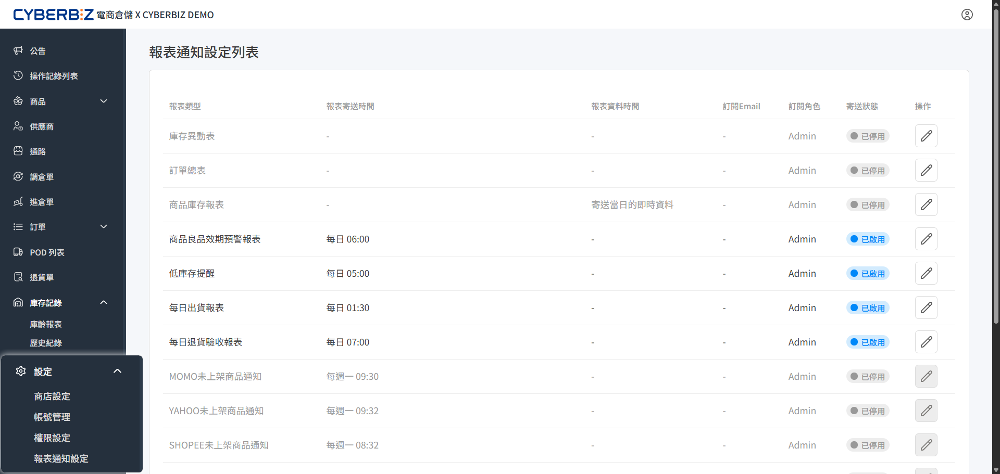
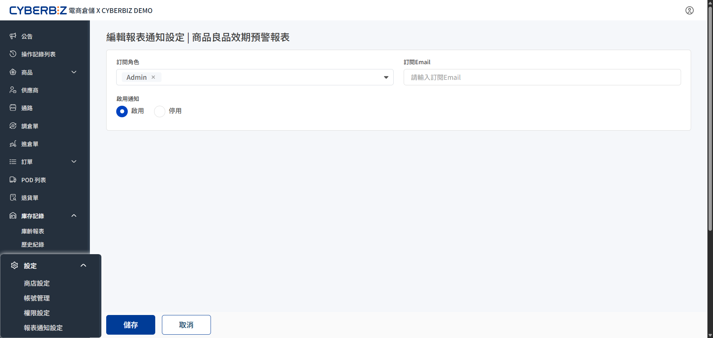
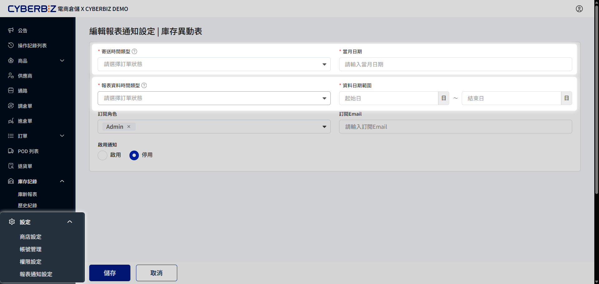

# 報表通知設定
重要的營運數據與庫存警示主動送達指定信箱。商家無需每日登入後台手動匯出，相關人員即可掌握關鍵資訊。
{ .subtitle }

{ .hero-page }

!!! tip "自動化的核心優勢"
    - **主動送達**：關鍵數據定時發送至信箱，縮短決策路徑。
    - **資訊分流**：可依據角色權限或外部信箱，將報表精準發送給相關負責人。
    - **預防過載**：靈活調整各類報表的啟用狀態，過濾非必要資訊。

## 查看報表通知列表

透過報表通知列表頁，檢視系統中所有可供訂閱的報表項目及其目前的啟用狀態。

1. 前往 **設定 > 報表通知設定**。
2. 查看列表資訊：
    - **報表名稱**：如訂單總表、庫存異動表、商品庫存報表等。
    - **訂閱狀態**：顯示目前是否已啟用自動發送。
3. 點擊操作欄位 :lucide-pencil: **編輯** 進入詳細配置。

## 設定一般報表通知

一般報表提供基礎的訂閱配置，主要用於管理接收對象與啟用狀態。

1. **訂閱角色**：勾選後台的使用者角色（如管理者、物流人員）。系統將通知發送至擁有該角色的帳號信箱。
2. **訂閱 Email**：手動輸入額外的電子郵件地址。適用於不需登入後台但需同步掌握數據的外部人員。
3. **啟用通知**：切換開關。
    - **注意**：一般報表預設為 **開啟** 狀態。

{ .screenshot }

## 設定進階報表通知

進階報表（如：庫存異動表、訂單總表、商品庫存報表）提供高彈性的發送排程與資料篩選邏輯。

!!! info "進階報表預設規範"
    與一般報表不同，進階報表預設為 **關閉** 狀態，商家須手動配置後方可啟用。

### 1. 配置寄送時間

設定報表於每月的指定日期或週期發送：

- **寄送時間類型**：選擇發送排程的基準，可選 **當月日期** 或 **倒數工作日**。
- **當月日期**：設定數值 X，系統於每月 X 號固定發送報表。
- **倒數工作日**：設定數值 X，系統於每月倒數第 X 個工作日發送報表。

### 2. 配置資料範圍

於 **報表資料時間類型** 中設定報表檔案內應包含的資料時段：

- **當月**：設定 **資料日期範圍** 為 X 日至 Y 日，報表涵蓋該月指定區稱的數據。
- **跨月份**：設定 **資料日期範圍** 為 X 日至隔月 Y 日，報表涵蓋從當月 X 日到隔月 Y 日的連續數據。

{ .screenshot }

## 小提醒

- **角色權限**：若透過 **訂閱角色** 發送，請確保該角色的帳號已在系統中設定正確的電子郵件位址。
- **發送失敗排除**：若長期未收到報表，請先檢查垃圾信箱，或確認信箱空間是否已滿。

