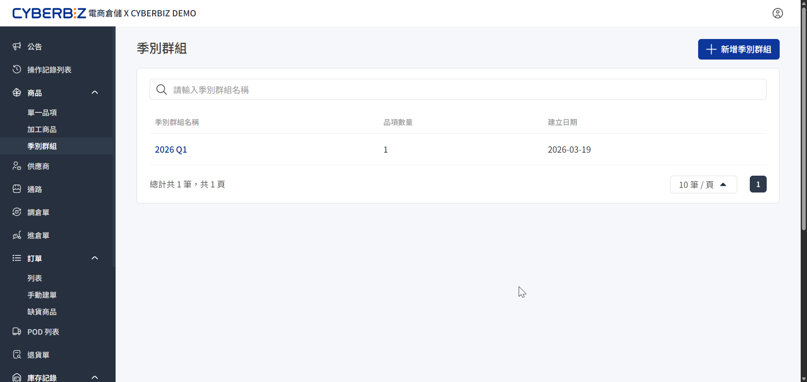
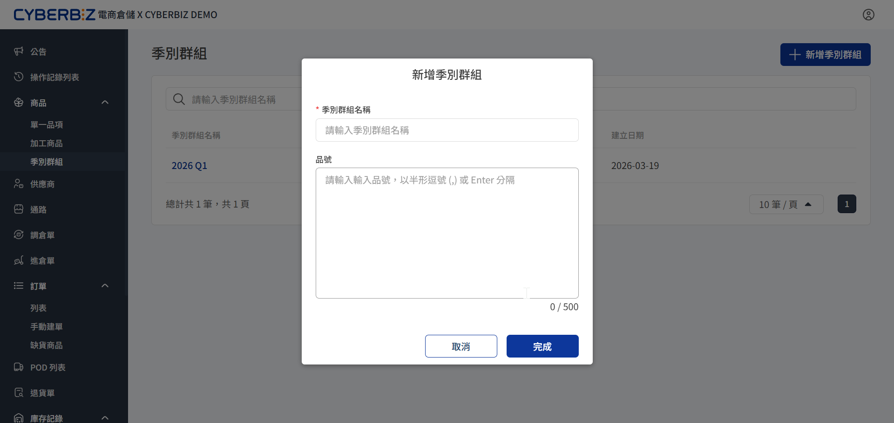
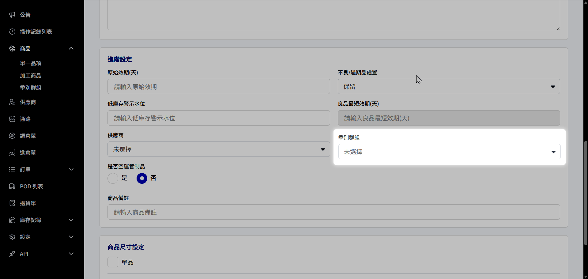
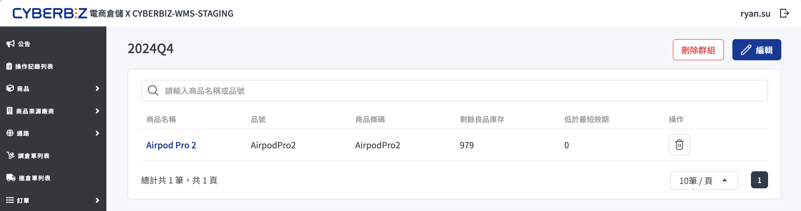

# 季別群組
指引商家如何在電商倉儲中建立與管理「季別群組」，將同屬性或同銷售波段的商品進行歸類，優化「庫齡報表」的監控效率。
{ .subtitle }

{ .hero-page }

## 使用情境

- **精準監控**：在庫齡報表中依 **季別** 維度篩選，快速識別哪些波段的商品已囤積過久。

## 建立季別群組

1. 前往 **商品 > 季別群組**。
2. 點擊右上角 **新增季別群組**。
3. 輸入群組名稱（例：2026 春夏新款、聖誕節限定款）。
4. 輸入欲歸屬該季別的商品品號，系統將自動進行商品綁定。
5. 點擊 **完成** 存檔。

{ .screenshot }

## 將商品加入季別群組

建立群組後，透過單一品項列表將商品批次加入。

1. 前往 **商品 > 單一品項**。
2. 點選欲加入群組的商品。
3. 於 **季別群組** 欄位選擇對應的群組名稱。
5. 點擊 **儲存** 完成指派。

{ .screenshot }

## 管理與維護群組

商家隨時調整群組結構或移除不合適的商品。

- **編輯/刪除群組**：在 **季別群組** 明細頁面，點擊群組旁的 **編輯** 修改名稱，或點擊 **刪除** 移除整個群組（不會影響實體商品）。
- **移除商品**：在群組明細中，將特定商品從該群組中移除。
- **資料檢視**：前往 **庫存紀錄 > [庫齡報表](庫存紀錄/#庫齡報表分析週轉健康度)**，即可看到已設定的季別資訊出現在對應的欄位中。

{ .screenshot }

## 後續操作

- :lucide-file-chart-pie:{ .lg }   
  [__查看庫存分析報表數據__](庫存紀錄)     
  了解庫存周轉情況與歷史異動紀錄。

