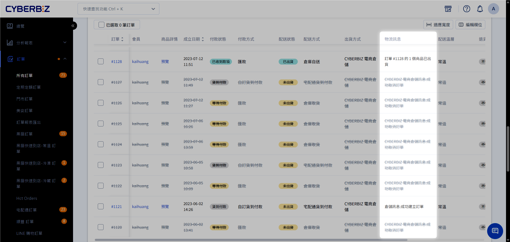

# 官網與倉儲同步規則
了解官網（EC）與電商倉儲（WMS）間的庫存同步邏輯、訂單拋轉機制以及出貨的基本規則，確保訂單能順利履行。
{ .subtitle }

## 庫存同步規則

系統會在多個關鍵時間點執行庫存比對，確保官網顯示的可銷售數量與倉庫實體庫存同步。

### 同步觸發時間點

1. **消費者結帳**：當顧客在官網點擊結帳時，系統會即時核對庫存。
2. **SKU 更新**：在官網後台修改商品 SKU 資訊時。
3. **倉儲進出貨**：WMS 端完成 **進倉單** 或 **調倉單** 作業後。
4. **自動定時同步**：系統於每日凌晨 **03:30** 執行全量庫存自動對帳。

!!! tip "核心串接前提"
    - **SKU 唯一性**：所有商品（含各款式規格）必須填寫 **商品 SKU**。系統透過 SKU 作為唯一識別碼來比對兩端的庫存。
  

## 訂單拋轉規則

當官網產生訂單且品項具備有效 SKU 時，系統將依據以下規則將訂單傳送（拋轉）至 WMS。

### 拋轉時間與機制

- **即時拋轉**：訂單成立後（不論付款狀態），系統會立即嘗試將資訊傳送至 WMS。
- **自動補拋**：系統於每日凌晨 **00:40** 自動抓取當日因網路或數據異常而「拋轉失敗」的訂單，重新執行拋轉。
- **手動觸發**：商家可於訂單列表對特定訂單點擊 **準備出貨**，強制執行拋轉動作。

### 拋轉優先順序

若多筆訂單同時成立，系統將依據以下邏輯處理：

1. **已付款訂單**：優先拋轉信用卡、轉帳已確認等已完成付款的訂單。
2. **貨到付款訂單**：待已付款訂單處理完畢後，依訂單成立時間排序拋轉。

## 出貨執行規則

倉庫（WMS）在接收到訂單後，需同時符合以下條件才會正式啟動揀貨與出貨流程：

1. **WMS 建單成功**：訂單已順利匯入倉儲系統。
    - 可前往電商官網後台 **訂單 > 所有訂單**，於 **物流訊息** 欄位查看倉儲訊息。
    { .screenshot }
    
2. **付款狀態確認**：非貨到付款訂單需為 **已付款** 狀態。
3. **庫存充足**：該 SKU 在 WMS 端的可用庫存大於或等於訂單數量。

## 注意事項

- **超賣預防**：雖然系統有多重同步機制，但在極短時間內的高併發下單（如快閃活動）仍建議參考 [設定商品(現貨、限量、預購)](設定商品(現貨、限量、預購).md) 進行細緻化庫存管理。
