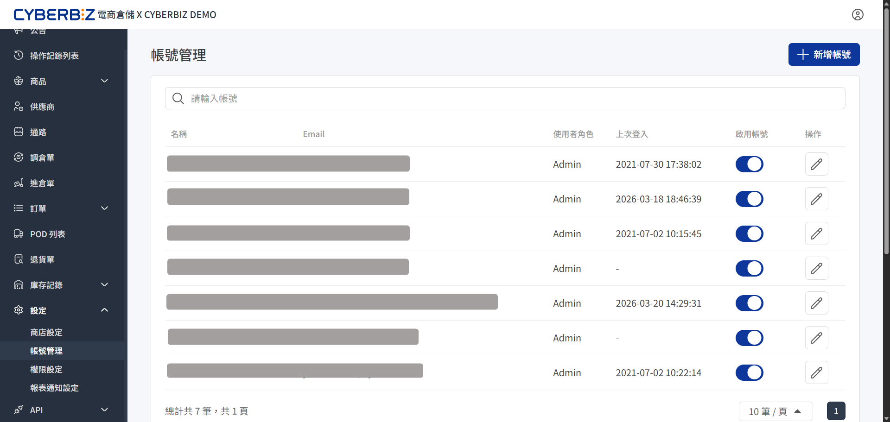
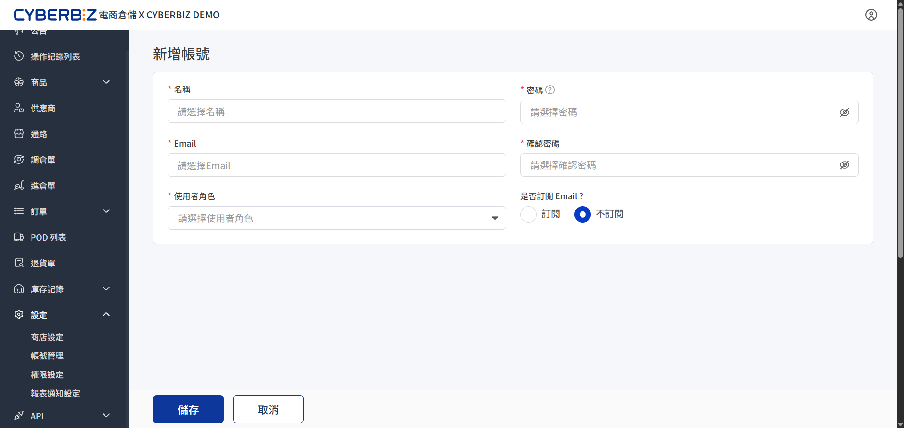

# 帳號管理
在 CYBERBIZ 電商倉儲系統中建立員工帳號、設定登入憑證、指派職務角色，並執行帳號停權與資料維護。
{ .subtitle }

{ .hero-page }

!!! tip "應用情境"
    - **人員入職**：為新進員工建立帳號並指派預設角色（如：Admin 或 自定義角色）。
    - **安全維護**：定期檢查「上次登入」時間，識別長期未使用的帳號並評估是否回收權限。
    - **即時停權**：當人員離職或職務異動時，透過開關立即切斷系統存取權限。

## 使用須知

- **唯一性規則**：每個帳號必須使用唯一的 Email 作為登入帳號，不可重複註冊。
- **密碼安全性**：設定密碼時應符合系統複雜度要求，並由管理員通知使用者於首次登入後自行修改。
- **權限前提**：在指派「使用者角色」前，需先 [建立角色並定義權限](權限設定.md)。

## 建立新帳號

1. 登入 CYBERBIZ 電商倉儲管理後台，前往 **設定 > 帳號管理**。
2. 點擊頁面右上角的 **+ 新增帳號**。
3. 根據以下表格說明填寫帳號資訊：

    | 欄位名稱 | 說明 | 必選填 |
    | :--- | :--- | :--- |
    | **名稱** | 顯示在系統介面上的員工姓名或代號 | 必填 |
    | **Email** | 該帳號的登入帳號與系統通知發送地址 | 必填 |
    | **使用者角色** | 選擇此帳號適用的職務角色模板（如：Admin） | 必填 |
    | **密碼** | 設定該帳號的初始登入密碼 | 必填 |
    | **確認密碼** | 再次輸入密碼以進行核對 | 必填 |
    | **是否訂閱 Email?** | 設定是否接收系統發出的營運或功能通知。 | 單選（訂閱 / 不訂閱） |

4. 點擊 **儲存** 完成建立。

{ .screenshot }

## 帳號維護與狀態控管

建立完成後，您可以在帳號列表進行日常管理作業。

1. **搜尋與篩選**：在搜尋框中輸入關鍵字，即可快速找尋特定員工。
2. **切換啟用狀態**：
    - 使用 **啟用帳號** 欄位的開關切換狀態。
    - :lucide-toggle-right: 表示帳號正常運作。
    - :lucide-toggle-left: 表示帳號已停權，使用者將無法登入系統。
3. **編輯帳號資料**：點選 **操作** 欄位的 **:lucide-pen: 編輯**，可修改名稱、角色、Email 訂閱設定或重設密碼。

## 常見問題

??? quote "為什麼新增帳號時提示「Email 已被使用」？"
    該 Email 已經在系統中被註冊過。請先在搜尋列確認該帳號是否已存在（可能處於停權狀態），或是改用其他 Email 進行註冊。

