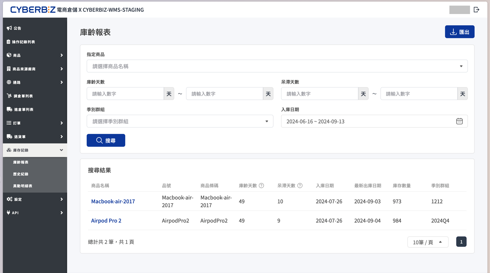
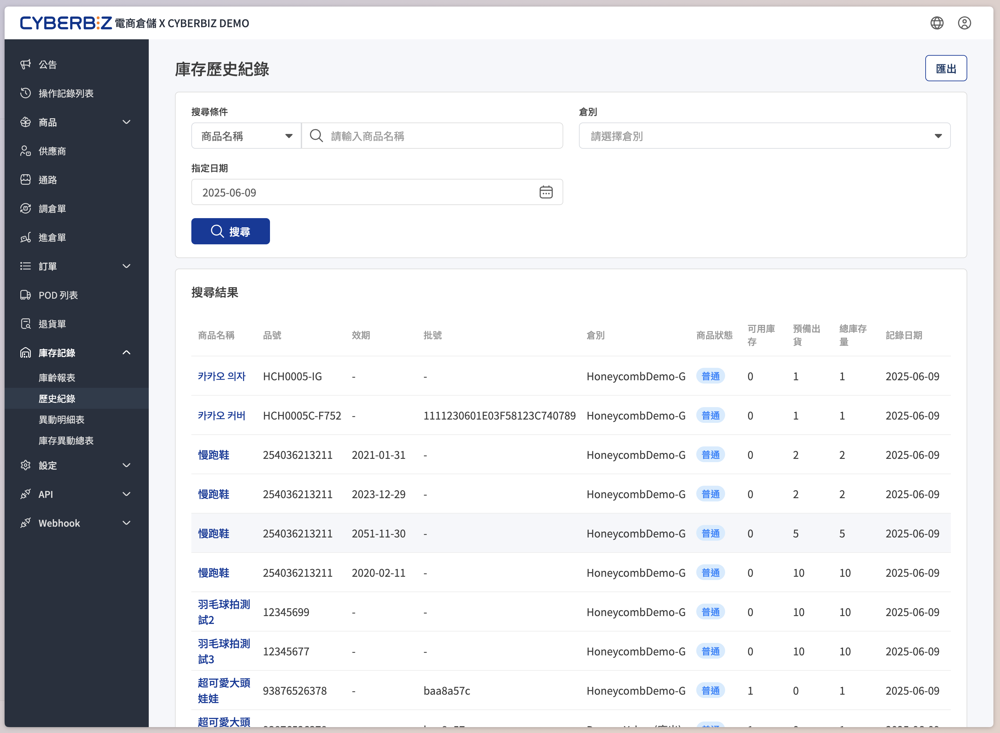
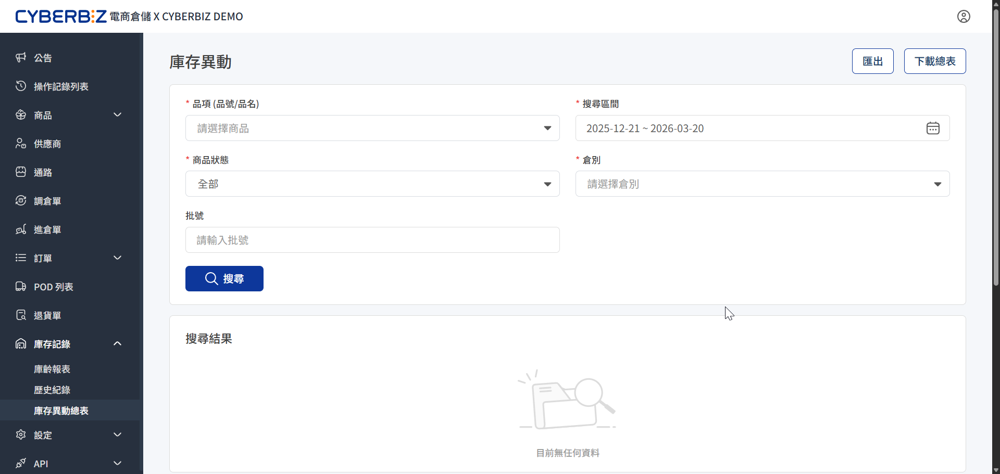

# 庫存紀錄
在電商倉儲（WMS）中查詢庫存異動細節與庫齡分析，包含歷史庫存紀錄、異動明細表及庫齡報表。
{ .subtitle }

## 庫齡報表

### 分析週轉健康度

協助商家識別庫存存放天數，是執行促銷規劃或庫存清理的重要依據。

### 篩選與查詢

1. 前往 **庫存紀錄 > 庫齡報表**。
2. 設定篩選條件：
    - **指定商品**：輸入商品名稱或品號篩選特定對象。
    - **庫齡/呆滯天數**：輸入天數範圍來篩選即將過時的商品。
    - **季別群組**：依據 [季別設定](季別群組.md) 篩選特定銷售波段。
    - **入庫日期**：設定商品最初入庫的時間區間。
3. 點擊 **匯出** 下載 Excel 報表進行分析。

### 關鍵指標定義

- **庫齡天數**：計算商品 **第一次入庫日期** 至今的總天數。
- **呆滯天數**：計算商品 **最後一次出庫日期** 至今的總天數。若此數值過高，代表該商品銷售動能不足。

{ .screenshot }

## 歷史紀錄

### 每日快照

提供過往特定日期的庫存「截點」數據，適用於月結對帳或週轉紀錄備份。

1. 前往 **庫存紀錄 > 歷史紀錄**。
2. 選擇 **查詢日期**（僅限昨日以前）。
3. 指定 **商品品號** 或 **倉別** 縮小範圍。
4. 點擊 **搜尋** 或 **匯出**。

!!! info "更新時效說明"
    系統固定於 **每日凌晨 4 點** 更新前一日的庫存快照。後台無法查詢 **當日即時** 的歷史紀錄，請以 **昨日（含）以前** 的資料為準。

{ .screenshot }

## 庫存異動明細表

### 追蹤單品流向

若需核對特定商品的入庫、出貨、退貨細節，應使用異動明細表。

1. 前往 **庫存紀錄 > 庫存異動總表**。
2. 輸入 **商品品號** 並設定 **時間區間**。
3. 系統將條列顯示該時段內所有導致庫存變動的事件（包含單號、類型與異動數量）。
4. 支援匯出搜尋結果。

### 宏觀變動概覽

適用於檢視整體的移庫、調整與銷售出貨總量。

1. 前往 **庫存紀錄 > 庫存異動總表**。
2. 設定 **時間區間** 與 **倉別**。
3. 查詢結果將區分 **入庫**、**出貨**、**調整** 等類別顯示總變動量。
4. 支援下載完整總表。

{ .screenshot }