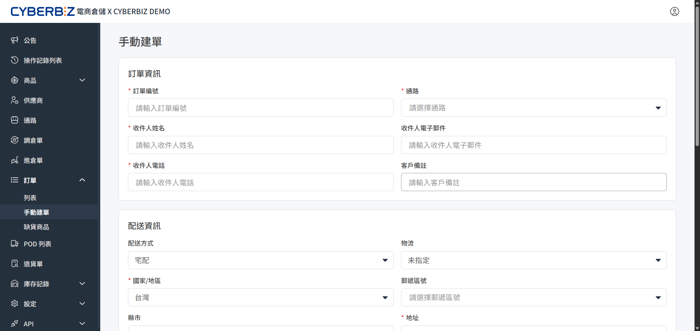

# 手動建單
當商家有來自非串接通路的出貨需求，或需要將商品從倉庫轉運回公司進行業務調整時，可直接向倉庫發送出貨指令。
{ .subtitle }

{ .hero-page }

## 使用情境

- **多通路出貨**：處理來自非 CYBERBIZ 串接通路（如蝦皮、Momo 等）的訂單需求。
- **倉庫轉貨**：因應業務調整或參展需求，將庫存商品從倉庫轉運回商家端。
- **緊急出貨**：特殊情況下需跳過系統自動抓單，手動快速建立出貨任務。

## 操作流程

### 步驟 1：填寫訂單基本資訊

前往 **訂單 > 手動建單**，輸入訂單的來源與時程資料。

1. **輸入基本資料**：填寫 **訂單編號**、**收件人資訊**。
2. **選擇通路**：選取訂單所屬的銷售通路。若尚未新增通路，請先 [建立通路](通路.md)。
3. **預約倉庫出貨日期**：
    - 此日期為 **倉庫預計出貨日**，非實際送達日，請預留物流配送時間。
    - 若需預約未來日期出貨，請選擇 **預定配達日** 的 **前一天** 作為預約日期。
4. **備註說明**：
    - **客戶備註**：此內容會印製在託運單上，**顧客與物流員可見**，適合填寫配送特殊要求。
        

### 步驟 2：配置配送資訊

根據顧客選用的物流方式填寫詳細收件資訊。

#### 1. 宅配

- **支援物流**：黑貓、宅配通、順豐海外、新竹貨運，或選擇 **不指定**。
- **必填欄位**：國家/地區、**縣市**、**鄉鎮市區**、詳細地址、訂單總金額。
- **選填項目**：
    - **指定時段**：可選擇「中午前」或「12-17 時」。
    - **來回件**：若需回收商品（如換貨需求）請勾選。
    - **貨到付款**：勾選後需額外輸入代收金額。

#### 2. 超商取貨

- **支援超商**：7-11、全家、萊爾富。
- **必填欄位**：**超商代碼**、訂單總金額。
- **貨到付款**：可依需求勾選是否由超商代收貨款。

#### 3. 倉庫自取 

- **地址填寫**：地址欄位請填寫倉庫所在地 **桃園市龜山區**。
- **備註強化**：務必在 **商家備註** 欄位填寫 **自取** 字樣。
- **選填欄位**：可視需求填寫訂單總金額。

!!! tip "如何保留訂單的修改空間？"
    若訂單建立後，您預期可能會有異動，建議在建立時勾選 **暫不出貨**。這會使訂單強制停留在 **待處理** 狀態，直到您確認資訊無誤後再手動開啟出貨流程。

### 步驟 3：選擇出貨商品

1. 點擊 **新增品項** 開啟商品選擇視窗。
2. 搜尋商品：輸入 **品號** 或 **品名** 進行關鍵字查找。
3. **規格確認**：
    - 選擇 **貨品狀態**（如正常品、瑕疵品）。
    - 選擇 **商品效期** 或 **批號**（若該商品有啟用效期/批號管理）。
    - 輸入本次出貨的數量。
4. 點擊 **新增** 將商品加入待出貨清單。

### 步驟 4：完成建單

1. **商家備註**：僅供 WMS 作業人員查看，**顧客不可見**。
2. **上傳附件**：若有特定出貨單、採購單、客製化文件需附上，請在此上傳檔案。
3. **送出訂單**：確認配送資訊與商品明細無誤後，點擊下方 **送出訂單** 完成操作。

## 常見問題

??? quote "**客戶備註** 與 **商家備註** 有何差異？"
    主要差異在於 **資訊的可見範圍**：
    
    - **客戶備註**：公開資訊。顧客於訂單頁面可見，且會印製於物流單上，供 **物流人員** 配送參考。
    - **商家備註**：內部資訊。僅供後台與 **WMS 作業人員** 查看，顧客與物流人員皆無法看見，適合紀錄內部作業需求。

??? quote "訂單建立後，是否還能修改內容？"
    訂單能否修改，取決於目前的 **訂單狀態**：

    - **待處理**：此階段商家可修改商品內容、收件資訊或取消訂單。
    - **作業中**：倉庫已啟動揀貨或打包流程，為避免出貨錯誤，系統已 **限制直接修改**。
