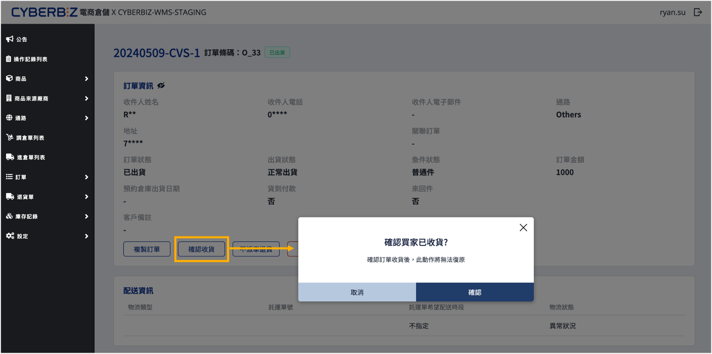

# 手動確認收貨
在超商端漏傳收貨狀態時，手動更新電商倉儲訂單為「已收貨」狀態，以利後續帳務結案與退貨流程執行。
{ .subtitle }

## 使用須知

### 使用情境

超商出貨之訂單，若超商端漏拋已收貨狀態，商家與消費者確認商品確實已送達並領取後，手動將系統貨態變更為 **已收貨**。

### 操作限制與規範

- **訂單類型**：僅支援 **超商取貨** 類型的訂單。
- **配送狀態**：訂單目前狀態須為 **已出貨**。
- **貨態條件**：符合以下其中一項異常情境：
    - 託運單狀態顯示為 **異常**。
    - 商品抵達門市超過 **7 天** 仍未更新貨態。
- **不可逆性**：手動確認收貨後，系統將無法回復至原始狀態。若因操作失誤誤改，則須啟動後續的退貨流程修正帳務。

### 注意事項

- **責任歸屬**：商家執行手動收貨前，務必與消費者確認是否已實際完成領取。
- **異常修復**：若執行手動收貨後發現商品實際上未取件（如包裹遺失），須手動啟動 [退貨流程](../ec/orders/訂單退貨流程/#步驟-1啟動退貨與安排逆物流)，以利執行 [倉庫驗退作業]()、[訂單退款作業](../ec/orders/訂單退款流程.md)。

## 操作步驟

1. 前往 **訂單 > 列表**。
2. 點擊目標訂單的 **訂單編號** 進入明細頁面。
3. 於配送資訊區塊，點擊 **確認收貨**。

{ .screenshot }
