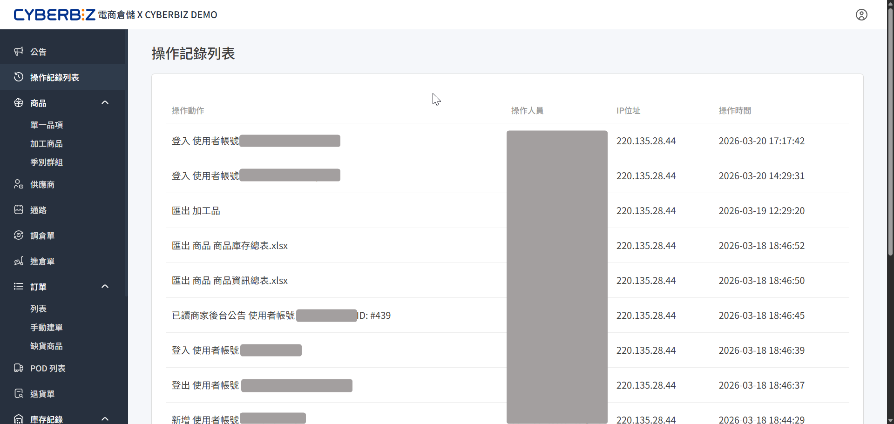

# 操作紀錄列表
「操作紀錄列表」記錄所有使用者在電商倉儲後台的行為軌跡，管理人員可追蹤各帳號的操作動作、來源 IP 與時間。
{ .subtitle }

{ .hero-page }

## 查看操作紀錄

系統會自動記錄關鍵的操作行為，並以時間倒序排列。

1. 登入 **WMS 管理後台**。
2. 點擊左側選單的 **操作紀錄列表**。
3. 在列表中查看各項資訊：
    - **操作動作**：記錄執行的具體行為（如：登入、匯出報表、讀取公告等）。
    - **操作人員**：執行該動作的使用者帳號名稱或 ID。
    - **IP 位址**：執行操作時的連線 IP，可用於識別異常登入位置。
    - **操作時間**：動作發生的精確時間點。

## 常見記錄行為

「操作紀錄列表」主要涵蓋以下幾類系統活動：

- **帳號活動**：包含使用者的「登入」與「登出」紀錄。
- **資料匯出**：記錄報表或資料的下載行為（如：匯出加工品、商品庫存總表、商品資訊總表等）。
- **系統互動**：包含讀取「商家後台公告」等系統通知的行為。
- **資料異動**：記錄對商品、訂單、供應商等模組的關鍵修改動作。

!!! tip "安全性與權限提醒"
    - **安全性稽核**：若發現非預期的 IP 位址登入，或在非工作時間有大量資料匯出紀錄，請立即檢查帳號安全性並更新密碼。
    - **權責劃分**：對於擁有多名作業人員的商家，操作紀錄可作為核對作業流程與責任歸屬的重要依據。
    - **權限限制**：僅具備特定權限的管理者帳號可查看完整的操作紀錄列表。
