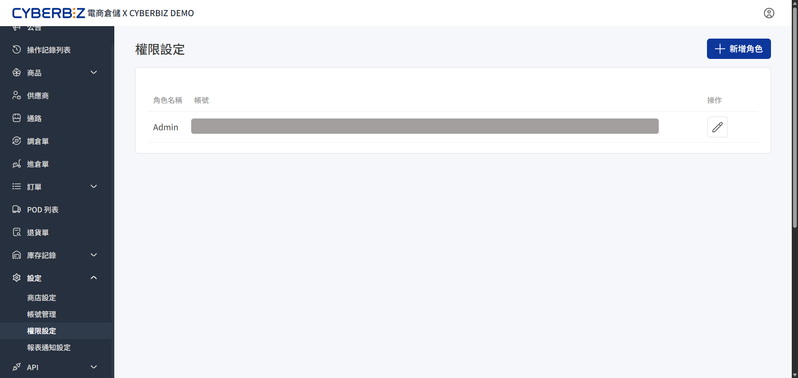
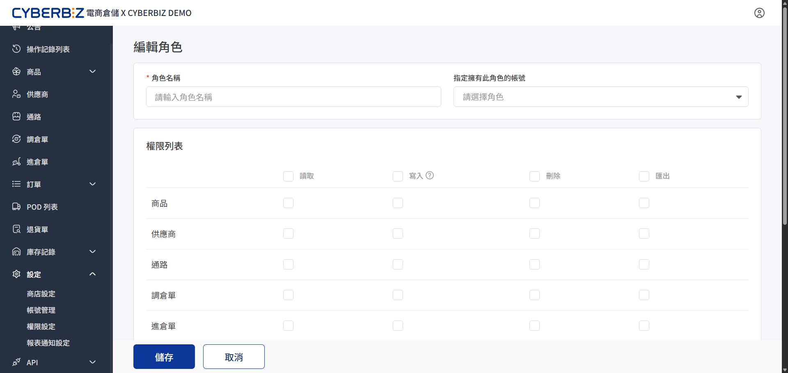

# 權限設定
透過建立自定義職務角色並配置模組化權限，您可以精確控管不同帳號在系統中的作業範圍，確保核心資料安全與組織職責分工。
{ .subtitle }

{ .hero-page }

!!! tip "應用情境"
    - **人員分權**：為倉儲人員設定僅能操作「進倉單」與「庫存管理」，同時限制其瀏覽「帳號管理」等敏感區塊。
    - **資安防護**：限制基層店員僅具備「讀取」權限，防止誤刪商品資料或擅自「匯出」包含個資的訂單列表。
    - **營運協作**：建立具備完整「寫入」權限的主管角色，負責審核與修正各類單據。

## 使用須知

- **必要欄位**：建立角色時，「角色名稱」為必填項。
- **權限維度**：系統提供「讀取、寫入、刪除、匯出」四種操作維度，需逐一勾選生效。
- **管理限制**：具備「權限管理」寫入權限的角色，才能修改其他角色的功能範疇。

## 操作流程

### 步驟一：進入編輯角色頁面

1. 登入 CYBERBIZ 電商倉儲管理後台，前往 **設定 > 權限設定**。
2. 點擊 **新增角色** 或針對現有角色點選 **編輯**。

### 步驟二：配置角色資訊與權限

1. 在 **角色名稱** 欄位輸入職務名稱（如：倉庫人員、營運主管）。
2. 在 **指定擁有此角色的帳號** 下拉選單中，選取欲指派的員工帳號。
3. 根據職責需求，在 **權限列表** 中勾選對應功能的權限維度。

{ .screenshot }

!!! note "權限定義說明"
    - **讀取**：僅能瀏覽頁面資訊與清單。
    - **寫入**：可新增、編輯或更新資料內容。
    - **刪除**：具備移除資料的權限。
    - **匯出**：可將系統資料下載為 Excel 或 CSV 檔案。

### 步驟三：儲存設定

1. 確認勾選項目無誤後，點擊頁面底部的 **儲存**。
2. 受指派的帳號重新登入後，系統將立即套用新的權限範疇。

