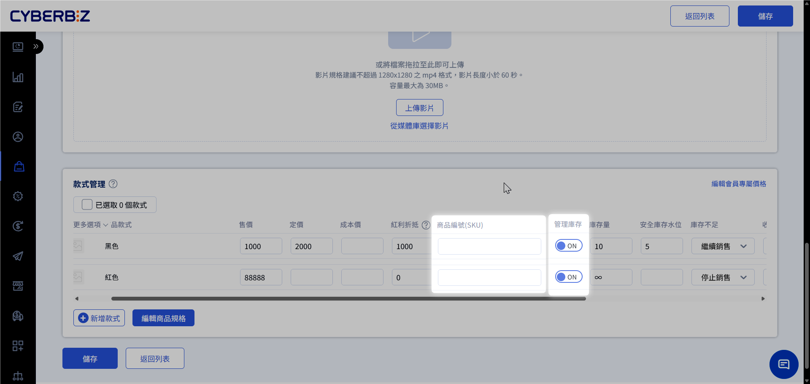
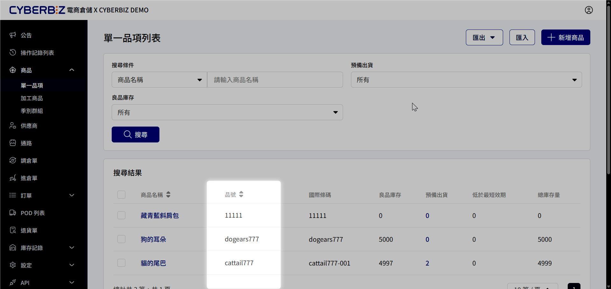
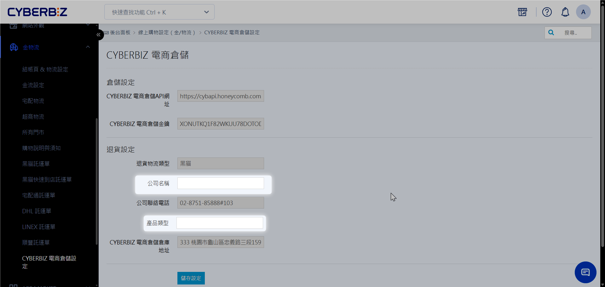
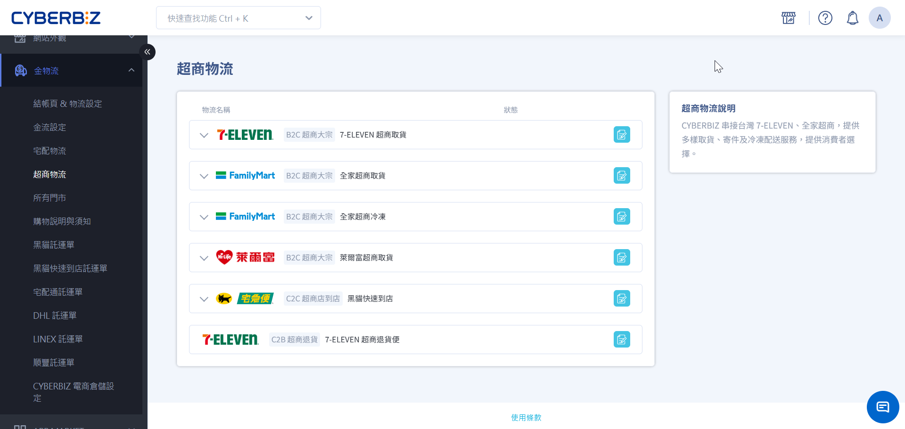
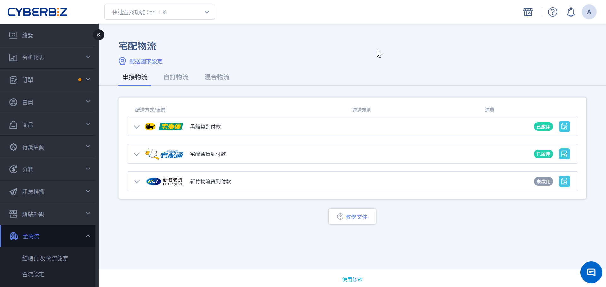
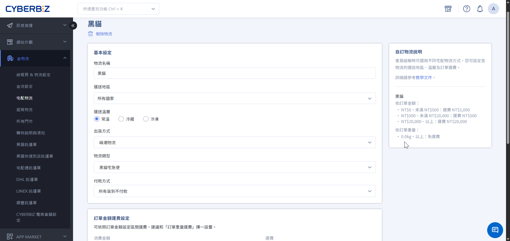

# 申請流程與開通
在正式開通串接前，商家需完成合約簽訂、系統環境建置以及商品資料同步，以確保訂單能正確拋轉至倉庫執行。
{ .subtitle }

## 串倉核心須知

- **SKU 唯一性**：串倉後，每件商品（包含規格分項）都必須填寫 SKU 碼。
- **作業主體**：一旦正式開通，後續的所有出貨、退貨作業皆由 CYBERBIZ 電商倉儲負責處理。
- **廠退處理**：若物流中心有商品退回需求，將統一由物流端退回 CYBERBIZ 倉儲，商家不需另行派車。
- **資料驗證**：建議在開通後的首週，密切核對訂單拋轉狀態，確保 SKU 同步無誤。

## 步驟 1：申請與簽約

在系統操作前，請先完成行政流程與倉儲需求評估。

1. **填寫入倉表單**：前往 [CYBERBIZ 電商倉儲申請頁面](https://www.cyberbiz.io/wms/#list) 填寫需求，倉儲經理將主動聯繫。
2. **需求評估與簽約**：與倉儲經理確認商品屬性、進倉量及物流費率，並完成合約簽署。
3. **物流模式檢查**：
    - 若目前使用超商 C2C 模式，請聯繫專屬顧問或客服，申請切換為 **B2C 大宗寄倉**。
    - 物流中心廠退將由 **佶傳貨運** 退回 CYBERBIZ 倉庫。

## 步驟 2：商家系統前置設定

合約簽訂後，商家需在官網後台（EC）完成以下設定，以利系統對接。

### 1. 商品 SKU 同步

- 入倉商品於電商倉儲後台[建立品項](單一品項/#新增單一品項)。
- 確保官網（EC）與電商倉儲（WMS）後台的商品 SKU **皆已填寫且完全一致**。
- 每個規格分項（如顏色、尺寸）都必須有 **獨立且唯一** 的 SKU 碼，不可留空。

=== "查看 EC 商品 SKU"

    登入電商官網後台，前往 **商品 > 所有商品**，點擊指定商品，查看 **商品編號(SKU)** 欄位。

    { .screenshot }

=== "查看 WMS 商品品號"

    登入電商倉儲後台，前往 **商品 > 單一品項**，點擊指定商品，查看 **品號** 欄位。

    { .screenshot }

### 2. 開啟管理庫存

- 前往 **商品 > 所有商品**，進入各商品編輯頁面。
- 將 **管理庫存** 選項開啟。

    > 開啟後不需填寫庫存量，系統將在開通後自動抓取倉庫實體庫存。

{ .screenshot }

### 3. 清理待處理訂單

- 串倉正式開通前，EC 後台原有的現有訂單必須 **全數完成出貨**。
- 訂單 **配送狀態** 需更新為 **已出貨** 或 **已收貨**。

## 步驟 3：開通與物流設定

完成前置設定後，請回信通知 CYBERBIZ 客服。系統將由專人執行開通作業，**完成後將發信通知商家**。

!!! info "CYBERBIZ 協助項目"
    - 執行超商取件標籤測試（測標）
    - 開通並配置 **金物流 > CYBREBIZ 電商倉儲設定** 串接欄位
    - 開通電商倉儲物流類型

商家收到開通完成通知信後，請繼續完成以下設定：

### 填寫基本資訊

1. 前往 **金物流 > CYBERBIZ 電商倉儲設定**。
2. 於 **退貨設定** 區域，填寫空白欄位。
    - 公司名稱
    - 產品類型

{ .screenshot }

### 設定物流運費

#### 超商設定

1. 前往 **金物流 > 超商物流**。
2. 依您開啟的物流選項，設定 **運費** 與 **免運門檻**。
3. 勾選是否提供 **貨到付款** 功能。

{ .screenshot }

#### 宅配設定

1. 前往 **金物流 > 宅配物流**。
2. **貨到付款**：前往 **串接物流** 頁籤，點擊物流選項。
    - 輸入運費與免運門檻

    { .screenshot }

3. **貨到不付款**：前往 **自訂物流** 頁籤，建立自訂物流。
    - **物流名稱**：定義顧客於結帳頁面看到的配送選項（如：低溫宅配）。
    - **配送範圍**：設定 **運送地區** 與對應 **溫層**。
    - **出貨方式**：選擇 **峰潮物流**，以確保倉儲系統正確接收指令。
    - **物流類型**：綁定出貨物流選項。
    - **付款與計費**：指定支援的 **付款方式** 並設定對應 **運費** 規則。

    { .screenshot }

    !!! tip "多樣化運費政策"
        為了精準對應不同的運費門檻或配送限制，您可以針對不同 **物流類型**、**運送地區**、**溫層** 等條件，建立多組 **自訂物流**。

        - **範例**：您可以同時建立「常溫宅配（本島）」與「常溫宅配（離島）」，分別設定不同的加價規則。

## 更多操作

- :lucide-square-arrow-right:{ .lg }   
  [__進倉作業規範__](商家進倉作業規範)     
  串接完成後，可執行進倉作業，將商品送至 CYBERBIZ 倉庫。

