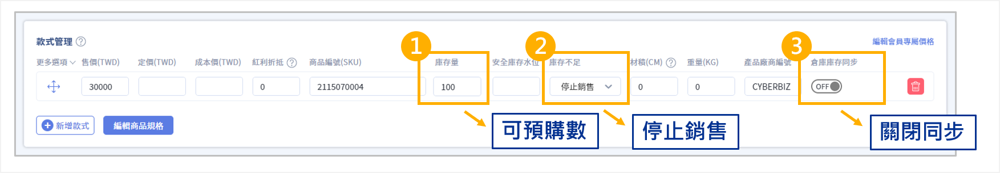
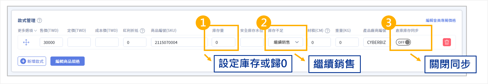

# 設定商品(現貨、限量、預購)
串接電商倉儲（WMS）時，針對不同銷售策略（現貨、限量、預購）設定庫存同步機制。
{ .subtitle }

## 使用須知

- **單一模式原則**：每筆訂單僅支援 **單一出貨模式**，若訂單中包含不同屬性的商品（如：現貨 + 預購），系統將無法處理混單或拆分出貨。
- **恢復同步**：活動結束或商品轉回一般現貨銷售時，請務必重新 **開啟** 倉庫庫存同步，以回復真實庫存水位。

!!! warning "設定風險提示"
    若因商家設定預購或限量情境錯誤（如：誤關同步導致數據落差）造成超賣，CYBERBIZ 無法提供系統操作建議外的補償協助。請務必在發布銷售活動前確認設定準確。

## 現貨銷售模式

常見的正規銷售流程。當商品有實際庫存存放在倉庫時使用。

1. **基本設定**：商品已填寫 **商品 SKU**，且官網（EC）與倉儲（WMS）的庫存已完成初始同步。
2. **銷售機制**：
    - 開啟 **倉庫庫存同步**。
    - 當消費者下單，系統確認 WMS 有可用庫存後，訂單將即時拋轉至 WMS 執行出貨。

## 限量銷售模式

適用於「快閃促銷」或「特定額度分配」情境。商家希望僅釋出部分倉庫庫存供官網銷售。

1. **調整庫存量**：將 **庫存量** 手動更改為 **可限購庫存數**。

    > 例如：實際總庫存 200，僅設定 100 供此活動購買。

2. **設定銷售規則**：將 **庫存不足** 欄位設定為 **停止銷售**。
3. **關閉同步**：**關閉** 倉庫庫存同步，避免 WMS 實體庫存覆蓋限量設定。
4. **結果**：官網將在售完設定的限量數後自動下架，避免超賣。

{ .screenshot }

## 預購銷售模式

適用於商品尚未入倉，但希望先接收訂單的情境。分為「限量預購」與「不限量預購」。

### 1. 限量預購

1. **設定庫存**：將庫存更改為 **預計可預購數**（即後續預計進貨的總量）。
2. **銷售規則**：將 **庫存不足** 設定為 **停止銷售**。
3. **關閉同步**：**關閉** 倉庫庫存同步。
4. **結果**：訂單會同步拋轉至 WMS，但因 WMS 尚未進貨，訂單狀態將停留在 **庫存不足**，待商品入倉後即可自動或手動履行。

{ .screenshot }

### 2. 不限量預購

1. **設定庫存**：將庫存設為 **0** 或 **預計可預購數**。
2. **銷售規則**：將 **庫存不足** 設定為 **繼續銷售**。
3. **關閉同步**：**關閉** 倉庫庫存同步。
4. **結果**：消費者可持續下單，WMS 會同步接收訂單但因缺貨暫緩出貨。

{ .screenshot }
