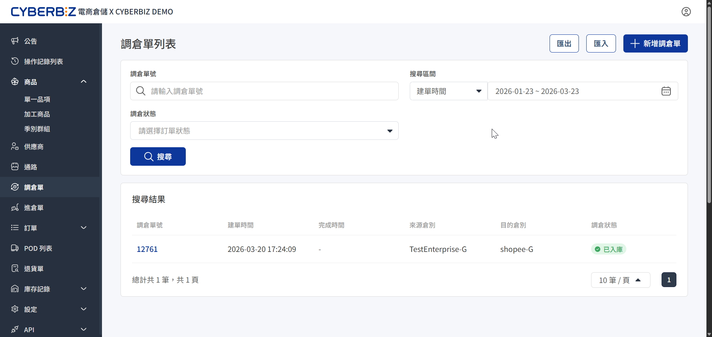
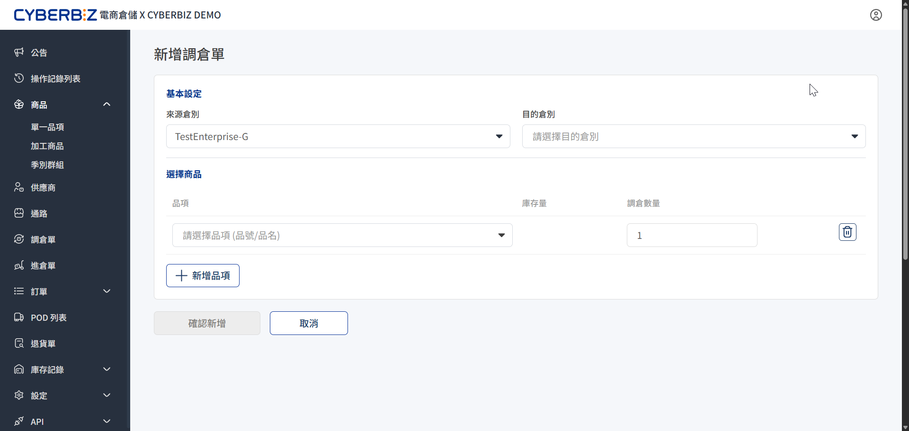
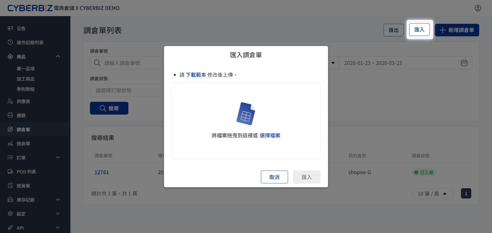
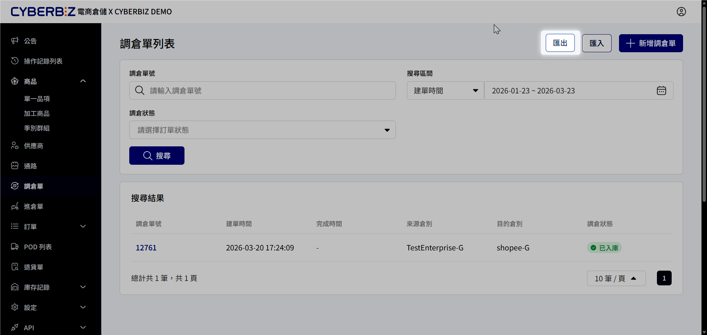

# 調倉單
在電商倉儲中，庫存分布於多個不同的「倉別」。透過「調倉單」，商家能將商品庫存從原始倉別轉移至目標倉別。
{ .subtitle }

{ .hero-page }

## 使用須知

### 為什麼需要調倉？

系統支援將不同 **倉別** 綁定特定 **通路**（出貨規則）。例如：

- **A 倉**：僅供特定平台出貨。
- **B 倉**：開放所有通路使用。

當 A 倉庫存用盡時，商家需透過調倉單將 B 倉商品移至 A 倉，確保特定平台通路能正常供貨。

### 注意事項

- **庫存鎖定**：當調倉單處於 **待確認** 或 **處理中** 時，該部分庫存可能會被系統鎖定，無法進行其他出貨作業。
- **資料核對**：點擊調倉單列表中的 **單號**，可隨時查看該筆移庫的詳細品項與歷史軌跡。

## 調倉單狀態說明

在列表頁中，可透過狀態追蹤移庫進度：

| 狀態 | 說明 |
| :--- | :--- |
| **待確認** | 單據已建立，正等待倉庫客服人員審核與確認 |
| **處理中** | 倉庫人員正在現場執行商品核對與實體移位作業 |
| **已入庫** | 移庫已完成，目的地倉別的可用庫存已正式增加 |

## 手動建立調倉單

當有少量的庫存調度需求時，可直接在後台新增單據。

1. 前往 **調倉單**。
2. **選擇倉別**：
    - **來源倉別**：選擇目前存放商品的原始倉庫。
    - **目的倉別**：選擇欲轉移入的目標倉庫。
3. **選擇商品**：
    - 點擊 **新增品項**。
    - 搜尋並選擇商品，輸入欲轉移的 **數量**。
4. 點擊 **確認新增** 提交。
5. **關鍵動作**：調倉單建立後，請務必主動 **聯繫倉庫客服** 協助做實體移庫的最後確認。

{ .screenshot }

## 批次匯入調倉單

若需一次性調度多項商品，可使用匯入功能。

1. 前往 **調倉單**。
2. 點擊右上角 **匯入**。
3. 下載範本並完成填寫後，上傳檔案。
4. 選擇檔案並點擊 **匯入**。

{ .screenshot }

## 匯出調倉單

若需進行庫存異動對帳或留存調撥紀錄，可透過匯出功能取得詳細資料。

1. 前往 **調倉單**。
2. 點擊右上角 **匯出**。
3. 系統將自動生成並下載 **調倉單明細表**。

{ .screenshot }
