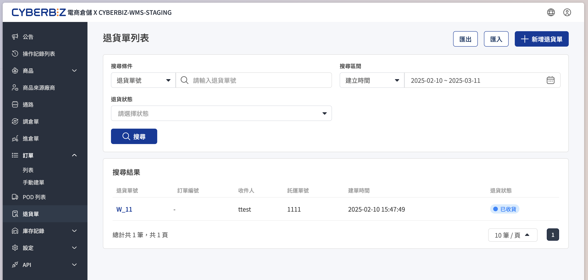
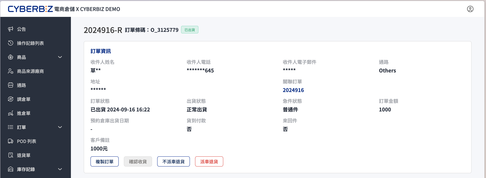
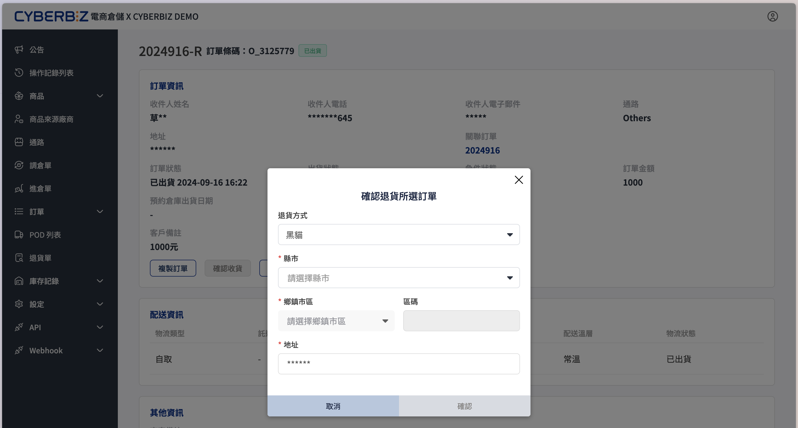
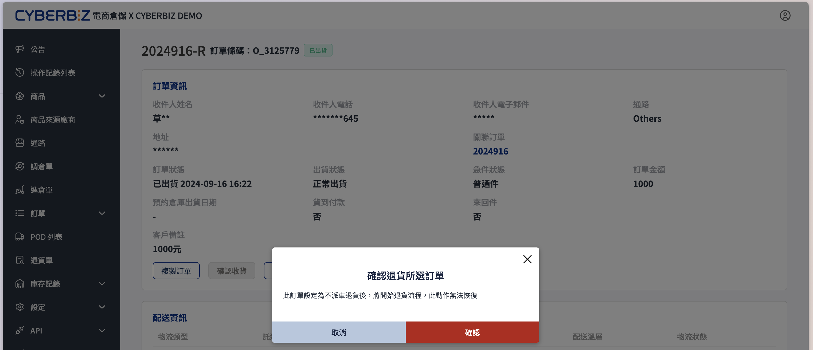
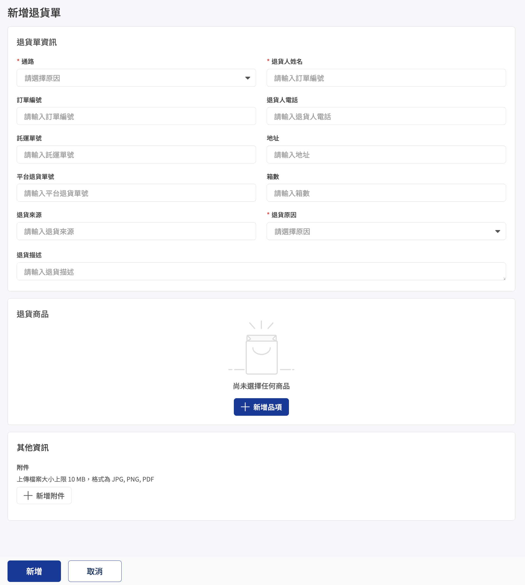

# 退貨單
在電商倉儲系統處理退貨申請，包含派車取件、驗收狀態說明以及後續退款流程執行。
{ .subtitle }

{ .hero-page }

## 退貨操作引導

- **純倉儲服務商家**：
    - **定義**：僅使用 CYBERBIZ 倉儲系統，未連動 CYBERBIZ 電商官網者。
    - **作業路徑**：所有退貨申請與庫存回置，均統一於 WMS 倉儲系統內執行，請依下方說明操作。
- **官網串倉商家**：
    - **定義**：使用 CYBERBIZ 電商官網並開啟倉儲串接功能者，且官網系統版本為 **高手版**。
    - **作業路徑**：可於倉儲系統執行退貨，系統將自動同步狀態至官網後台，請依下方說明操作。

!!! info "官網串倉商家退貨方式"
    - **所有方案商家**：於 **官網（EC）後台** 執行退貨、派車與退款。可參考 [退貨與派車]()。
    - **高手版商家**：除 EC 外，也可於 **WMS 倉儲後台** 申請退貨。

## 使用須知

- 下方提供之方式請 **擇一操作，不可重複執行**，以免造成系統重複出單。

## 方式一：於訂單頁申請退貨

1. 前往 **訂單 > 列表**。
2. 點擊目標訂單進入明細頁面。
3. 根據需求選擇退貨模式：

{ .screenshot }

=== "派車退貨"

    系統會自動向物流商發送取件請求，並建立退貨單。

    - **支援物流**：目前僅支援 **黑貓宅急便** 與 **宅配通**。
    - **必要資訊**：須確實填寫買家的 **取件地址**（不可填寫超商地址）。
    - **注意**：**高手版** 已開通 **CYBERBIZ PAYMENTS** 的商家，WMS 介面將自動隱藏此按鈕，請務必返回 **EC 後台** 提出 [逆物流申請](../ec/orders/訂單退貨流程/#步驟-1啟動退貨與安排逆物流)，以利金流自動退款。
    
    { .screenshot }

=== "不派車退貨"

    系統自動建立退貨單（數位憑證），不執行物流派車。

    { .screenshot }

## 方式二：手動建立退貨單

### 使用情境

- **無對應原始訂單**：退貨商品非透過本倉儲系統發貨，但需將退貨商品送回倉儲執行收退作業。
- **退貨內容異動處理**：原始訂單雖存在，但消費者實際退回的 **品項** 或 **數量** 與原訂單申報不符，需透過手動建單以修正實到貨物資訊。
  
    > 供 **純倉儲服務商家** 使用，**官網串倉商家** 請依 [退貨與派車]() 操作。

### 注意事項

- 退貨單 **不具備物流派車功能**，僅供 **倉儲收貨** 與退貨退款作業憑證使用。

### 操作步驟

1. 前往 **退貨單**，點擊 **新增退貨單**。
2. 填寫資訊：
    - **訂單編號**：若與特定訂單相關請填寫，以利對帳。
    - **退貨品項與數量**：精確輸入預計退回的商品。

{ .screenshot }

## 倉儲驗收與退貨單狀態

| 退貨單狀態 | 說明 |
| :--- | :--- |
| **等待收取** | 已建立退貨單，正等待物流取件或商品寄回倉庫 |
| **已驗收** | 訂單全數商品執行退貨，已抵達倉庫，作業人員已核對品項並入庫 |
| **部分驗收** | 訂單部分商品執行退貨，已抵達倉庫，作業人員已核對品項並入庫 |
