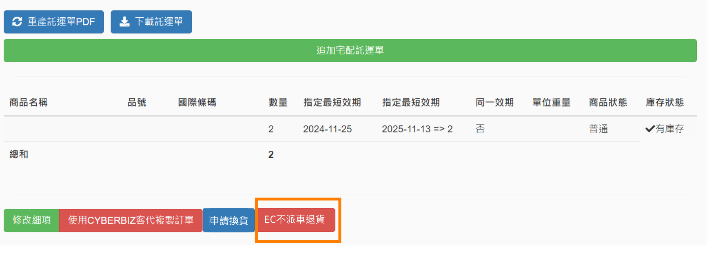

# 退貨與派車
了解 CYBERBIZ 電商倉儲系統（WMS）與 EC 後台的退貨整合流程，包含逆物流派車設定、商品回收驗收、超商逾期未取處理以及自動化退款作業。
{ .subtitle }

## 使用須知


- **特殊需求**：倉庫出貨的商品，預設寄回倉庫。若您希望倉庫出貨的商品，在退貨時直接寄回商家地址進行驗收，請參閱 [商家自行驗收退貨](商家自行驗收退貨.md)。


!!! tip "系統核心整合邏輯"
    - **EC 後台**：負責前端流程控管。包含 **接收消費者申請**、**產生逆物流單號** 以及執行最終的 **退款作業**。
    - **WMS 系統**：負責後端實物作業。包含接收退貨資訊、產出倉庫退貨單、**執行實物驗收與入庫**。

## 退貨處理

### 步驟一：消費者退貨申請

依據商家是否開啟 [官網前台的退貨功能]()，採用的操作路徑如下：

=== "開啟前台退貨"

    - **流程**：消費者於官網 **我的帳戶 > 訂單查詢** 點擊申請退貨。
    - **狀態變化**：EC 訂單的 **退貨狀態** 會自動變更為 **退貨申請**。
    - **優點**：降低客服負擔，系統自動彙整申請資訊。

=== "關閉前台退貨"

    - **流程**：消費者透過 [訂單客服對話](../ec/members/官網會員客服問答系統/#2-專屬訂單詢問) 功能向商家提出需求。
    - **狀態變化**：由商家確認原因後，手動在 EC 後台操作。
    - **優點**：商家可先行過濾退貨原因，減少不必要的退貨成本。


### 步驟二：逆物流派車回收

商家需根據「是否需要回收商品」選擇處理方式：

=== "需要回收商品"

    === "流程圖示"

        ```mermaid
            sequenceDiagram

            autonumber
            
            participant 商家
            participant EC
            participant WMS
            
            商家 ->> EC: 建立逆物流
            EC ->> WMS: 建立退貨單
            note right of EC: 逆物流派車向消費者收取退貨包裹
            note right of EC: 退貨包裹送至倉庫
            note right of WMS: 進行退貨審查
            WMS ->> EC: 更新退貨結果
            商家 ->> EC: 執行退款
        ```

    === "詳細步驟"

        1. **建立逆物流**：於 EC 後台，選擇適用的逆物流類型。

            !!! info "選擇逆物流"
                商家可依系統類型與出貨方式，選擇適用的逆物流：

                | 系統類型 | 全部串倉 | 部分串倉 | 部分串倉 | 部分串倉 |
                | ------- | ------- | -------- | ------- | ------- |
                | 訂單出貨方式 | 倉儲出貨 | 倉儲出貨 | 混單(自行出貨+倉儲出貨) | 自行出貨 | 
                | 適用逆物流 | 黑貓 | 黑貓 | 黑貓 | 黑貓 |
                | | 宅配通 | 宅配通 | 宅配通 | 宅配通 |
                | | 7-11 C2B | 7-11 C2B | | |
                | 逆物流送貨地址 | 倉庫地址 | 倉庫地址 | 商家公司地址 | 商家公司地址 |

            - 建立 [宅配逆物流](../ec/payments-and-logistics/宅配逆物流（黑貓宅配通新竹物流）)
            - 建立 [7-11 C2B逆物流]()

        2. **狀態切換**：訂單 **退貨狀態** 自動轉為 **退貨中**。
        3. **系統同步**：官網自動將資訊同步至 WMS，產生 **退貨單** 並取得 **託運單號**。
        4. **實體派車**：逆物流司機依約前往消費者指定地址（或超商）收取包裹。
        5. **倉庫驗收**：倉庫收到包裹後，執行實物檢查與 WMS 系統入庫作業。

 


=== "不回收商品 (不派車)"

    === "流程圖示"

        ```mermaid
            sequenceDiagram

            autonumber
            
            participant 商家
            participant EC
            participant WMS
            
            商家 ->> WMS: 直接向倉儲客服回報訂單編號、退貨數量
            WMS ->> WMS: 產生退貨單
            WMS ->> EC: 更新訂單退貨狀態
            商家 ->> EC: 執行退款
        ```

    === "詳細步驟"

        適用於生鮮、破損、瑕疵或與消費者協商後不收回之情況。

        1. **群組回報**：商家將該筆訂單截圖上傳至與倉庫的溝通群組，註明「不收回」及「退貨數量」。
        2. **禁止操作**：**商家切勿在 EC 後台執行任何逆物流操作**，避免系統重複派車。
        3. **人工建單**：由倉庫人員於 WMS 執行 **EC 不派車退貨**，手動產生退貨單。
            { .screenshot }
        4. **狀態連動**：EC 訂單 **退貨狀態** 變更為 **部分退貨**。


### 步驟三：訂單退款作業

當倉庫完成驗收後，請根據驗收狀態執行退款：

| 驗收情況 | 倉儲退貨單狀態 | EC 訂單退貨狀態 | 建議操作 |
| :--- | :--- | :--- | :--- |
| **全數商品收退** | 已驗收 | 已退貨 | 執行 [訂單退款作業](../ec/orders/訂單退款流程/) |
| **部分商品收退** | 部分驗收 | 部分退貨 | 執行 [訂單退款作業](../ec/orders/訂單退款流程/) |


## 超商逾期未取處理

針對超商取貨未取的包裹，系統具備自動化退回機制：

1. **狀態自動標記**：
    - EC 訂單 **配送狀態** 切換為 **逾期未取**。
    - **退貨狀態** 切換為 **轉運中心**。
2. **退貨單產出**：WMS 系統自動生成相對應的退貨單。
3. **包裹退回倉庫**：超商物流將包裹退回指定倉庫，倉庫人員核對後執行入庫驗收。
4. **退款機制**：請依站台金流與訂單支付工具，查看訂單的 [退款方式](../ec/orders/訂單退款流程/#步驟-1判定退款方式)。

    === "自動退款 "

        - 系統即刻向金流商發出退刷請求。
        - 退刷成功後，**付款狀態** 自動更新為 **已退款**。

    === "人工退款"

        - 商家需主動聯繫會員取得銀行帳戶。
        - 系統會先將 **付款狀態** 更新為 **待退款**。
        - 作業時間約 7-10 天，完成後更新為 **已退款**。

        

