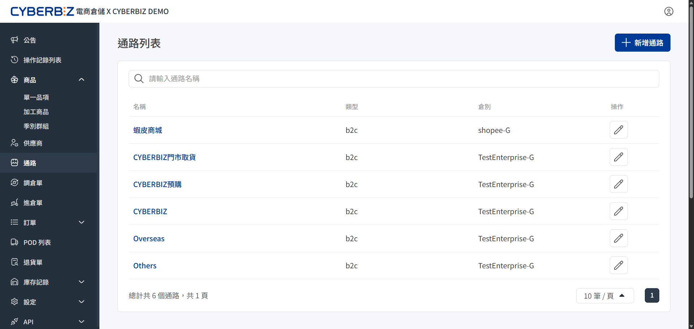
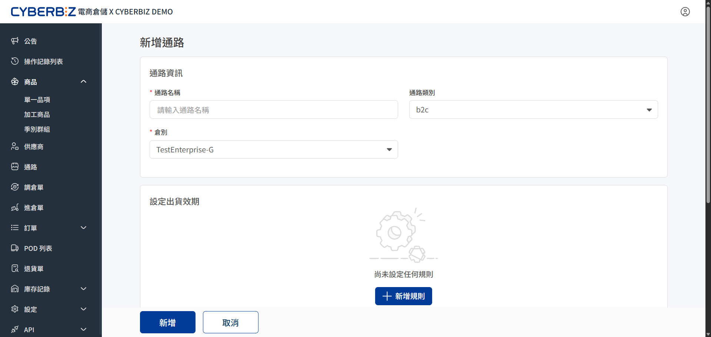
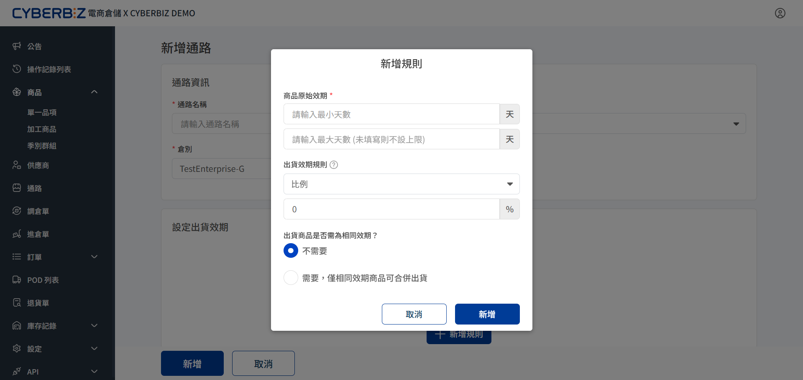

# 通路
透過設定通路，商家可以為不同銷售平台管理庫存，定義專屬的商品效期接受範圍與出貨條件。
{ .subtitle }

{ .hero-page }

## 適用場景

- **效期分流管理**：針對不同通路對 **剩餘效期** 的嚴格度進行設定。
    - **量販通路**：設定較長效期門檻，確保符合大型零售商的上架規範。
    - **特賣/福利通路**：可設定較短效期，加速出清庫存，並將其與一般正常效期訂單明確區隔。
- **出貨型態統計**：依據業務屬性（如：貨運商類別、特殊包裝作業、大宗採購模式）建立專屬通路，以便在報表分析中，快速統計各項出貨型態的佔比。

## 設定通路規則

通路規則主要用於管理 **效期商品** 的出貨邏輯。透過規則，系統會自動在揀貨階段排除效期不足的商品。

### 1. 建立通路

前往 **通路 > 列表**，點擊 **新增通路** 進入編輯頁面。

- **通路名稱**：自訂便於識別的名稱，建議採用 **平台+物流** 或 **業務性質** 命名。
    - **命名範例**：`酷朋`、`團購`、`誠品生活`、`東森-黑貓`、`東森-全家`。
- **出貨倉別**：指定該通路對應的實體或虛擬倉庫，確保訂單能精確扣減該倉別的庫存數量。
- **通路類別**：依業務模式選擇 `B2C`或`C2C`。

{ .screenshot }

### 2. 新增效期規則

點擊 **新增規則**，設定該通路可接受的商品條件：

#### 接受範圍設定

- **商品原始效期下限 (必填)**：設定通路可接受的 **最低** 賸餘效期天數。
    - *範例*：設定 50 天。系統僅會揀選距離到期日大於 50 天的商品。
- **商品原始效期上限 (選填)**：設定通路可接受的 **最高** 賸餘效期天數。
    - *範例*：設定 100 天。系統會排除距離到期日大於 100 天的商品。此項通常搭配下限使用，用於鎖定特定的效期區段。

#### 出貨規則種類

選擇依據 **比例** 或 **天數** 來計算：

- **比例**：以 **商品總效期 × 數值** 計算。
    - *範例*：設定 50%。若商品總效期為 100 天，則會出貨距離到期日大於 50 天 (100×50%) 的商品。
- **天數**：直接以 **數值** 計算。
    - *範例*：設定 50 天。不論商品總效期長短，皆出貨距到期日大於 50 天的商品。

#### 特殊條件

- **同效期**：若該通路要求 **單一訂單內的同品項必須為同一批效期**，勾選此項。系統在揀貨時會強制鎖定同一批號。

{ .screenshot }
