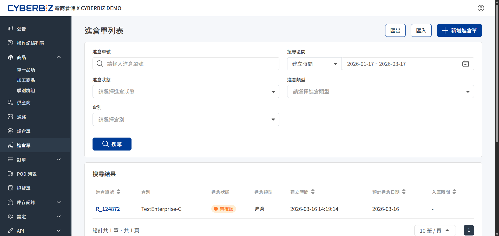
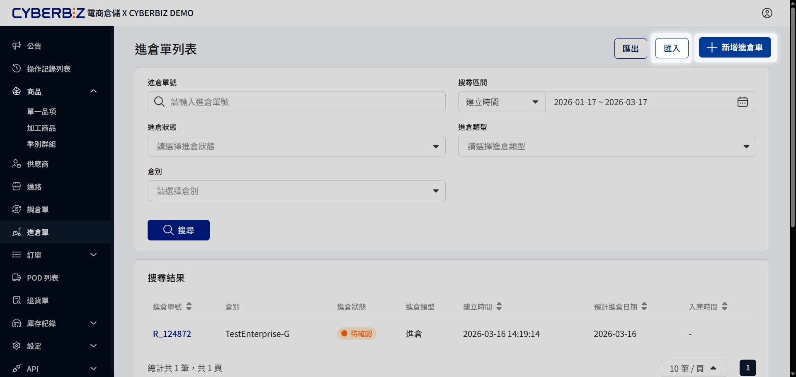
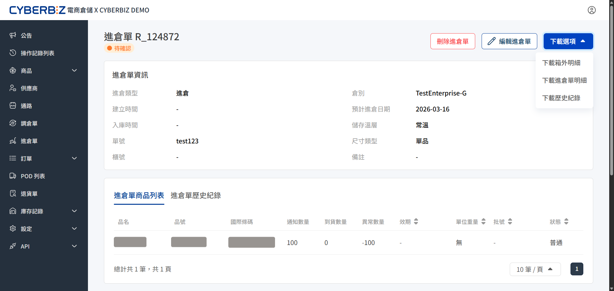

# 進倉單
在實體貨物送達前，商家必須先於後台建立進倉單，精確填寫預定入庫的品項、數量與效期，並通知倉庫行政人員。
{ .subtitle }

{ .hero-page }

## 使用須知

- **預約限制**：系統僅支援建立 **當日** 或 **未來日期** 的進倉單。
- **急單費用**：若設定進倉日期為 **當日**，倉庫將加收 **急單作業費**。建議提早 3-5 天預約。
- **收貨截單**：倉庫收貨截止時間為每日 **15:00**。15:00~16:00 到貨之商品，將協助收件入庫，但驗收上架時間將依現場排程順延。

## 進倉單作業流程

1. **建立進倉單**：商家於後台新增進倉資訊，系統產生待確認單據。
2. **貨物送達**：商品依預約日期送達倉庫，倉庫人員簽收貨物。
3. **驗收上架**：倉庫人員清點品項數量與效期，完成系統上架。
4. **結案完成**：系統更新進倉單狀態，官網庫存同步增加。

## 新增進倉單

選擇手動建立單筆進倉單，或使用 Excel 批次匯入大量資料。

=== "手動新增"

    登入電商倉儲後台，前往 **進倉單**，點擊右上角 **新增進倉單**。

    1. **基本設定**：
        - **到倉日期 (必填)**：填寫預計送達倉庫的日期。
        - **倉別**：預設選取 **G 倉 (正常倉)**。若選取 **L 倉 (鎖倉)**，商品入庫後將無法出貨。
        - **單號 (選填)**：輸入原廠出貨單號，方便對帳。
        - **備註 (選填)**：記錄特殊需求或入庫注意事項。
    2. **選擇商品**：
        - 點擊新增商品，選取本次要進貨的品項與數量。
        - 若商品已開啟效期管理，務必在此指定效期。系統將依此效期進行驗收。
    3. **儲存送出**：確認資訊無誤後點擊儲存，系統將產生一張 **進倉狀態** 為 **待確認** 的進倉單。

=== "批次匯入"

    登入電商倉儲後台，前往 **進倉單**，點擊右上角 **匯入**。

    1. 點擊 **下載範本**。
    2. 依照 Excel 欄位規範填寫進倉資料，確保 SKU 與數量正確。
    3. 選取對應倉別，上傳檔案並點擊匯入。

{ .screenshot }

## 進倉單列表管理

### 篩選

您可以利用篩選功能，在大量的單據中快速定位特定進度或類別的貨件，協助財務核對與倉庫排程。

- **進倉單號**：輸入完整的單號，直接查詢特定批次貨件的驗收明細與入庫狀態。
- **搜尋區間**：依據 **建立日期** 篩選週報或月報所需之單據，核對各時段的進貨頻率與總額。
- **進倉狀態**：過濾 **待確認**、**盤點中** 或 **已完成** 的單據，追蹤是否有逾期未到或尚未入庫的異常件。
- **進倉類型**：依據 **一般進倉**、 **調撥進倉** 或 **退貨進倉** 等類別進行區隔，加速不同業務核對。
- **倉別**：當您的商店啟用多個倉位時，可切換特定倉別查看該區域的入庫動態。

### 追蹤進倉單狀態

即時監控貨物入庫進度與執行對應動作。

| 狀態名稱 | 說明 | 可執行動作 |
| :--- | :--- | :--- |
| **待確認** | 商家已送出申請，正等待倉庫接收 | 編輯、刪除、下載單據 |
| **已取消** | 倉庫拒絕進倉（如資訊有誤） | 編輯後重新送出、刪除 |
| **已收貨** | 倉庫已簽收商品，正等待驗收 | 下載單據（無法編輯/刪除） |
| **盤點中** | 倉庫人員清點數量與驗收上架中 | 下載單據（無法編輯/刪除） |
| **已完成** | 商品全數驗收入庫，庫存已同步 | 下載單據、查看歷史紀錄 |

### 匯出調倉單

點擊右上角 **匯出**，即可下載報表。

## 進倉單明細頁管理

點擊進倉單號，進入進倉單明細頁，執行更多操作。

{ .screenshot }

### 刪除/ 編輯進倉單

點擊右上角 **刪除進倉單** 或 **編輯進倉單**。

### 下載與列印進倉文件

1. 在列表頁點擊該筆 **進倉單號**。
2. 點擊 **下載選項**，選擇檔案類型。
    - **下載箱外明細**
    - **下載進倉單明細**
    - **下載歷史紀錄**

> 進倉單建立完成後，必須隨貨檢附 **箱外明細** 單據，以利倉庫識別貨物並加速驗收流程。完整流程可參考 [商家進倉規範](商家進倉作業規範/#2-貨品標籤)。

### 查看進倉單資訊

1. **進倉單商品列表**：即時比對申報與實收差異、確認商品效期與批號。

2. **進倉單歷史紀錄**：追蹤分批到貨進度、快速識別漏發或遺失（尚欠）狀況。

## 異常處理

若實到數量與單據不符，系統將依以下邏輯處理：

### 情境 A：短少/效期不符

- **異常定義**：實收數量 < 應收數量
- **系統機制**：系統自動產生一張 **延伸單據**，（單號後綴 -1，例如 R_54-1），並同步發送 Email 通知至申請帳號。
- **後續處理**：若需補進貨，可依此單再次預約；若不再補貨，手動刪除該單即可。

### 情境 B：溢收

- **異常定義**：實收數量 > 應收數量
- **系統機制**：系統不會自動產單。倉庫人員會主動聯繫商家，確認處理方式後手動調整，確認後才會完成入庫。

