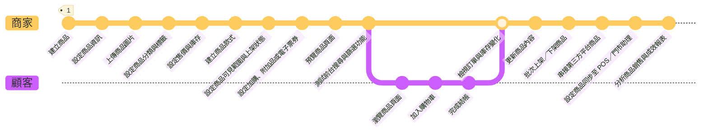

# 商品管理
輕鬆管理商品資訊、分類與庫存，提升上架效率。
{ .page-subtitle }

-    
     

    快速上架商品、分類與管理庫存，輕鬆掌控商店運營。    

    [[新增單一商品|上架第一個商品 :material-arrow-right-circle:]]  
    [[快入上手|快速上手 :material-arrow-right-circle:]]   

-   ![[product-hero.png]]{ .screenshot-hero-page }

---

 

---

## 立即開始

=== ":material-rocket-launch-outline: 快速上手"

    

    
    - __[[商品管理介面]]__  
    在所有商品頁面管理和操作商品。

    

=== ":material-plus-circle-outline: 新增商品"

    

    - __[[新增單一商品]]__  
    建立及上架商品、更新商品資訊。  
    [[新增組合商品|新增組合商品]] :material-lock-outline:

     - __[[新增大量商品]]__  
     使用 Excel 一次新增大量商品。  
    [[從蝦皮匯入|從蝦皮匯入商品]]

	- __[[設定多購物車#設定預購商品|新增預購商品]]__  
	建立預購商品通路，套用至既有商品。

	- __[[設定電子票券#新增電子票券|新增電子票券]]__  
	建立電子票券商品，供線上購買、門市或指定通路兌換使用。
    

=== ":material-magnify: 搜尋商品"

    

    
	 - __[[後台搜尋商品|定位商品進行管理]]__  
	 使用多種搜尋方式找到目標商品進行操作。

    

=== ":material-update: 更新商品"

	

	 - __[[批次修改商品資訊|更新大量商品]]__   
	 使用 Excel 一次更新大量商品跟資訊。
	 
	

=== ":material-eye-off: 隱藏商品"

	

	 - __[[設定商品排除搜尋|關閉商品搜尋]]__   
	將商品從特定搜尋結果中排除。

	 - __[[設定商品排除上傳至第三方平台|排除商品上傳至第三方平台]]__ :material-lock-outline:  
	 設定排除標籤，讓商品不上傳至第三方平台。

	 - __[[設定商品秘密群組|建立專屬秘密商店]]__  
	 為特定顧客群體建立專屬秘密商品群組
	

### 設定管理
=== "商品資訊"

	

	 - __[[設定商品配送屬性（一般宅配）]]__
	 
	 - __[[設定商品配送屬性（宅配貨到付款）]]__

    - __[[設定商品標語與商品簡述文字]]__
    設定商品的標語和簡述，吸引顧客目光。

    - __[[設定商品影片]]__
    上傳商品介紹影片，豐富商品頁面內容。

    - __[[設定商品超商物流限制與排除選項]]__
    管理超商物流限制與排除規則。

	

=== ":material-folder-outline: 商品群組"

	 

	- __[[自訂商品分類群組]]__  
	依需求建立商品分類群組

	- __[[設定商品多層級分類]]__ :material-lock-outline:  
	建立多層級商品結構，套用至導覽列與行銷活動

	- __[[設定條件分類群組|條件分類群組]]__  
	依條件建立動態商品分類

    - __[[設定商品標籤]]__
    為商品建立與管理自訂標籤，以便分類、篩選、行銷應用及控制第三方平台同步。

    - __[[設定前台商品群組排序]]__
    調整前台商品群組的顯示順序。
	
	

=== ":material-filter-outline: 篩選商品"

	

	
	- __[[設定前台商品篩選器|前台商品篩選器]]__ :material-lock-outline:     
	讓顧客能自行設定篩選條件找到目標商品。
	
	

=== ":material-ticket-outline: 電子票券"

	

	- __[[新增電子票券]]__
	
	- __[[購買電子票券]]__
	
	- __[[電子票券分票]]__
	
	- __[[核銷電子票券]]__

	 - __[[票券分潤自動結案]]__  
	 設定電子票券訂單自動結案並計算分潤
	
	- __[[電子票券退款]]__  
	為顧客辦理電子票券的全額或部分退款作業

	 - __[[設定電子票券門市權限|電子票券門市權限]]__
	 
	- __[[設定電子票券任選折扣|電子票券任選折扣]]__

	

	
### 營運行銷

=== ":material-checkbox-multiple-marked-outline: 批次管理"

    

    - __[[新增大量商品]]__   
      Excel 批次匯入商品
    - __[[批次修改商品資訊]]__

    

=== ":material-sale-outline: 行銷促銷"

    

    - __[[設定單品限時折扣群組|單品限時折扣]]__ :material-lock-outline:
    - __[[設定加價購群組]]__
    - __[[設定任選折扣群組]]__
    - __[[設定不適用折扣群組]]__
    - __[[設定 VIP 會員專屬價格]]__
    - __[[設定加價購群組的多國語系名稱]]__
    為加價購活動設定多國語言名稱，支援跨境銷售。

    

=== ":material-thumb-up-outline: 優化體驗"

    

    - __[[使用商品評論功能|開啟商品評論功能]]__ :material-lock-outline:  
      獲取真實顧客意見，建立品牌信譽。  
      [[啟用留言區 reCAPTCHA|防止垃圾訊息與機器人留言]]
    - __[[設定商品到貨通知|發送商品到貨通知]]__ :material-lock-outline:   
	自動發送補貨通知 Email 給已追蹤商品的顧客。  
	[[設定商品到貨通知#步驟二：Email 樣板設定|設定 Email 通知樣式]]
    - __[[編輯商品描述與設定]]__
	- __[[設定前台商品篩選器#開啟/關閉篩選器|啟用前台商品篩選器]]__ :material-lock-outline:    
    讓顧客可以依照不同條件篩選商品。  
	 [[設定前台商品篩選器#調整篩選器與子條件排序|調整篩選條件跟排序]]
	- __[[設定商品配送物流、溫層與出貨通路（一般宅配）#多購物車結帳說明|統一商品配送屬性]]__  
	減少溫層、配送方式或出貨通路差異，以簡化結帳流程和降低運費。
    - __[[docs/ec/product/operation/設定多購物車|設定多購物車]]__
    管理多購物車結帳流程，提升大型訂單處理效率。
	
    

### 系統整合與串接

=== ":material-vector-combine: CYBERBIZ 系統"
    === "POS"
        

        
        - __[[批次更新商品 SKU]]__  
        使用 Excel 匯入，更新欠缺 SKU 資訊的所有商品  
        [[同步 POS 商品]]   

        

	=== "門市助理"
	
	=== "WMS" 
		

		
		- __[[同步電商與倉儲庫存]]__  
		串接「峰潮物流」系統，同步商品庫存。
		- __[[]]__
		
		
 		
		

=== ":material-vector-link: 第三方平台"
    === "Google"
        

        - __[[設定 Google 購物廣告]]__  
        同步商品資料至 Google 搜尋與購物廣告  
        - __[[自動化廣告系統]]__

        

    === "Meta"
        

        - __[[設定 Meta 商品影片廣告]]__

        

    === "蝦皮"
        

        - __[[從蝦皮搬遷商品]]__  
        匯入蝦皮網站上的商品至您的 CYBERBIZ 品牌官網
        `CYBERBIZ CHANNEL BRIDGE`

        

### 成長 & 跨境

=== ":material-earth: 跨境電商"

### 延伸閱讀

=== ":material-compass: 指南"
	
	

	 
	 - __[[商品可見性]]__  
     影響商品能見度的相關功能及設定。

	- __[[電子票券指南]]__  
	設定、銷售、核銷與退款，店員權限與對帳流程。
	

=== ":material-bookshelf: 參考資料"

	 

	 
	 -   __[[商品詳細資訊設定]]__
	 
	

---
