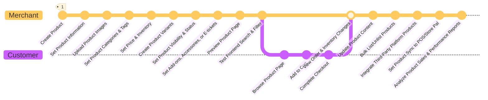

# Product Management
Easily manage product information, categories, and inventory to improve listing efficiency.
{ .page-subtitle }

-    
     
    __Get Started__  
    Quickly list products, categorize, and manage inventory to easily control store operations.  
    [[add-single-product|List Your First Product :material-arrow-right-circle:]]  
    [[quick-start|Quick Start :material-arrow-right-circle:]]

-   ![[product-hero.png]]{ .screenshot-hero-page }

---

 

---

### Get Started
=== ":material-rocket-launch-outline: Quick Start"

    

    
    - __[[Product Management Interface]]__  
    Manage and operate products from the all products page.

    

=== ":material-plus-circle-outline: Add Products"

    

    - __[[新增單一商品|Add a Single Product]]__    
    Create and list products, update product information.  
    [[Add a Bundle Product|Add a Bundle Product]] :material-lock-outline:
     - __[[Add Products in Bulk]]__  
     Use Excel to add a large number of products at once.
    [[Import from Shopee|Import Products from Shopee :material-arrow-right-circle-outline:]]
	- __[[setup-multiple-shopping-carts#setup-pre-order-products|Add Pre-order Products]]__  
	Create a pre-order channel and apply it to existing products.

    

=== ":material-magnify: Search Products"

    

    
	 - __[[Search Products in Admin|Search All Products]]__  
	 Use various search methods to find and operate on target products.

    

=== ":material-update: Update Products"

	

	 - __[[Bulk Edit Product Info|Update Products in Bulk]]__   
	 Use Excel to update a large number of products and their information at once.
	 
	

=== ":material-eye-off: Hide Products"

	

	 - __[[Exclude Products from Search|Disable Product Search]]__   
	Exclude products from specific search results.
	 - __[[Exclude Products from Uploading to Third-Party Platforms|Exclude Products from Uploading to Third-Party Platforms]]__ :material-lock-outline:  
	 Set exclusion tags to prevent products from being uploaded to third-party platforms.
	 
	

### Configuration
=== "Product Information"
	

	
	

=== ":material-folder: Product Groups"

	 

	- __[[Custom Product Category Groups]]__  
	Create product category groups based on your needs.
	- __[[Set Up Multi-Level Product Categories]]__ :material-lock-outline:  
	Create a multi-level product structure and apply it to navigation bars and marketing campaigns.

	

=== "Filter Products"

	

	
	- __[[Set Up Frontend Product Filters]]__ :material-lock-outline:     
	Allow customers to set their own filter conditions to find target products.
	
	

	
### Operations
=== ":material-checkbox-multiple-marked-outline: Bulk Management"

    

    - __[[Add Products in Bulk]]__   
      Bulk import products via Excel
    - __[[Bulk Edit Product Information]]__

    

=== ":material-sale-outline: Marketing & Promotions"

    

    - __[[Set Up Single-Item Timed Discount Groups|Single-Item Timed Discounts]]__ :material-lock-outline:
    - __[[Set Up Add-on Purchase Groups]]__
    - __[[Set Up Mix-and-Match Discount Groups]]__
    - __[[Set Up Discount Exclusion Groups]]__
    - __[[Set Up VIP Member Exclusive Prices]]__

    

=== ":material-thumb-up-outline: Enhance Experience"

    

    - __[[Use Product Review Feature|Enable Product Reviews]]__ :material-lock-outline:  
      Get real customer feedback to build brand credibility.
      [[Enable reCAPTCHA for Comments|Prevent Spam and Bot Comments :material-arrow-right-circle-outline:]]
    - __[[Set Up Back-in-Stock Notifications|Send Back-in-Stock Notifications]]__ :material-lock-outline:   
	Automatically send restock notification emails to customers who are following the product.
	[[set-up-back-in-stock-notifications#step-two-email-template-settings|Configure Email Notification Style :material-arrow-right-circle-outline:]]
    - __[[Edit Product Information & Settings]]__
    - __[[How to Use Product Group Filters]]__
	- __[[set-up-frontend-product-filters#adjust-filters-and-sub-condition-sorting|Adjust Frontend Product Filter Conditions]]__ :material-lock-outline:    
    Adjust the filter conditions and sorting of the product page filter.
	
    

### Integrations
=== ":material-vector-combine: CYBERBIZ Systems"
    === "POS"
        

        
        - __[[Bulk Update Product SKUs]]__  
        Import via Excel to update all products missing SKU information.
        [[Sync POS Products :material-arrow-right-circle-outline:]]   

        

	=== "Store Pal"
	
	=== "WMS" 
		

		
		- __[[Sync E-commerce and Warehouse Inventory]]__  
		Integrate with "Fengchao Logistics" system to synchronize product inventory.
		- __[[]]__
		
		
 		
		

=== ":material-vector-link: Third-Party Platforms"
    === "Google"
        

        - __[[Set Up Google Shopping Ads]]__  
        Sync product data to Google Search and Shopping ads
        - __[[Automated Advertising System]]__

        

    === "Meta"
        

        - __[[Set Up Meta Product Video Ads]]__

        

    === "Shopee"
        

        - __[[Migrate Products from Shopee]]__  
        Import products from your Shopee store to your CYBERBIZ brand website
        `CYBERBIZ CHANNEL BRIDGE`

        

### Growth & Expansion
=== ":material-earth: Cross-Border E-commerce"
### Further Reading
=== ":material-compass: Guides"
	
	

	 
	 -   __[[Product Visibility]]__  
     Features and settings that affect product visibility.
	
	

=== ":material-bookshelf: References"

	 

	 
	 -   __[[Product Detail Information Settings]]__
	 
	

---

### New Merchants | Starting from Scratch

-   :material-cube-outline: __Create Your First Product__

    --- 

    [[Add a Single Product]]    
    [[Product Management Interface]]    
    [[Product Visibility Guide]]    
-   :material-view-grid-outline: __Organize Your Product Catalog__

    --- 

    [[Set Up Multi-Level Product Categories]]    
    [[Set Up Product Tags]]      
    [[Set Up Frontend Product Filters]]  
-   :material-cog-outline: __Basic Operational Settings__

    --- 

    [[Set Product Logistics, Temperature Layers, and Shipping Channels (Standard Delivery)]]    
    [[Set Product Slogans and Short Descriptions]]      
    [[Set Up Product Videos]]   

### Growing Merchants | Increasing Revenue

-   :material-playlist-edit: __Bulk Management Tools__

    ---

    [[Add Products in Bulk]]   
    [[docs/ec/product/activate/Bulk Edit Product Information]]  
    [[Search Products in Admin]]    
    [[How to Search Products in Admin]]  
-   :material-sale-outline: __Promotional & Marketing Tools__

    ---

    [[Set Up Add-on Purchase Groups]]    
    [[Set Up Mix-and-Match Discount Groups]]   
    [[docs/ec/product/operation/Set Up Single-Item Timed Discount Groups]]   
    [[Set Up Discount Exclusion Groups]]     
-   :material-star-outline: __Enhance Shopping Experience__

    ---

    [[Set Up Product Reviews]]   
    [[Set Up Back-in-Stock Notifications]]   
    [[Edit Product Information & Settings]]     
    [[Filter Products to Create Category Groups]]     

### Mature Merchants | Scaling Operations

-   :material-package-variant-closed: __Advanced Sales Models__

    ---

    [[Add Bundle Products]]      
    [[Set Up E-tickets]]      
    [[Set Up E-ticket Mix-and-Match Discounts]]      
    [[Set Up E-ticket Store Permissions]]  
-   :material-account-star-outline: __Member Management & Differentiation__

    ---

    [[Set Up VIP Member Exclusive Prices]]     
    [[Set Up Secret Groups]]     
    [[Set Up Multilingual Names for Add-on Groups]]  
-   :material-storefront-outline: __Multi-channel Integration__

    ---

    [[Configure Google Shopping Ads (GMC)]]     
    [[docs/ec/product/configure/Exclude Products from Uploading to Third-Party Platforms]]     
    [[Set Product Logistics, Temperature Layers, and Shipping Channels (Cash on Delivery)]]      
    [[docs/ec/product/operation/Set Up Multiple Shopping Carts]]   
-   :material-cog-sync-outline: __Operational Optimization__

    ---

    [[Set Up Product Category Groups]]    
    [[Set Up Conditional Category Groups]]    
    [[Set Frontend Product Group Sorting]]    
    [[Set Convenience Store Logistics Restrictions and Exclusions for Products]]  

---

## :material-hammer-wrench: Feature Quick-Find
Know what to do but not sure which feature to use? I want to...
=== ":material-upload-outline: List Products"

    

    -   __[[Add a Single Product]]__  
        Create and list a single product
    
    -   __[[Add Products in Bulk]]__  
        Bulk list products, improve listing efficiency
    -   __[[Edit Product Information & Settings]]__    
        Modify product information
    
    -   __[[Bulk Edit Product Information]]__  
        Bulk edit

    

=== ":material-folder-outline: Manage Categories"

    

    -   __[[Set Up Multi-Level Product Categories|Set Up Multi-Level Product Categories :material-star-half-full:{ title="Advanced" }]]__  
        Create category structure
        `Drag-and-drop layout`
    
    -   __[[Set Up Conditional Category Groups]]__  
        Automatic categorization
    -   __[[Set Up Custom Category Groups]]__    
        Manual categorization
    
    -   __[[Set Up Secret Groups]]__  
        Hidden categories

    

=== ":material-sale-outline: Set Up Promotions"

    

    -   __[[Set Up Add-on Purchase Groups]]__  
        Add-on purchase
    
    -   __[[Set Up Mix-and-Match Discount Groups]]__  
        Mix-and-match offer
    -   __[[Set Up Single-Item Timed Discount Groups]]__    
        Limited-time offer
    
    -   __[[Set Up VIP Member Exclusive Prices]]__  
        Member price
    
    -   __[[Set Up Bundle Products]]__  
        Bundle offer

    

=== ":material-truck-outline: Manage Logistics" 

    

    -   __[[Set Product Logistics, Temperature Layers, and Shipping Channels (Standard Delivery)]]__  
        Delivery settings
    
    -   __[[Set Product Logistics, Temperature Layers, and Shipping Channels (Cash on Delivery)]]__  
        Cash on delivery
    -   __[[Set Convenience Store Logistics Restrictions and Exclusions for Products]]__    
        Convenience store restrictions
    
    

=== ":material-account-outline: Enhance Experience"

    

    -   __[[Set Up Product Reviews]]__  
        Product reviews
    
    -   __[[Set Up Back-in-Stock Notifications]]__  
        Back-in-stock notification
    -   __[[Frontend Product Filters]]__    
        Product filtering
    
    -   __[[Set Up reCAPTCHA for Comments]]__  
        Anti-spam
        `Security`

    

---
