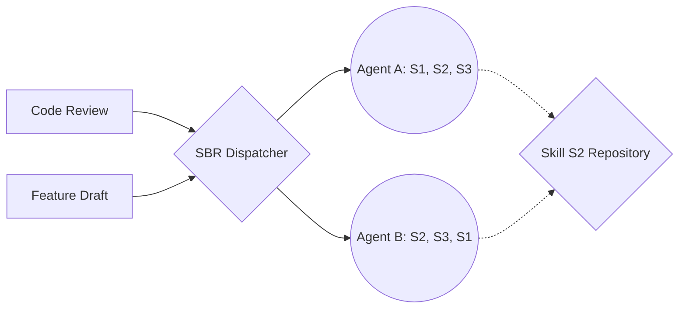

# Architectural Standard: MAS-SBR Mesh

## 1. Abstract
The **MAS-SBR** framework defines a system where intelligence is not a property of a single agent, but an emergent property of a **Skill-Based Route**. By decoupling "Skills" (atomic functions) from "Agents" (logical sequencers), the architecture allows for a many-to-many relationship that optimizes for task-specific logic patterns.

## 2. Structural Components

### 2.1 The Skill Atom ($S$)
The smallest executable unit of work. Skills are stateless and idempotent where possible.
* **Examples:** `Data_Fetch`, `Syntax_Check`, `Tone_Shift`, `Cross_Reference`.

### 2.2 The Agent Node ($A$)
An Agent is a "sequencer" of specific Skill Atoms. Its unique value is its **Execution Vector** ($V$).
* **Agent A Vector:** $S_1 \to S_2 \to S_3$ (Deductive Logic)
* **Agent B Vector:** $S_3 \to S_1 \to S_2$ (Inductive Logic)

### 2.3 The SBR Mesh (The "Web")
The topology is a **Directed Acyclic Hypergraph**.
* **Nodes:** Agents and Skill Repositories.
* **Edges:** Data handoffs defined by the routing logic.
* **M:M Relation:** Multiple tasks can trigger the same agent; a single agent can call upon multiple skill-sharing peers to fulfill a missing atom in its vector.

---

## 3. Dynamic Routing Logic

### 3.1 The Dispatcher (The Router)
The Dispatcher does not look for an "Agent Name"; it looks for a **Logic Profile**.
1.  **Requirement Analysis:** Parses the user prompt for required Skill Atoms.
2.  **Permutation Matching:** Identifies which Agent Vector ($V$) produces the most appropriate "State Transformation" for the goal.
3.  **Cost-Benefit Selection:** Evaluates agent availability (latency) vs. historical success rates for that specific sequence.

### 3.2 State Handover Protocol (SHP)
To maintain the many-to-many net, data must be wrapped in a **Context Carrier** as it moves through the mesh:
* **Payload:** The actual data/result.
* **Trace:** The list of skills already executed ($S_{history}$).
* **Intent:** The remaining skills required to satisfy the route ($S_{remaining}$).

---

## 4. Operational Comparison

| Feature | Legacy Hierarchical MAS | MAS-SBR Mesh |
| :--- | :--- | :--- |
| **Connectivity** | 1:Many (Tree) | **Many:Many (Web)** |
| **Redundancy** | Low (Single point of failure) | **High (Skill overlap across nodes)** |
| **Logic Type** | Fixed/Declarative | **Permutational/Procedural** |
| **Scalability** | Linear (More tasks = More agents) | **Exponential (Skill reuse allows new logic patterns)** |

---

## 5. Maintenance & Evolution

### 5.1 Adding a New Skill
When a new Skill Atom is registered to the central library, all agents in the mesh immediately gain the *potential* to include it in their vectors. No hard-coding of connections is required; the **SBR Dispatcher** simply acknowledges the new capability in its next routing cycle.

### 5.2 Conflict Resolution
If two agents, **Agent X** $(S_a, S_b)$ and **Agent Y** $(S_a, S_b)$, both claim the same task, the mesh uses **Telemetry-Based Selection**:
* **Success Delta:** Which agent’s specific LLM/Code implementation of $S_a$ produces higher quality output for this specific domain?
* **Load Balancing:** Route to the agent with the lowest current token-queue depth.

---

## 6. Visualization of the Many-to-Many Net

---

