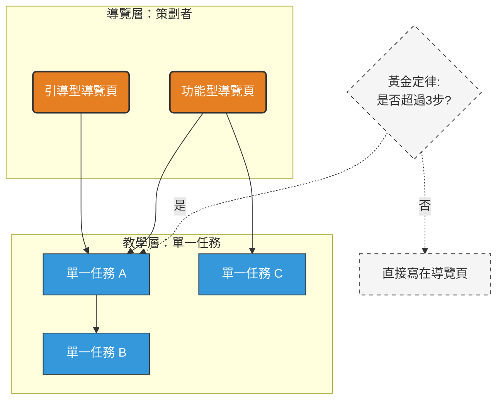

## 內容架構：主題式撰寫法 (Topic-Based Authoring)

為了提升文件的維護效率與閱讀體驗，本指南採用 **「樞紐與輻輳」(Hub-and-Spoke)** 架構。這種模式將文件拆分為「導覽中心」與「單一任務教學」，能有效解決長篇大論（Wall of Text）的問題，並實現內容的高度複用。[[information architecture#Module (模組)]]

### 1. 核心概念定義

- **教學頁 (The Spokes / Single-Mission Tutorial)：**
    
    - **定義：** 專注於完成一個特定的「單一任務」。
        
    - **特性：** 原子化（Atomicity）。同份教學可被多個導覽頁引用，UI 變動時只需修改一處。
        
- **導覽頁 (The Hub / The Orchestrator)：**
    
    - **定義：** 作為功能模組的入口，負責串聯多個教學，提供「學習路徑」。
        
    - **特性：** 提供全局背景，回答讀者：「我該按什麼順序達成目標？」。
        

---

### 2. 導覽頁 (Hub) 的設計類型

根據讀者意圖（User Intent），導覽頁應分為以下兩類：

|**類型**|**核心價值**|**撰寫重點**|**範例**|
|---|---|---|---|
|**引導型 (Onboarding Hub)**|強調「順序性」|適合新手，引導其按步驟完成基礎設定。|新手上路教學、首筆交易設定|
|**功能型 (Feature Hub)**|強調「分類性」|作為工具箱，方便熟練使用者快速查找特定功能。|物流管理模覽、API 整合工具箱|

---

### 3. 撰寫準則與黃金定律 (The Golden Rules)

為了平衡「內容拆分」與「點擊疲勞」（Click Fatigue），請遵循以下原則：

- **三步定律：** * 若任務 **$\le$ 3 個步驟**（且不涉及跨頁面跳轉）：請直接寫在「導覽頁」中。
    
    - 若任務 **> 3 個步驟** 或具備高複雜度（如需申請 API Key）：請獨立為「教學頁」。
        
- **標題動詞化：** 教學頁標題應以動詞開頭。例如：「如何設定黑貓貨到付款」優於「黑貓設定」。
    
- **模組化思維：** 想像教學頁是 `Function`，導覽頁是 `Main Program`。確保 Function 能獨立運行且邏輯單一。
    

---

### 4. 文件類型 (Diátaxis Framework)

本指南參考國際標準 **Diátaxis** 框架，將文件分為四大類型：

- **Tutorial (教學)：** **學習導向**。手把手帶領新手完成第一個任務，不解釋過多原理。
    
- **Guide (指南)：** **任務導向**。解決具體、現實中的問題（如：如何串接金流），假設讀者已有基礎。
    
- **Explanation (概念說明)：** **理解導向**。解釋系統架構、為什麼我們要這樣設計（The "Why"）。
    
- **Reference (參考資料)：** **資訊導向**。精準的參數清單、API 文檔、規格表，要求絕對的準確度。
    

---

### 5. 結構優點

- **高可搜尋性：** 原子化的標題（如：如何設定 API）對 SEO 與內部檢索極為友善。
    
- **低維護成本：** 修正一個操作步驟，所有引用該步驟的導覽頁都會同步更新。
    
- **尊重讀者時間：** 熟練使用者可以直接跳過背景介紹，直達操作步驟。

